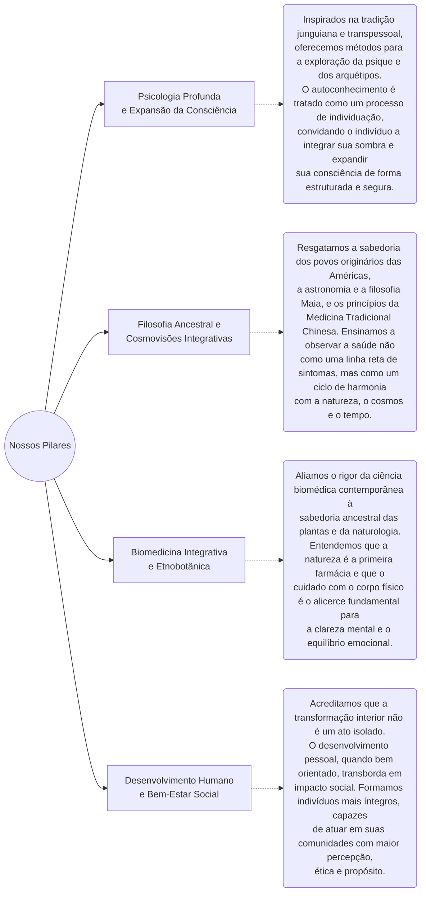

  <h5 style="color: var(--global-theme-color); font-size: 1.25rem;">Plataforma de Cursos, Livros, Videos e Artigos sobre Práticas Integrativas e Complementares.</h5>

  

Bem-vindo ao ponto de convergência entre o saber ancestral e o rigor da ciência contemporânea. Reflexões literárias sobre sociedade, comportamento e bem-estar. Este projeto nasce da síntese de décadas de pesquisa, prática clínica e reflexão filosófica, com o propósito de oferecer um caminho sólido, ético e fundamentado para o desenvolvimento humano e o bem-estar integral.

<h3 class="mt-5">Nossa Proposta</h3>

Mais do que uma escola, este é um ecossistema de aprendizado e pesquisa. Aqui, o Desenvolvimento Humano, as Ciências do Bem-Estar e a Etnobotânica se encontram para oferecer ferramentas práticas de individuação, estabelecendo uma sintonia profunda e respeitosa com o método científico.

<h3 class="mt-5">Nossos Pilares</h3>

<h3 class="mt-5">Por que nos acompanhar?</h3>

Neste espaço, documentamos e aplicamos a busca pelo saber. Seja através de sistemas ancestrais como a Iridologia, os Florais e a Fitoterapia, ou da análise científica das propriedades botânicas, convidamos você a ir além da superfície.

Aqui, o conhecimento é um convite à prática transformadora. Seja você um profissional da saúde em busca de novas metodologias, um terapeuta integrativo ou alguém em uma jornada de descoberta pessoal, nosso compromisso é inegociável: com a verdade, a autonomia e o respeito profundo pela complexidade da experiência humana.
