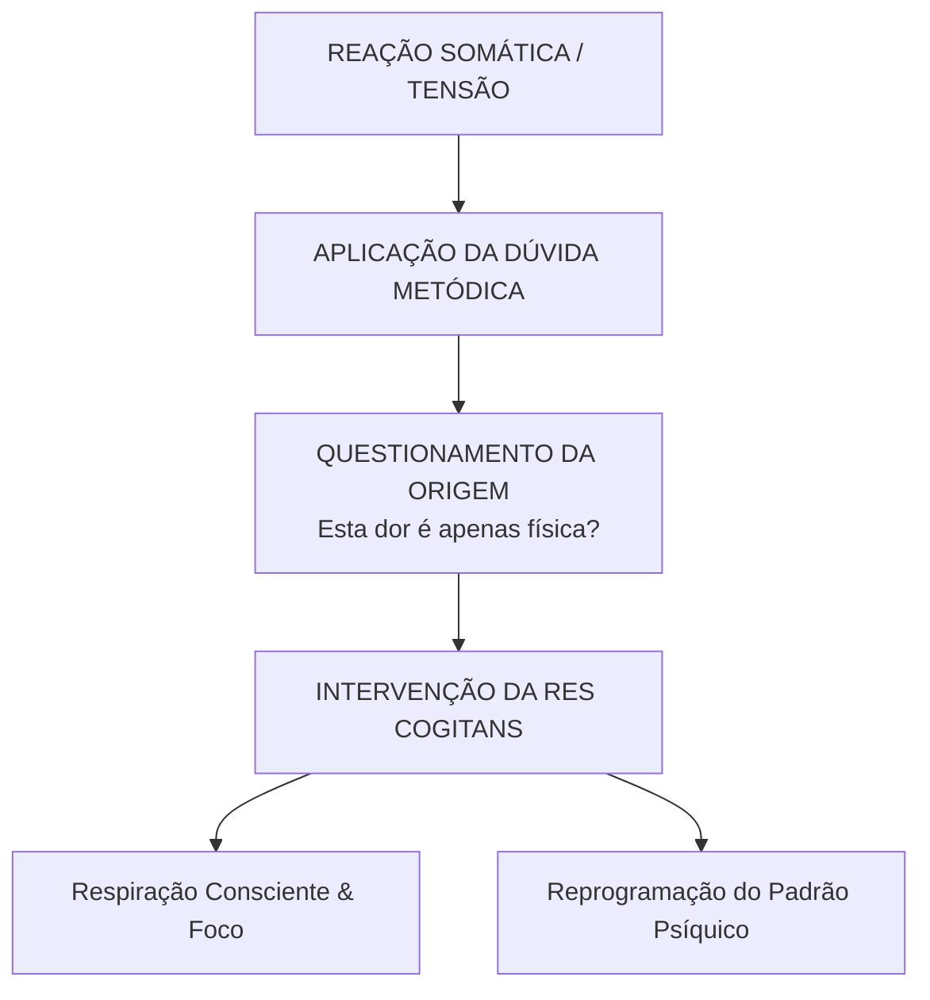

Autora: Silviane Silvério  
Data: 16 de junho de 2026  
Tempo médio de leitura: 9 minutos  

**Palavras-chave:** René Descartes, espiritualidade racional, dualismo cartesiano, glândula pineal, res cogitans, res extensa, dúvida metódica, autoconhecimento, saúde integrativa.

---

> **© Conteúdo Autoral:** Todo o conteúdo desta postagem é de autoria de Silviane Silvério. Caso utilize este texto como referência em seus estudos, trabalhos ou publicações, solicitamos a gentileza de dar os devidos créditos à autora e incluir as referências bibliográficas. Para localizar a autora e a fonte do artigo, pesquise na internet: [https://praticasdebemestarsocial.github.io/blog/](https://praticasdebemestarsocial.github.io/blog/)
{: .prompt-info }

---

## Resumo

René Descartes (1596–1650) é amplamente reconhecido como o precursor do pensamento científico moderno e da geometria analítica. Contudo, longe de anular o universo imaterial, o rigor cartesiano ofereceu uma das fundações mais sólidas para o que podemos conceituar como uma espiritualidade racional: a busca pela expansão da consciência livre de dogmas, guiada pelo discernimento, pela dúvida metódica e pela investigação da mente. Ao propor o famoso *"Cogito, ergo sum"* (Penso, logo existo), Descartes colocou a experiência consciente em primeiro plano. Este artigo analisa o dualismo cartesiano e apresenta um protocolo prático para a autorregulação e desconstrução de padrões psicossomáticos.

---

## Desenvolvimento

### 1. Como o Pai do Racionalismo Fundamentou as Bases para uma Espiritualidade Racional?

René Descartes estabeleceu que o conhecimento verdadeiro exige clareza, distinção e a eliminação de crenças cegas. Contudo, longe de se limitar a uma visão estritamente mecanicista da existência, o rigor cartesiano preservou um profundo respeito pela dimensão intangível da consciência.

Na perspectiva da filosofia da mente e da saúde integrativa, a espiritualidade racional não se opõe à ciência; ao contrário, utiliza a razão, a auto-observação neutra e a dúvida investigativa para compreender os mecanismos do espírito e da mente sem cair em dogmatismos.

Harmonizar o rigor científico com o cultivo do mundo interior nos convida a assumir a soberania sobre nossos processos mentais e somáticos.

---

### 2. A Arquitetura do Dualismo Cartesiano e o Papel Neuroendócrino da Pineal

Nas obras *Meditações sobre a Filosofia Primeira* (1641) e *As Paixões da Alma* (1649), Descartes formulou a divisão fundamental do ser humano em duas substâncias interdependentes:

* **Res Cogitans (Substância Pensante):** A mente imaterial, a consciência, a alma e a capacidade de reflexão metacognitiva.
* **Res Extensa (Substância Extensa):** A matéria física, o corpo biológico, sujeito às leis da física e às reações mecânicas.

Para equacionar a comunicação entre essas duas dimensões, Descartes identificou na glândula pineal o ponto de convergência fisiológico, fundamentando sua escolha em características anatômicas marcantes, como sua unicidade central e sua relação com a circulação dos fluidos encefálicos.

---

### Tabela Comparativa: Matriz Cartesiana e a Neurobiologia Contemporânea

| Dimensão Cartesiana | Atributo Filosófico | Leitura Neurobiológica Atual | Aplicação Prática no Autoconhecimento |
| :--- | :--- | :--- | :--- |
| **Res Cogitans** | Consciência imaterial, não espacial, ponto de partida da dúvida metódica. | Processamento pré-frontal de alta ordem, metacognição e observação neutra. | Desidentificação de pensamentos automáticos e crenças limitantes. |
| **Res Extensa** | Máquina biológica, corpo físico, tecidos e respostas somáticas automatizadas. | Sistema nervoso autônomo, eixos hormonais e somatização psicofisiológica. | Mapeamento de sintomas corporais e autorregulação neurovegetativa. |
| **Ponte Pineal** | Centro único e indiviso de convergência entre alma e máquina corpórea. | Transdução neuroendócrina: conversão de sinais de luz em melatonina. | Higiene circadiana, preservação do sono e regulação do relógio biológico. |

---

### O Circuito da Dúvida Metódica na Prática Integrativa

A aplicação da dúvida radical permite desconstruir reações somáticas automáticas e restaurar a regulação consciente:

---

### 3. Protocolo Prático: 3 Passos para a Autorregulação e Desconstrução de Padrões

Inspirando-se no método cartesiano para gerenciar o estresse e aprimorar a saúde psicossomática, é possível aplicar uma sequência de auto-investigação estruturada:

1. **Mapeamento da Res Extensa (Identificação do Sintoma Somático):** Observe neutramente as manifestações do corpo físico, como uma tensão muscular no pescoço, aperto no peito ou alteração gastrointestinal em momentos de pressão.
2. **Aplicação da Dúvida Metódica (Investigação da Causa Psíquica):** Cumpra o exercício de duvidar da resposta óbvia ou meramente externa. Pergunte-se: *"Esse desconforto biológico é puramente mecânico ou reflete um padrão de pensamento, fobia ou memória mantida pela mente?"*
3. **Intervenção da Res Cogitans (Soberania e Reprogramação Consciente):** Utilize o foco atencional, a modulação respiratória e a presença metacognitiva para despolarizar a resposta de estresse do sistema nervoso autônomo, reestabelecendo a homeostase.

---

## 4. Expanda seus Conhecimentos em Epistemologia, Neurobiologia e Saúde Integrativa

Se você busca aprofundar sua jornada de autoconhecimento aliando a solidez do método científico à riqueza dos saberes tradicionais:

📚 **Conheça os livros e cursos da nossa plataforma!**

Acesse o catálogo de obras e treinamentos elaborados por **Silviane Silvério** (Biomédica, Naturóloga e Escritora) e descubra como aplicar ferramentas analíticas, mapas de autoconhecimento e práticas integrativas na sua rotina e atuação profissional.

👉 [Clique aqui para explorar nossos Cursos e Livros na Plataforma](https://praticasdebemestarsocial.github.io/silvianesilverio/)

---

> ### ⚠️ Aviso Legal e Isenção de Responsabilidade (Disclaimer)
> Este artigo possui caráter exclusivamente educativo, filosófico e de divulgação em saúde integrativa, assinado por profissional Biomédica Naturopata. A reflexão analítica das obras de René Descartes não substitui diagnóstico, tratamento ou acompanhamento médico, neurológico ou psiquiátrico.
{: .prompt-warning }

---

## Referências Bibliográficas

- **DESCARTES, René.** *Meditações sobre a Filosofia Primeira.* São Paulo: Martins Fontes, 2001.
- **DESCARTES, René.** *As Paixões da Alma.* São Paulo: Martins Fontes, 2004.
- **SILVÉRIO, Silviane de Souza.** *Pesquisas em Saúde Integrativa, Neurobiologia e Saberes Tradicionais.* São Paulo, 2025.

---

Quer pesquisar as referências acadêmicas e o histórico das minhas investigações em saúde integrativa, iridologia e saberes tradicionais? Acesse o meu currículo Lattes e ORCID:

* 🔗 **ORCID:** [https://orcid.org/0000-0001-6311-1195](https://orcid.org/0000-0001-6311-1195)
* 🔗 **Lattes:** [http://lattes.cnpq.br/7481458793724724](http://lattes.cnpq.br/7481458793724724)  
*(ID Lattes: 7481458793724724 | Registro Profissional: CRTH-BR 1741)*

---

*Com múltiplos olhos e um só coração,*  
**Silviane Silvério**  
*Olho Preditivo – Mapas do Autoconhecimento*

---

> **© Conteúdo Autoral:** Todo o conteúdo desta postagem é de autoria de Silviane Silvério. Licença CC BY-NC-ND 4.0 Internacional. Registros oficiais com DOI em Zenodo/OSF/HAL. Para localizar a autora e a fonte do artigo, pesquise na internet: [https://praticasdebemestarsocial.github.io/blog/](https://praticasdebemestarsocial.github.io/blog/)
{: .prompt-info }

---

**Reflexão para a comunidade:**  
Você já havia reparado como muitas reações ou tensões do seu corpo físico (*res extensa*) são respostas a padrões armazenados na sua mente (*res cogitans*)?  
Compartilhe suas impressões nos comentários digitando a palavra **"RACIONALIDADE"** e participe do debate com a nossa comunidade! 🧠✨
