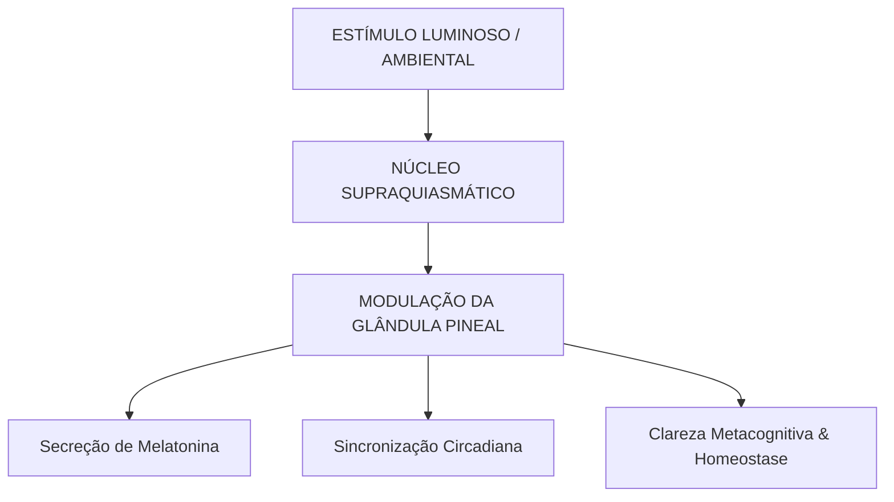

Autora: Silviane Silvério  
Data: 16 de junho de 2026  
Tempo médio de leitura: 9 minutos  

**Palavras-chave:** René Descartes, dualismo cartesiano, glândula pineal, res cogitans, res extensa, autoconhecimento, neurobiologia, metacognição, saúde integrativa.

---

> **© Conteúdo Autoral:** Todo o conteúdo desta postagem é de autoria de Silviane Silvério. Caso utilize este texto como referência em seus estudos, trabalhos ou publicações, solicitamos a gentileza de dar os devidos créditos à autora e incluir as referências bibliográficas. Para localizar a autora e a fonte do artigo, pesquise na internet: [https://praticasdebemestarsocial.github.io/blog/](https://praticasdebemestarsocial.github.io/blog/)
{: .prompt-info }

---

## Resumo

René Descartes (1596–1650) revolucionou a história humana ao propor que a razão e a matemática eram as ferramentas definitivas para compreender a realidade. No entanto, para além das equações e do plano cartesiano, o "Pai da Filosofia Moderna" deparou-se com o maior mistério da existência: a ponte de comunicação entre a matéria palpável (*res extensa*) e a consciência imaterial (*res cogitans*). Em sua obra *As Paixões da Alma* (1649), Descartes utilizou seu rigor analítico para rastrear a anatomia cerebral e propor um ponto físico de convergência: a glândula pineal. Este artigo analisa o dualismo cartesiano, o fluxo neuroendócrino e a atualização desse método para o autoconhecimento contemporâneo.

---

## Desenvolvimento

### 1. Como a Dúvida Metódica e a Busca pela Convergência Corpo-Mente Revolucionaram a Percepção?

René Descartes revolucionou o pensamento ocidental ao estabelecer o racionalismo moderno. Em sua busca por uma verdade indubitável, propôs a **dúvida metódica**: suspender temporariamente a confiança nos sentidos e em conceitos preconcebidos para construir um edifício do conhecimento sobre bases absolutamente sólidas.

Contudo, ao isolar o pensamento puro (*Cogito, ergo sum*), Descartes deparou-se com a necessidade de explicar como uma mente incorpórea interage com um organismo biológico sujeito às leis da física.

Compreender essa jornada histórica — e resgatar o método da dúvida radical — oferece ferramentas extraordinárias para a metacognição, a regulação neuroendócrina circadiana e a soberania em saúde integrativa.

---

### 2. Do Dualismo Cartesiano à Fisiologia Neuroendócrina

A escolha de Descartes pela glândula pineal (epífise) não foi aleatória, mas amparada por observações anatômicas rigorosas para a sua época:

* **Unicidade Central:** Enquanto a maioria das estruturas encefálicas apresenta pares simétricos nos hemisférios esquerdo e direito, a pineal revelou-se ímpar, centralizada e indivisa. Para Descartes, a unidade da consciência humana exigia um ponto físico único de síntese.
* **Localização Ventricular:** Posicionada no centro geométrico do cérebro, próxima aos ventrículos, ele postulou que ela atuava como uma válvula reguladora do fluxo dos "espíritos animais" (fluidos que teorizava moverem os nervos e músculos, conceito expandido pela neurologia moderna como impulsos elétricos e neurotransmissores).

---

### Tabela Comparativa: A Mente Cartesiana e a Neurobiologia Integrativa

| Conceito Cartesiano | Descrição (Século XVII) | Correspondência Científica Moderna | Aplicação na Saúde Integrativa |
| :--- | :--- | :--- | :--- |
| **Res Cogitans** | Substância pensante, imaterial, sede do livre-arbítrio e dos pensamentos. | Processamento neurocognitivo de alta ordem, consciência e metacognição. | Autorregulação mental e reprogramação de padrões automáticos. |
| **Res Extensa** | A matéria biológica como máquina mecânica sujeita às leis físicas. | Sistema somático, matriz extracelular e malha neuroendócrina/imunológica. | Intervenções no estilo de vida, nutrição e higiene circadiana. |
| **Ponte Pineal** | Válvula central de convergência da percepção consciente e da resposta motora. | Transdução neuroendócrina de sinal luminoso em secreção de melatonina. | Regulação do ritmo circadiano, eubiose, sono reparador e modulação do estresse. |

---

### O Fluxo da Transdução: Do Estímulo à Consciência

A ciência moderna substituiu a mecânica dos "espíritos animais" pela eletrofisiologia e neuroendocrinologia, mantendo a pineal no centro da regulação temporal do organismo:

---

### 3. Três Pilares de Atualização Cartesiana para o Autoconhecimento

Integrar a filosofia cartesiana às práticas contemporâneas de autorregulação biológica e emocional desenvolve a autonomia pessoal através de três eixos:

1. **Metacognição (O Olhar para Dentro):** Os sentidos podem ser enganados por vieses e automatismos. Desenvolver o hábito de observar a própria mente permite interromper reações estressoras pré-programadas antes que impactem a fisiologia somática.
2. **Higiene Circadiana e Modulação Pineal:** A sensibilidade da pineal à luz exige cuidados com a iluminação noturna (telas e luz azul artificial). Respeitar o ciclo claro/escuro e otimizar o ambiente de descanso restaura os níveis hormonais reparadores.
3. **Desconstrução de Padrões Somáticos:** A dúvida metódica aplicada à saúde nos convida a questionar tensões e dores crônicas reativas. Ao reconhecer o diálogo contínuo entre mente e corpo, podemos aplicar técnicas de coerência cardíaca e respiração para reconfigurar a resposta neurovegetativa.

---

## 4. Aprofunde seus Estudos na Filosofia da Mente, Neurobiologia e Saúde Integrativa

Se você é pesquisador, profissional da saúde, terapeuta integrativo, estudante ou praticante do autoconhecimento consciente:

📚 **Conheça os livros e cursos da nossa plataforma!**

Explore o acervo de publicações e formações desenvolvidas por **Silviane Silvério** (Biomédica, Naturóloga e Escritora). Aprenda a articular os fundamentos históricos da ciência, a neurobiologia moderna e as abordagens integrativas na sua prática e desenvolvimento diário.

👉 [Clique aqui para explorar nossos Cursos e Livros na Plataforma](https://praticasdebemestarsocial.github.io/silvianesilverio/)

---

> ### ⚠️ Aviso Legal e Isenção de Responsabilidade (Disclaimer)
> Este texto possui finalidade estritamente voltada à educação em saúde, estilo de vida e divulgação de conceitos históricos e integrativos, sob a autoria de profissional Biomédica Naturopata. As correlações filosóficas representam marcos do pensamento humano e não configuram diagnóstico ou tratamento médico para transtornos neurológicos, endócrinos ou psiquiátricos.
{: .prompt-warning }

---

## Referências Bibliográficas

- **DESCARTES, René.** *Meditações sobre a Filosofia Primeira.* São Paulo: Martins Fontes, 2001.
- **DESCARTES, René.** *As Paixões da Alma.* São Paulo: Martins Fontes, 2004.
- **SILVÉRIO, Silviane de Souza.** *Pesquisas em Saúde Integrativa, Neurobiologia e Saberes Tradicionais.* São Paulo, 2025.

---

Quer pesquisar as referências acadêmicas e o histórico das minhas investigações em saúde integrativa, iridologia e saberes tradicionais? Acesse o meu currículo Lattes e ORCID:

* 🔗 **ORCID:** [https://orcid.org/0000-0001-6311-1195](https://orcid.org/0000-0001-6311-1195)
* 🔗 **Lattes:** [http://lattes.cnpq.br/7481458793724724](http://lattes.cnpq.br/7481458793724724)  
*(ID Lattes: 7481458793724724 | Registro Profissional: CRTH-BR 1741)*

---

*Com múltiplos olhos e um só coração,*  
**Silviane Silvério**  
*Olho Preditivo – Mapas do Autoconhecimento*

---

> **© Conteúdo Autoral:** Todo o conteúdo desta postagem é de autoria de Silviane Silvério. Licença CC BY-NC-ND 4.0 Internacional. Registros oficiais com DOI em Zenodo/OSF/HAL. Para localizar a autora e a fonte do artigo, pesquise na internet: [https://praticasdebemestarsocial.github.io/blog/](https://praticasdebemestarsocial.github.io/blog/)
{: .prompt-info }

---

**Reflexão para a comunidade:**  
O que você achou da perspectiva de Descartes sobre a centralidade da pineal? Qual destas ferramentas cartesianas (metacognição, higiene circadiana ou desconstrução de padrões automáticos) mais agrega à sua rotina atual?  
Escreva sua reflexão nos comentários e compartilhe com nossa comunidade digitando a palavra **"PINEAL"**! 🧠✨
