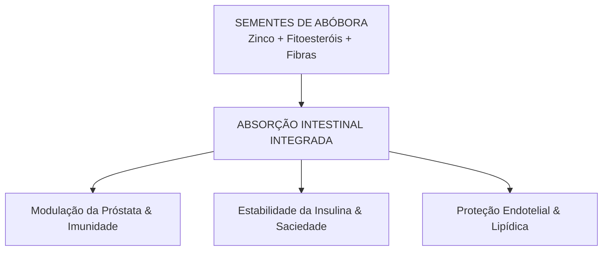

Autora: Silviane Silvério  
Data: 24 de julho de 2026  
Tempo médio de leitura: 6 minutos  

**Palavras-chave:** Sementes de abóbora, Cucurbita pepo, nutrição funcional, zinco, magnésio, fitoesteróis, saúde prostática, proteção cardiovascular, medicina preventiva.

---

> **© Conteúdo Autoral:** Todo o conteúdo desta postagem é de autoria de Silviane Silvério. Caso utilize este texto como referência em seus estudos, trabalhos ou publicações, solicitamos a gentileza de dar os devidos créditos à autora e incluir as referências bibliográficas. Para localizar a autora e a fonte do artigo, pesquise na internet: [https://praticasdebemestarsocial.github.io/blog/](https://praticasdebemestarsocial.github.io/blog/)
{: .prompt-info }

---

## Resumo

Quando pensamos na abóbora (*Cucurbita pepo*), a imagem que nos vem à mente é a de confortantes sopas ou pratos caseiros. Contudo, em seu interior reside um dos densos nutricionais mais potentes e negligenciados da naturopatia: suas sementes. Pequenas na forma, mas gigantescas em densidade fitoquímica, as sementes de abóbora oferecem uma matriz concentrada de zinco, magnésio, proteína vegetal e fitoesteróis. Resgatar esse alimento do descarte e incorporá-lo à rotina alimentar é uma estratégia acessível de medicina preventiva e autorregulação biológica.

---

## Desenvolvimento

### 1. Como um Tesouro Renegado ao Descarte Atua na Saúde Sistêmica?

As sementes de abóbora representam um exemplo fascinante de como a natureza concentra em estruturas modestas elementos vitais para a homeostase humana. Na rotina moderna, as sementes frequentemente são descartadas durante o preparo culinário, eliminando uma das fontes mais ricas de microminerais e antioxidantes lipofílicos.

Ao resgatarmos esse alimento do descarte e incorporá-lo de forma consciente ao cardápio diário, ativamos mecanismos de autorregulação biológica, imunomodulação e proteção endotelial, promovendo o bem-estar social e a saúde preventiva por meio da nutrição integral.

---

### 2. Bioquímica Funcional, Suporte Prostático e Regulação Metabólica

A matriz fitoquímica das sementes de abóbora atua sinergicamente em diversos eixos da saúde humana:

#### 1. Zinco e Saúde da Próstata
O teor elevado de zinco e fitoesteróis atua na modulação de processos inflamatórios no tecido prostático, auxiliando no manejo profilático da hiperplasia prostática benigna (HPB) e na integridade imunológica.

#### 2. Proteção Cardiovascular e Perfil Lipídico
Ricas em fitoesteróis (que competem com a absorção intestinal do colesterol) e em vitamina E, protegem o endotélio vascular contra o estresse oxidativo e ajudam na manutenção do colesterol LDL em níveis saudáveis.

#### 3. Estabilidade Glicêmica e Índice de Saciedade
Seu baixo índice glicêmico combinado à matriz de fibras e proteínas lentifica a liberação de glicose, evitando picos de insulina e favorecendo a saciedade sustentada ao longo do dia.

---

### Tabela Comparativa: Matriz Nutricional x Benefício Fisiológico

| Composto Bioativo | Concentração / Função Principal | Impacto Fisiológico / Benefício Sistêmico |
| :--- | :--- | :--- |
| **Zinco Biodisponível** | Cofator de mais de 300 enzimas e imunomodulador | Saúde prostática, integridade imune e cicatrização |
| **Magnésio e Potássio** | Eletrólitos e moduladores neuromusculares | Relaxamento vascular, controle pressórico e regulação do humor |
| **Fitoesteróis & Vitamina E** | Antioxidantes lipofílicos estruturais | Redução da absorção do colesterol LDL e proteção endotelial |
| **Proteínas & Fibras** | Aminoácidos essenciais e substrato intestinal | Retardo do esvaziamento gástrico e manutenção da massa magra |

---

### A Sinergia do Consumo Integrado

A incorporação das sementes de abóbora ativa o eixo metabólico-endócrino de forma equilibrada:

---

### 3. Prática Funcional e Preparo na Rotina de Autocuidado

Para aproveitar integralmente os compostos bioativos das sementes de abóbora no seu dia a dia:

* **Preparo e Tostagem Branda:** Lave as sementes para remover os resíduos da polpa, seque-as bem e leve ao forno em temperatura baixa/moderada com um fio de azeite e temperos funcionais (páprica, açafrão ou sal marinho). O aquecimento brando preserva os óleos essenciais e aumenta a crocância.
* **Aplicação Versátil:** Polvilhe 1 a 2 colheres de sopa sobre saladas frescas, sopas, iogurtes vegetais, aveia ou cremes.
* **Consumo Integrado:** Utilize-as como um snack intermediário entre as refeições para evitar compulsão por ultraprocessados.

---

## 4. Aprofunde seus Estudos na Ecologia do Ser, Nutrição Funcional e Práticas Integrativas

Se você é estudante, nutricionista, terapeuta integrativo, profissional da saúde, pesquisador ou entusiasta do autocuidado consciente:

📚 **Conheça os livros e cursos da nossa plataforma!**

Mergulhe no acervo acadêmico e nas formações exclusivas desenvolvidas por **Silviane Silvério** (Biomédica, Naturóloga e Escritora). Aprenda a integrar os alimentos funcionais, a naturopatia e os mapas de autoconhecimento na sua prática diária e atendimento profissional.

👉 [Clique aqui para explorar nossos Cursos e Livros na Plataforma](https://praticasdebemestarsocial.github.io/silvianesilverio/)

---

> ### ⚠️ Aviso Legal e Isenção de Responsabilidade (Disclaimer)
> Este texto possui finalidade estritamente voltada à educação em saúde, estilo de vida e divulgação de conceitos de nutrição funcional e naturopatia, sob a autoria de profissional Biomédica Naturopata.  
> O conteúdo exposto não configura, em nenhuma hipótese, diagnóstico ou tratamento médico individualizado. Caso apresente sintomas persistentes ou condições pré-existentes, busque orientação com profissionais habilitados.
{: .prompt-warning }

---

Quer pesquisar as referências acadêmicas e o histórico das minhas investigações em saúde integrativa, iridologia e saberes tradicionais? Acesse o meu currículo Lattes e ORCID:

* 🔗 **ORCID:** [https://orcid.org/0000-0001-6311-1195](https://orcid.org/0000-0001-6311-1195)
* 🔗 **Lattes:** [http://lattes.cnpq.br/7481458793724724](http://lattes.cnpq.br/7481458793724724)  
*(ID Lattes: 7481458793724724 | Registro Profissional: CRTH-BR 1741)*

---

*Com múltiplos olhos e um só coração,*  
**Silviane Silvério**  
*Olho Preditivo – Mapas do Autoconhecimento*

---

> **© Conteúdo Autoral:** Todo o conteúdo desta postagem é de autoria de Silviane Silvério. Licença CC BY-NC-ND 4.0 Internacional. Registros oficiais com DOI em Zenodo/OSF/HAL. Para localizar a autora e a fonte do artigo, pesquise na internet: [https://praticasdebemestarsocial.github.io/blog/](https://praticasdebemestarsocial.github.io/blog/)
{: .prompt-info }

---

**Reflexão para a comunidade:**  
Qual das propriedades das sementes de abóbora (suporte cardiovascular, proteção prostática ou regulação glicêmica) mais ressoa com o seu momento atual?  
Deixe seu comentário abaixo digitando a palavra **"VITALIDADE"** e compartilhe suas receitas e experiências com a nossa comunidade! 🌱✨
