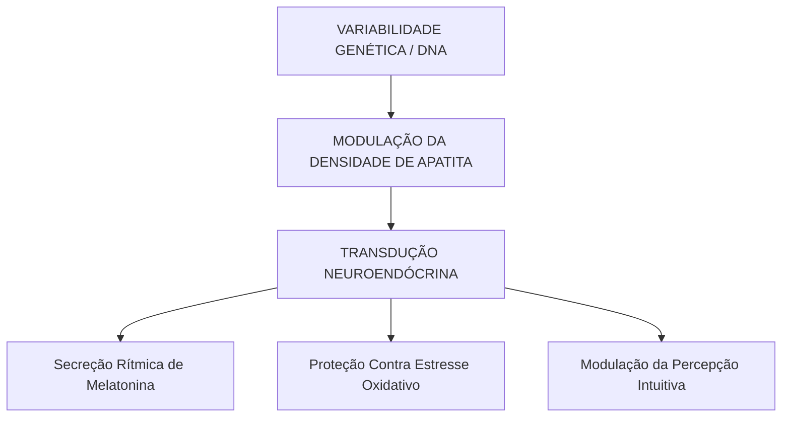

Autora: Silviane Silvério  
Data: 31 de julho de 2026  
Tempo médio de leitura: 10 minutos  

**Palavras-chave:** Glândula pineal, olho parietal, antropologia evolutiva, Sérgio Felipe de Oliveira, genética, neurobiologia, saúde integrativa, autoconhecimento.

---

> **© Conteúdo Autoral:** Todo o conteúdo desta postagem é de autoria de Silviane Silvério. Caso utilize este texto como referência em seus estudos, trabalhos ou publicações, solicitamos a gentileza de dar os devidos créditos à autora e incluir as referências bibliográficas. Para localizar a autora e a fonte do artigo, pesquise na internet: [https://praticasdebemestarsocial.github.io/blog/](https://praticasdebemestarsocial.github.io/blog/)
{: .prompt-info }

---

## Resumo

O conceito arquetípico do "Terceiro Olho" ganha um contorno científico quando investigado sob as lentes da antropologia evolutiva, da genética e da neurobiologia. Longe de ser apenas um mito esotérico, a glândula pineal (epífise cerebral) representa uma herança anatômica direta de um órgão fotorreceptor ancestral. Ao longo do processo de cefalização dos mamíferos, o olho parietal fotorreceptor migrou para a cavidade central do encéfalo, convertendo-se em uma complexa estrutura neuroendócrina. Este artigo analisa a jornada evolutiva da pineal, a biomineralização da matriz celular e a higiene circadiana.

---

## Desenvolvimento

### 1. Como a Transição Evolutiva do Olho Parietal Esculpiu o Centro da Percepção?

A investigação biológica do encéfalo revela que a glândula pineal possui uma história evolutiva extraordinária. Em vertebrados primitivos e ancestrais aquáticos, o órgão pineal comunicava-se diretamente com o meio exterior por meio de uma abertura no osso parietal da calota craniana (o olho parietal).

Com o avanço do processo evolutivo e o desenvolvimento do córtex cerebral nos mamíferos, essa estrutura retraiu-se para a região central do diencéfalo, mantendo, no entanto, células homólogas às da retina e fotorreceptores especializados.

Entender essa jornada evolutiva, alinhando os conceitos clássicos de René Descartes às pesquisas de biomineralização e modulação genético-circadiana, é fundamental para promover a autonomia no autocuidado e fortalecer o bem-estar social por meio do conhecimento integrativo.

---

### 2. Biomineralização, Polimorfismos Genéticos e Transdução Neuroendócrina

A fisiologia moderna e a antropologia biológica demonstram como a pineal atua na interface entre os estímulos ambientais e a resposta somática:

1. **A Herança do Olho Parietal:** Em vertebrados ancestrais (e em certas espécies atuais, como a tuatara *Sphenodon punctatus*), o olho parietal captava diretamente a radiação solar. Nos mamíferos, essa estrutura internalizou-se, mantendo células fotorreceptoras ativadas indiretamente via trato retinohipotalâmico.
2. **Biomineralização e Microcristais:** Estudos conduzidos pelo Dr. Sérgio Felipe de Oliveira (USP) investigam a presença de microcristais de calcita e apatita na matriz celular da pineal. Esses minerais formam um sistema de transdução biofísica capaz de responder a oscilações eletromagnéticas e influenciar estados de percepção.
3. **Assinatura Genética e Neurobiologia:** A variabilidade genética e polimorfismos em genes circadianos modulam a densidade receptora e a taxa de secreção hormonal, sugerindo uma base neurobiológica para a alta sensibilidade perceptiva e a intuição.

---

### Tabela Comparativa: Da Antropologia Evolutiva à Fisiologia Atual

| Estágio Evolutivo / Estrutura | Mecanismo Fisiológico | Impacto Neurobiológico | Aplicação na Saúde Integrativa |
| :--- | :--- | :--- | :--- |
| **Olho Parietal Ancestral** | Fotorrecepção direta na calota craniana | Sensibilidade à radiação e aos ciclos solares | Termorregulação e sincronização primitiva |
| **Glândula Pineal Interna** | Transdução neuroendócrina via trato óptico | Secreção de melatonina e modulação límbica | Proteção antioxidante central e regulação do sono |
| **Matriz Mineral (Apatita)** | Biomineralização e ressonância dielétrica | Interação com oscilações bioeletromagnéticas | Base fisiológica para sensibilidade perceptiva |

---

### A Cadeia Fisiológica da Percepção Expandida

A integração entre genética, anatomia e neuroquímica pode ser compreendida no seguinte fluxo de transdução:

---

### 3. Prática Funcional, Higiene Circadiana e Preservação Biológica

Para otimizar o funcionamento da glândula pineal e manter a clareza perceptiva no dia a dia:

* **Higiene da Luz (Sincronização Circadiana):** Exponha-se à luz solar natural logo no início da manhã para calibrar o relógio biológico. Ao anoitecer, reduza drasticamente a exposição à luz azul de telas (smartphones, computadores e TVs).
* **Ambiente de Descanso Isolado:** Garanta escuridão total no quarto durante a noite. A ausência de estímulos luminosos maximiza a síntese de melatonina, um dos antioxidantes endógenos mais potentes do cérebro.
* **Práticas de Desaceleração:** Cultive estados de meditação, silêncio e respiração consciente, favorecendo a diminuição do tom simpático e permitindo a modulação limbo-pineal.

---

## 4. Aprofunde seus Estudos na Ecologia do Ser, Neurobiologia e Saúde Integrativa

Se você é estudante, nutricionista, terapeuta integrativo, profissional da saúde, pesquisador ou entusiasta do autoconhecimento consciente:

📚 **Conheça os livros e cursos da nossa plataforma!**

Mergulhe no acervo acadêmico e nas formações exclusivas desenvolvidas por **Silviane Silvério** (Biomédica, Naturóloga e Escritora). Aprenda a integrar os conhecimentos da antropologia evolutiva, a neurobiologia e os mapas de autoconhecimento na sua prática diária e atendimento profissional.

👉 [Clique aqui para explorar nossos Cursos e Livros na Plataforma](https://praticasdebemestarsocial.github.io/silvianesilverio/)

---

> ### ⚠️ Aviso Legal e Isenção de Responsabilidade (Disclaimer)
> Este artigo possui finalidade estritamente voltada à educação em saúde, bem-estar e divulgação científica no campo das terapias integrativas e somáticas, sob a autoria de profissional Biomédica Naturopata. As correlações entre evolução biológica, genética e a metáfora do "terceiro olho" representam modelos teóricos e de revisão integrativa, não configurando diagnóstico ou tratamento médico para distúrbios neurológicos ou endócrinos.
{: .prompt-warning }

---

## Referências Bibliográficas

- **OLIVEIRA, Sérgio Felipe de.** *A Pineal: Visão e Mitos.* São Paulo: Madras, 2010.
- **MOORE, K. L.; PERSAUD, T. V. N.; TORCHIA, M. G.** *Embriologia Clínica.* 11. ed. Rio de Janeiro: Elsevier, 2020.
- **QUAY, W. B.** *Pineal Gland.* New York: Pergamon Press, 1972.
- **SILVÉRIO, Silviane de Souza.** *Pesquisas em Saúde Integrativa, Neurobiologia e Saberes Tradicionais.* São Paulo, 2025.

---

Quer pesquisar as referências acadêmicas e o histórico das minhas investigações em saúde integrativa, iridologia e saberes tradicionais? Acesse o meu currículo Lattes e ORCID:

* 🔗 **ORCID:** [https://orcid.org/0000-0001-6311-1195](https://orcid.org/0000-0001-6311-1195)
* 🔗 **Lattes:** [http://lattes.cnpq.br/7481458793724724](http://lattes.cnpq.br/7481458793724724)  
*(ID Lattes: 7481458793724724 | Registro Profissional: CRTH-BR 1741)*

---

*Com múltiplos olhos e um só coração,*  
**Silviane Silvério**  
*Olho Preditivo – Mapas do Autoconhecimento*

---

> **© Conteúdo Autoral:** Todo o conteúdo desta postagem é de autoria de Silviane Silvério. Licença CC BY-NC-ND 4.0 Internacional. Registros oficiais com DOI em Zenodo/OSF/HAL. Para localizar a autora e a fonte do artigo, pesquise na internet: [https://praticasdebemestarsocial.github.io/blog/](https://praticasdebemestarsocial.github.io/blog/)
{: .prompt-info }

---

**Reflexão para a comunidade:**  
O que mais te impressionou ao descobrir que a sua glândula pineal é um olho ancestral internalizado ao longo da evolução e que a intuição possui bases genéticas?  
Deixe seu comentário abaixo digitando a palavra **"EVOLUÇÃO"** e compartilhe suas percepções com a nossa comunidade de pesquisadores! 🌱✨
