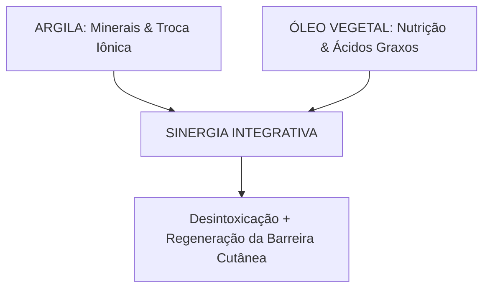

Autora: Silviane Silvério  
Data: 30 de julho de 2026  
Tempo médio de leitura: 10 minutos  

**Palavras-chave:** Argiloterapia, geoterapia, óleos vegetais, fitoterapia, trocas iônicas, manto hidrolipídico, estética integrativa, biomedicina.

---

> **© Conteúdo Autoral:** Todo o conteúdo desta postagem é de autoria de Silviane Silvério. Caso utilize este texto como referência em seus estudos, trabalhos ou publicações, solicitamos a gentileza de dar os devidos créditos à autora e incluir as referências bibliográficas. Para localizar a autora e a fonte do artigo, pesquise na internet: [https://praticasdebemestarsocial.github.io/blog/](https://praticasdebemestarsocial.github.io/blog/)
{: .prompt-info }

---

## Resumo

A argiloterapia é uma das Práticas Integrativas e Complementares em Saúde (PICS) mais antigas da humanidade. Longe de ser apenas um cuidado estético superficial, a aplicação de geoterápicos atua por meio de trocas iônicas: a argila doa minerais essenciais para os tecidos enquanto absorve toxinas, sujidades e metabólitos celulares. Quando aliada à fitoterapia dos óleos vegetais prensados a frio, essa prática ganha uma nova dimensão, preservando o manto hidrolipídico e potencializando a permeação de fitoquímicos terapêuticos. Este artigo aborda a bioquímica das argilas, as vias de aplicação e os protocolos integrativos de geoterapia.

---

## Desenvolvimento

### 1. Como a Combinação de Minerais Ancestrais e Lipídios Botânicos Transforma a Pele?

A utilização da argila para fins curativos e estéticos atravessa a história das civilizações, desde o Egito Antigo e a Grécia Clássica até as medicinas nativas das Américas. 

A argiloterapia baseia-se na **adsorção e troca iônica**: os minerais estruturais das argilas (como silício, alumínio, ferro, magnésio e cálcio) interagem com a epiderme, doando oligoelementos e removendo o excesso de sebo, resíduos poluentes e toxinas acumuladas.

Quando aliada à fitoterapia dos óleos vegetais extravirgens (prensados a frio), a argiloterapia é potencializada. A adição de lipídios nutritivos impede o ressecamento excessivo, preserva a barreira cutânea e favorece a ação dos princípios ativos botânicos.

Compreender essa sinergia permite criar protocolos seguros e eficientes, promovendo a autonomia no autocuidado e o bem-estar social por meio da reconexão com os saberes da terra.

---

### 2. Vias de Aplicação, Perfil dos Minerais e Sinergia Vegetal

A versatilidade da argiloterapia manifesta-se em diferentes formas de aplicação tópica:

* **Máscaras Faciais e Corporais:** Promovem limpeza profunda dos poros, regulação sebostática e melhoria da textura cutânea.
* **Cataplasmas:** Aplicação em camada espessa (recoberta com tecido úmido) excelente para o alívio de dores musculares, processos inflamatórios articulares e desconfortos dermatológicos.
* **Compressas:** Misturas fluidadas aplicadas em panos para o alívio de cefaleias tensionais e cólicas.
* **Banhos de Argila:** Auxiliam na desintoxicação sistêmica da pele e no relaxamento neuromuscular.

> ⚠️ **Alerta Terapêutico:** O uso oral (ingestão) de argilas apresenta riscos sérios de obstrução intestinal, interferência na absorção de nutrientes vitais e toxicidade por metais pesados. Por razões de biossegurança, a aplicação deve ser estritamente tópica e externa.
{: .prompt-danger }

---

### Tabela Comparativa: Propriedades dos Tipos de Argila

| Tipo de Argila | Minerais Predominantes | Ação Terapêutica Principal | Indicação Cutânea / Corporal |
| :--- | :--- | :--- | :--- |
| **Argila Verde** | Silício, Alumínio, Óxido de Ferro | Purificante, adstringente e sebostática | Peles oleosas, acneicas e desintoxicação corporal |
| **Argila Branca (Caulim)** | Caulinita, Alumínio | Calmante, cicatrizante e suave clareadora | Peles sensíveis, secas, maduras e com rosácea |
| **Argila Vermelha** | Óxido de Ferro e Cobre | Vasodilatadora e revitalizante | Peles maduras, sem viço e circulação periférica |
| **Argila Amarela** | Silício e Oligoelementos | Tensora, remineralizante e suavizante | Peles fadigadas e prevenção do envelhecimento |
| **Argila Rosa** | Mistura de Vermelha e Branca | Equilibrante, iluminadora e suave | Peles reativas e delicadas que buscam vitalidade |
| **Argila Preta (Vulcânica)** | Matéria orgânica e Carvão mineral | Adsorção profunda e desintoxicação | Protocolos detox e pele excessivamente oleosa |
| **Argila Rhassoul** | Magnésio e Potássio | Limpeza respeitosa sem desidratar | Couro cabeludo, cabelos e peles desidratadas |

---

### A Sinergia Botânica com Óleos Vegetais

A escolha do vetor lipídico é fundamental para enriquecer a pasta de argila com fitoquímicos específicos:

* **Anti-inflamatórios e Analgésicos:** Andiroba e Arnica (alívio muscular e contusões).
* **Calmantes e Cicatrizantes:** Calêndula e Camomila (peles irritadas e reativas).
* **Nutritivos e Regeneradores:** Rosa Mosqueta e Argan (linhas de expressão, marcas e cicatrizes).
* **Equilibrantes e Leves:** Jojoba (regulador de sebo) e Semente de Uva (antioxidante de rápida absorção).

---

### 3. Prática e Preparação do Protocolo Integrativo

Para preparar uma máscara de argila equilibrada e segura em casa ou no consultório:

1. **Preparo do Recipiente:** Utilize sempre recipientes de cerâmica, vidro ou madeira. Evite utensílios metálicos, pois o metal pode alterar as cargas elétricas e iônicas dos minerais da argila.
2. **Proporção Ideal:** Misture 2 colheres de sopa de argila com água mineral, chá concentrado ou hidrolato até formar uma pasta cremosa.
3. **Enriquecimento Lipídico:** Adicione de 5 a 10 gotas do óleo vegetal mais adequado à necessidade da pele.
4. **Aplicação Consciente:** Aplique uma camada generosa sobre a pele limpa. **Não deixe a argila secar completamente na pele** (borrifar água ou hidrolato se necessário), pois a secagem total retira a umidade da própria epiderme.

---

## 4. Aprofunde seus Estudos na Ecologia do Ser, Fitoterapia e Saúde Integrativa

Se você é estudante, nutricionista, terapeuta integrativo, profissional da saúde, cosmetólogo ou entusiasta do autocuidado consciente:

📚 **Conheça os livros e cursos da nossa plataforma!**

Mergulhe no acervo acadêmico e nas formações exclusivas desenvolvidas por **Silviane Silvério** (Biomédica, Naturóloga e Escritora). Aprenda a integrar os geoterápicos, a fitoterapia e os mapas de autoconhecimento na sua prática pessoal e profissional.

👉 [Clique aqui para explorar nossos Cursos e Livros na Plataforma](https://praticasdebemestarsocial.github.io/silvianesilverio/)

---

> ### ⚠️ Aviso Legal e Isenção de Responsabilidade (Disclaimer)
> Este artigo possui finalidade estritamente educativa, informativa e de divulgação de conceitos de argiloterapia, fitoterapia e Práticas Integrativas e Complementares em Saúde (PICS), sob a autoria de profissional Biomédica Naturopata.  
> O conteúdo exposto não configura diagnóstico ou tratamento médico dermatológico. Pessoas com pele atópica, alergias conhecidas ou feridas abertas devem consultar um profissional de saúde habilitado.
{: .prompt-warning }

---

## Referências Bibliográficas

- **CARVALHO, M. A. R.** *Argiloterapia: Saúde e Estética com Argilas.* São Paulo: Editora Senac, 2018.
- **KARAGÜL, S. et al.** The use of clay in medicine: A review. *Journal of Clinical and Analytical Medicine*, v. 9, n. 3, 2018.
- **SILVÉRIO, Silviane de Souza.** *Pesquisas em Dietoterapia, Saúde Integrativa e Saberes Tradicionais.* São Paulo, 2025.

---

Quer pesquisar as referências acadêmicas e o histórico das minhas investigações em saúde integrativa, iridologia e saberes tradicionais? Acesse o meu currículo Lattes e ORCID:

* 🔗 **ORCID:** [https://orcid.org/0000-0001-6311-1195](https://orcid.org/0000-0001-6311-1195)
* 🔗 **Lattes:** [http://lattes.cnpq.br/7481458793724724](http://lattes.cnpq.br/7481458793724724)  
*(ID Lattes: 7481458793724724 | Registro Profissional: CRTH-BR 1741)*

---

*Com múltiplos olhos e um só coração,*  
**Silviane Silvério**  
*Olho Preditivo – Mapas do Autoconhecimento*

---

> **© Conteúdo Autoral:** Todo o conteúdo desta postagem é de autoria de Silviane Silvério. Licença CC BY-NC-ND 4.0 Internacional. Registros oficiais com DOI em Zenodo/OSF/HAL. Para localizar a autora e a fonte do artigo, pesquise na internet: [https://praticasdebemestarsocial.github.io/blog/](https://praticasdebemestarsocial.github.io/blog/)
{: .prompt-info }

---

**Reflexão para a comunidade:**  
Qual argila ou óleo vegetal você mais utiliza no seu ritual de autocuidado? Já experimentou combinar a argila verde com óleo de andiroba ou a branca com rosa mosqueta?  
Deixe seu comentário abaixo digitando a palavra **"ARGILA"** e compartilhe suas dúvidas e receitas com nossa comunidade! 🌱✨
