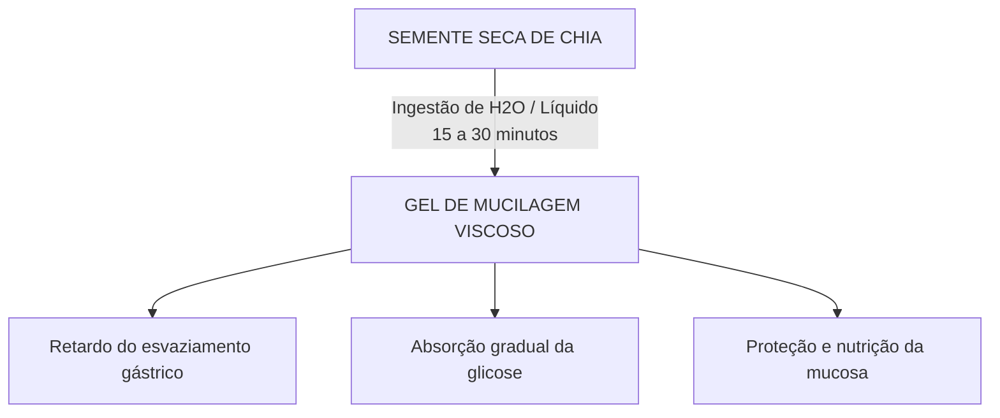

Autora: Silviane Silvério  
Data: 31 de julho de 2026  
Tempo médio de leitura: 8 minutos  

**Palavras-chave:** Chia, Salvia hispanica, mucilagem, ômega-3, fibras solúveis, modulação glicêmica, saciedade, dietoterapia, alimentos funcionais.

---

> **© Conteúdo Autoral:** Todo o conteúdo desta postagem é de autoria de Silviane Silvério. Caso utilize este texto como referência em seus estudos, trabalhos ou publicações, solicitamos a gentileza de dar os devidos créditos à autora e incluir as referências bibliográficas. Para localizar a autora e a fonte do artigo, pesquise na internet: [https://praticasdebemestarsocial.github.io/blog/](https://praticasdebemestarsocial.github.io/blog/)
{: .prompt-info }

---

## Resumo

A chia (*Salvia hispanica*) é amplamente reconhecida pela ciência da nutrição como um alimento funcional de altíssima densidade nutricional. Distante de ser uma mera "semente para emagrecimento", sua composição oferece uma combinação harmoniosa de ácidos graxos ômega-3 (ALA), fibras solúveis mucilaginosas e antioxidantes de alta biodisponibilidade. Quando integrada de forma consciente à dietoterapia, a chia atua como um potente modulador da resposta glicêmica pós-prandial, promovendo a saciedade e protegendo a mucosa intestinal. Este artigo analisa a bioquímica, a física da mucilagem e o uso seguro da chia.

---

## Desenvolvimento

### 1. Como a Sinergia entre Mucilagens, Lipídios e Fitonutrientes Atua no Controle Metabólico?

Originária da América Central e cultivada há milênios pelos maias e astecas, a chia (*Salvia hispanica*) era valorizada como uma fonte concentrada de energia e resistência física para guerreiros e mensageiros.

Na nutrição e naturologia contemporâneas, a chia destaca-se por sua capacidade extraordinária de retenção hídrica e pela presença de antioxidantes potentes (como quercetina, caempferol e ácido clorogênico).

Compreender a bioquímica dessa semente e a obrigatoriedade de sua hidratação prévia é fundamental para extrair seus benefícios terapêuticos com total segurança e promover a autonomia no autocuidado.

---

### 2. Bioquímica Funcional, Mecanismo de Mucilagem e Modulação Glicêmica

A complexidade nutricional da chia atua em múltiplos sistemas do organismo:

* **Ômega-3 Vegetal (Ácido Alfa-Linolênico - ALA):** Importante cardioprotetor com ação modulatória na cascata inflamatória sistêmica.
* **Fibras de Alta Viscosidade:** Com cerca de 34g de fibras por 100g de produto, possui uma fração solúvel que, ao contato com a água, expande-se e forma um gel denso e viscoso (mucilagem).
* **Proteína Completa e Oligoelementos:** Fornece aminoácidos essenciais, cálcio, magnésio, fósforo e fitoquímicos protetores da barreira tecidual.

---

### Tabela Comparativa: Mecanismo Metabólico da Chia x Impacto Fisiológico

| Componente Bioquímico | Mecanismo de Ação no Trato Digestório | Resultado Sistêmico / Benefício |
| :--- | :--- | :--- |
| **Mucilagem (Fibras Solúveis)** | Retardo do esvaziamento gástrico por aumento de volume no estômago | Estímulo vagal de saciedade e redução de picos de fome |
| **Rede Gelificada Intestinal** | Lentificação da quebra e absorção de carboidratos complexos | Controle da glicemia e estabilidade da insulina pós-prandial |
| **Fibras Fermentáveis** | Substrato para microbiota do cólon (produção de AGCC) | Manutenção da eubiose e integridade da mucosa intestinal |
| **Ácido Alfa-Linolênico (ALA)** | Modulação de eicosanoides e citocinas pró-inflamatórias | Suporte endotelial e ação cardioprotetora |

---

### A Física da Hidratação: Formação do Gel de Mucilagem

O consumo da semente de chia seca sem o aporte hídrico adequado pode retirar umidade das paredes do trato gastrointestinal, gerando estase fecal, desconforto abdominal ou até mesmo risco de obstrução.

---

### 3. Formas Ideais de Preparo e Precauções na Prática Clínica

Para otimizar a biodisponibilidade e garantir o uso seguro na rotina:

1. **Preparo do Gel de Chia:** Misture 1 colher de sopa (aprox. 15g) em 100mL de água, leite vegetal ou suco natural. Aguarde de 15 a 30 minutos até a formação do gel antes de consumir com frutas, vitaminas ou iogurtes.
2. **Uso em Pratos Secos:** Caso polvilhada diretamente em saladas ou refeições prontas, é indispensável a ingestão imediata de ao menos um copo grande de água (250mL).
3. **Aporte Hídrico Diário:** O consumo regular de sementes mucilaginosas exige a ingestão hídrica diária de, no mínimo, 2 litros de água.
4. **Atenção Terapêutica:** Devido ao efeito modulador sobre a viscosidade sanguínea (pelo teor de ômega-3) e à regulação glicêmica, indivíduos em uso de medicamentos anticoagulantes, antiagregantes plaquetários ou hipoglicemiantes orais devem ter seu consumo monitorado por profissional de saúde habilitado.

---

## 4. Aprofunde seus Estudos na Ecologia do Ser, Dietoterapia e Saúde Integrativa

Se você é estudante, nutricionista, terapeuta integrativo, profissional da saúde ou entusiasta do autocuidado consciente:

📚 **Conheça os livros e cursos da nossa plataforma!**

Mergulhe no acervo acadêmico e nas formações exclusivas desenvolvidas por **Silviane Silvério** (Biomédica, Naturóloga e Escritora). Aprenda a integrar os alimentos funcionais, a dietoterapia e os mapas de autoconhecimento na sua prática pessoal e profissional.

👉 [Clique aqui para explorar nossos Cursos e Livros na Plataforma](https://praticasdebemestarsocial.github.io/silvianesilverio/)

---

> ### ⚠️ Aviso Legal e Isenção de Responsabilidade (Disclaimer)
> Este artigo possui finalidade estritamente educativa, nutricional e de divulgação de conceitos de dietoterapia e Práticas Integrativas e Complementares em Saúde (PICS), sob a autoria de profissional Biomédica Naturopata.  
> O conteúdo exposto não configura prescrição dietética individualizada ou tratamento de doenças. Pessoas com disfagia, síndrome do intestino irritável grave ou em uso de medicação contínua devem consultar um profissional habilitado.
{: .prompt-warning }

---

## Referências Bibliográficas

- **AYALA, L. A. et al.** Salvia hispanica L. (Chia) as a functional food: A review of its nutritional and therapeutic properties. *Journal of Functional Foods*, v. 52, p. 528-538, 2019.
- **BRASIL. ANVISA.** *Tabela Brasileira de Composição de Alimentos (TBCA).* São Paulo: NUPENS/USP, 2023.
- **VUKSAN, V. et al.** Chia seed (Salvia hispanica L.) improves postprandial glycemia and satiety in healthy subjects. *European Journal of Clinical Nutrition*, v. 71, n. 1, p. 103-109, 2017.
- **SILVÉRIO, Silviane de Souza.** *Pesquisas em Saúde Integrativa, Fitoterapia e Práticas Naturais.* São Paulo, 2025.

---

Quer pesquisar as referências acadêmicas e o histórico das minhas investigações em saúde integrativa, iridologia e saberes tradicionais? Acesse o meu currículo Lattes e ORCID:

* 🔗 **ORCID:** [https://orcid.org/0000-0001-6311-1195](https://orcid.org/0000-0001-6311-1195)
* 🔗 **Lattes:** [http://lattes.cnpq.br/7481458793724724](http://lattes.cnpq.br/7481458793724724)  
*(ID Lattes: 7481458793724724 | Registro Profissional: CRTH-BR 1741)*

---

*Com múltiplos olhos e um só coração,*  
**Silviane Silvério**  
*Olho Preditivo – Mapas do Autoconhecimento*

---

> **© Conteúdo Autoral:** Todo o conteúdo desta postagem é de autoria de Silviane Silvério. Licença CC BY-NC-ND 4.0 Internacional. Registros oficiais com DOI em Zenodo/OSF/HAL. Para localizar a autora e a fonte do artigo, pesquise na internet: [https://praticasdebemestarsocial.github.io/blog/](https://praticasdebemestarsocial.github.io/blog/)
{: .prompt-info }

---

**Reflexão para a comunidade:**  
Como você costuma consumir a chia no seu dia a dia? Já experimentou prepará-la previamente em forma de gel ou costuma polvilhá-la sobre os alimentos?  
Deixe seu comentário abaixo digitando a palavra **"NUTRIÇÃO"** e compartilhe suas receitas e experiências com nossa comunidade! 🌱✨
