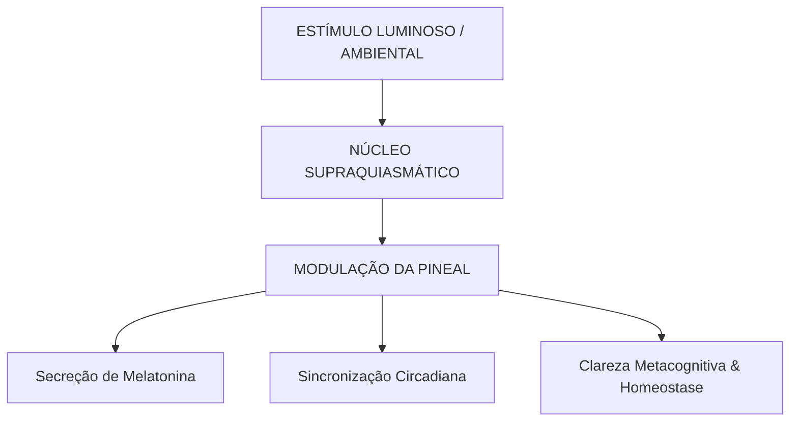

Autora: Silviane Silvério  
Data: 31 de julho de 2026  
Tempo médio de leitura: 9 minutos  

**Palavras-chave:** René Descartes, glândula pineal, dualismo cartesiano, res cogitans, res externa, dúvida metódica, neuroendocrinologia, metacognição, saúde integrativa.

---

> **© Conteúdo Autoral:** Todo o conteúdo desta postagem é de autoria de Silviane Silvério. Caso utilize este texto como referência em seus estudos, trabalhos ou publicações, solicitamos a gentileza de dar os devidos créditos à autora e incluir as referências bibliográficas. Para localizar a autora e a fonte do artigo, pesquise na internet: [https://praticasdebemestarsocial.github.io/blog/](https://praticasdebemestarsocial.github.io/blog/)
{: .prompt-info }

---

## Resumo

René Descartes (1596–1650) transformou radicalmente a história do pensamento ocidental ao propor que a razão e o rigor matemático eram os instrumentos soberanos para compreender o universo. Contudo, para além das equações e do plano cartesiano, o "Pai da Filosofia Moderna" debruçou-se sobre a questão fundamental da existência humana: como a consciência imaterial (*res cogitans*) interage com o corpo físico e mecânico (*res extensa*)? Em suas obras *Meditações sobre a Filosofia Primeira* (1641) e *As Paixões da Alma* (1649), Descartes investigou a neuroanatomia para identificar o ponto de convergência entre a mente e a matéria: a glândula pineal. Este artigo aborda a atualização da dúvida metódica na neurobiologia e na saúde integrativa.

---

## Desenvolvimento

### 1. Como a Dúvida Metódica Conecta o Racionalismo à Neurobiologia da Percepção?

A revolução cartesiana fundou o racionalismo ocidental ao propor que a dúvida sistemática é a ferramenta indispensável para libertar a mente de dogmas, ilusões sensoriais e vieses cognitivos.

Contudo, ao isolar o ato de pensar como prova irrefutável da existência (*Cogito, ergo sum*), Descartes assumiu o desafio de equacionar o diálogo contínuo entre a psique e o somatismo.

Revisitar a jornada cartesiana, integrando o método da dúvida radical aos conhecimentos da neurobiologia moderna, oferece ferramentas práticas para a metacognição, a regulação neuroendócrina circadiana e o desenvolvimento do autocuidado consciente.

---

### 2. Do Dualismo Cartesiano à Fisiologia do Sistema Neuroendócrino

A escolha de Descartes pela glândula pineal não foi fruto do acaso, mas baseou-se em observações anatômicas cuidadosas para a época:

* **Unicidade e Centralização:** Ao contrário de quase todas as outras estruturas encefálicas, que se apresentam duplicadas nos hemisférios esquerdo e direito, a glândula pineal revelou-se ímpar, centralizada e indivisa. Para Descartes, a unidade da consciência humana exigia um ponto físico único de síntese.
* **Localização Ventricular:** Suspensa nas proximidades dos ventrículos cerebrais, ele postulou que ela funcionava como uma válvula reguladora do fluxo dos "espíritos animais" (os fluidos que ele teorizava moverem os nervos e músculos, conceito traduzido pela neurologia moderna como impulsos bioelétricos e neurotransmissores).

---

### Tabela Comparativa: O Dualismo Cartesiano e a Neurobiologia Integrativa

| Conceito Cartesiano | Descrição Filosófica (Século XVII) | Leitura Neurobiológica Atual | Aplicação na Saúde Integrativa |
| :--- | :--- | :--- | :--- |
| **Res Cogitans** | Substância pensante, imaterial, não extensa e indivisível. | Processamento pré-frontal de alta ordem, consciência e metacognição. | Autorregulação mental e desidentificação de reações automáticas. |
| **Res Extensa** | A matéria biológica como máquina mecânica sujeita às leis físicas. | Sistema nervoso autônomo, eixos hormonais e matriz somática. | Intervenções no estilo de vida, modulação do estresse e saúde somática. |
| **Ponte Pineal** | Centro único de convergência entre a mente pensante e o corpo físico. | Transdução neuroendócrina: conversão do sinal luminoso em melatonina. | Regulação do ritmo circadiano, preservação do sono e homeostase. |

---

### O Circuito de Integração Neurobiológica

A ciência contemporânea ressignificou a mecânica dos "espíritos animais", demonstrando como o ambiente externo modula a função pineal e reflete na percepção do indivíduo:

---

### 3. Três Caminhos para a Atualização do Método Cartesiano no Autoconhecimento

Inspirando-se na dúvida metódica e na interatividade corpo-mente, podemos estruturar uma prática de autoinvestigação para a autorregulação e desconstrução de padrões psicossomáticos:

1. **Mapeamento da Res Extensa (Identificação do Sintoma Somático):** Observe com neutralidade a manifestação física no corpo (como uma tensão muscular crônica, alteração respiratória ou desconforto gastrointestinal) diante de situações de estresse.
2. **Questionamento da Origem Psíquica (Aplicação da Dúvida Metódica):** Duvide da interpretação automática de que se trata de uma reação puramente externa ou mecânica. Pergunte-se: *"Esta resposta biológica está sendo sustentada por um padrão de pensamento, memória ou gatilho da mente?"*
3. **Intervenção Consciente e Reprogramação (Soberania da Res Cogitans):** Utilize a atenção focada, a modulação respiratória e a presença metacognitiva para interromper o condicionamento nervoso automático, reestabelecendo a homeostase e a clareza interior.

---

## 4. Expanda seus Estudos em Epistemologia, Neurobiologia e Saúde Integrativa

Se você é pesquisador, profissional da saúde, terapeuta integrativo, estudante ou praticante do autoconhecimento consciente:

📚 **Conheça os livros e cursos da nossa plataforma!**

Explore o catálogo de publicações e formações desenvolvidas por **Silviane Silvério** (Biomédica, Naturóloga e Escritora) e aprenda a articular os fundamentos históricos da ciência, a neurobiologia moderna e as abordagens integrativas na sua prática diária.

👉 [Clique aqui para explorar nossos Cursos e Livros na Plataforma](https://praticasdebemestarsocial.github.io/silvianesilverio/)

---

> ### ⚠️ Aviso Legal e Isenção de Responsabilidade (Disclaimer)
> Este artigo possui finalidade estritamente voltada à educação em saúde, estilo de vida e divulgação de conceitos históricos e integrativos, sob a autoria de profissional Biomédica Naturopata. As correlações filosóficas e anatômicas representam marcos da história do pensamento humano e não configuram diagnóstico, tratamento ou orientação médica para distúrbios de ordem neurológica, endócrina ou psiquiátrica.
{: .prompt-warning }

---

## Referências Bibliográficas

- **DESCARTES, René.** *Meditações sobre a Filosofia Primeira.* São Paulo: Martins Fontes, 2001.
- **DESCARTES, René.** *As Paixões da Alma.* São Paulo: Martins Fontes, 2004.
- **SILVÉRIO, Silviane de Souza.** *Pesquisas em Saúde Integrativa, Neurobiologia e Saberes Tradicionais.* São Paulo, 2025.

---

Quer pesquisar as referências acadêmicas e o histórico das minhas investigações em saúde integrativa, iridologia e saberes tradicionais? Acesse o meu currículo Lattes e ORCID:

* 🔗 **ORCID:** [https://orcid.org/0000-0001-6311-1195](https://orcid.org/0000-0001-6311-1195)
* 🔗 **Lattes:** [http://lattes.cnpq.br/7481458793724724](http://lattes.cnpq.br/7481458793724724)  
*(ID Lattes: 7481458793724724 | Registro Profissional: CRTH-BR 1741)*

---

*Com múltiplos olhos e um só coração,*  
**Silviane Silvério**  
*Olho Preditivo – Mapas do Autoconhecimento*

---

> **© Conteúdo Autoral:** Todo o conteúdo desta postagem é de autoria de Silviane Silvério. Licença CC BY-NC-ND 4.0 Internacional. Registros oficiais com DOI em Zenodo/OSF/HAL. Para localizar a autora e a fonte do artigo, pesquise na internet: [https://praticasdebemestarsocial.github.io/blog/](https://praticasdebemestarsocial.github.io/blog/)
{: .prompt-info }

---

**Reflexão para a comunidade:**  
Você já havia considerado como muitas das reações e dores do seu corpo físico (*res extensa*) são respostas a padrões armazenados na sua mente (*res cogitans*)?  
Deixe seu comentário abaixo compartilhando suas reflexões e participe da discussão digitando a palavra **"PINEAL"**! 🧠✨
