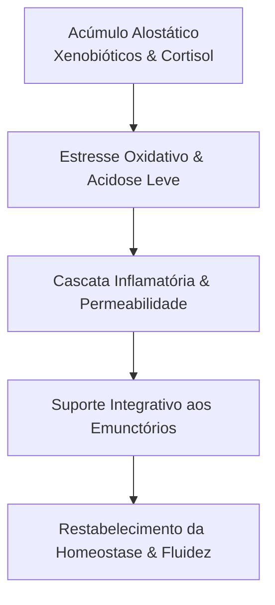

Autora: Silviane Silvério  
Data: 31 de julho de 2026  
Tempo médio de leitura: 8 minutos  

**Palavras-chave:** Desintoxicação fisiológica, inflamação crônica, estresse oxidativo, equilíbrio ácido-base, emunctórios, biotransformação hepática, saúde integrativa, naturopatia.

---

> **© Conteúdo Autoral:** Todo o conteúdo desta postagem é de autoria de Silviane Silvério. Caso utilize este texto como referência em seus estudos, trabalhos ou publicações, solicitamos a gentileza de dar os devidos créditos à autora e incluir as referências bibliográficas. Para localizar a autora e a fonte do artigo, pesquise na internet: [https://praticasdebemestarsocial.github.io/blog/](https://praticasdebemestarsocial.github.io/blog/)
{: .prompt-info }

---

## Resumo

A sensação persistente de fadiga, o inchaço frequente e a "peso" corporal não devem ser encarados com protocolos de desintoxicação punitivos ou jejuns radicais desprovidos de base científica. Na visão da saúde integrativa e da naturopatia fisiológica, desintoxicar significa dar suporte biológico aos emunctórios naturais do organismo, como fígado, rins, intestino, pele e pulmões. A exposição contínua a xenobióticos, somada ao estresse oxidativo e à dieta ocidental acidificante, supera a capacidade de excreção natural. Este artigo analisa os mecanismos de biotransformação endógena, o equilíbrio ácido-base e as estratégias integrativas para a restauração metabólica.

---

## Desenvolvimento

### 1. Como o Suporte aos Emunctórios Endógenos Reduz a Carga Alostática e a Inflamação?

O corpo humano foi biologicamente equipado com uma complexa malha de eliminação de resíduos metabólicos. Fígado, rins, intestino, pele e pulmões trabalham em sinergia ininterrupta para manter a homeostase do terreno biológico.

Contudo, quando a exposição diária a poluentes, aditivos alimentares, metais pesados e cortisol elevado ultrapassa a capacidade fisiológica de depuração, o organismo entra em estado de estresse oxidativo e acidose metabólica de baixo grau.

Entender os mecanismos de biotransformação endógena é o primeiro passo para restaurar o equilíbrio ácido-base, modular a inflamação crônica e promover o bem-estar social por meio do autoconhecimento biológico.

---

### 2. Os Mecanismos de Biotransformação e as Vias de Excreção Celular

O corpo humano possui sistemas sofisticados para lidar com produtos finais de glicação avançada, radicais livres e toxinas ambientais:

1. **Biotransformação Hepática (Fases I e II):** No fígado, os citocromos P450 (Fase I) alteram a estrutura do xenobiótico, enquanto as reações de conjugação (Fase II, com glutationa, glicina e sulfato) tornam as substâncias lipofílicas em metabólitos hidrossolúveis para posterior excreção.
2. **Filtração e Equilíbrio Ácido-Base Renal:** Os rins regulam o pH sanguíneo excretando íons de hidrogênio e reabsorvendo bicarbonato, eliminando toxinas solúveis em água através da urina.
3. **Barreira Intestinal e Microbiota:** Um microbioma saudável e uma mucosa íntegra impedem a reabsorção de toxinas biliares (circulação entero-hepática) e a translocação bacteriana.
4. **Excreção Cutânea (Sudorese):** A pele atua como um emunctório vital complementar, excretando compostos lipofílicos, metais pesados e eletrólitos através do suor.

---

### Tabela Comparativa: Vias Emunctórias e Estratégias de Suporte Integrativo

| Órgão Emunctório | Função Fisiológica Principal | Marcadores de Sobrecarga | Estratégia de Suporte Integrativo |
| :--- | :--- | :--- | :--- |
| **Fígado** | Biotransformação enzimática (Fases I e II) | Dificuldade digestiva de gorduras, fadiga pós-prandial | Sulforafanos (crucíferas), Alicina (alho), Glutationa |
| **Rins** | Filtração glomerular e controle do pH | Retenção de líquidos, urina muito concentrada | Hidratação estratégica com minerais, dieta de baixo PRAL |
| **Intestino** | Excreção fecal e barreira imunológica | Constipação, distensão abdominal, disbiose | Fibras solúveis e insolúveis, prebióticos naturais |
| **Pele** | Transpiração e eliminação lipofílica | Acne, dermatites, pele opaca ou sem viço | Sudorese induzida (exercícios, sauna), hidratação orgânica |

---

### O Ciclo Fisiológico da Carga Tóxica à Restauração Metabólica

A dinâmica entre sobrecarga metabólica, estresse oxidativo e restauração ocorre nas seguintes etapas contínuas:

---

### 3. Estratégias Práticas para Ativar a Desintoxicação Natural

Para auxiliar seu corpo a retomar a eficiência metabólica diária sem agressões radicais:

* **Hidratação Mineralizada:** Consuma água ao longo do dia com pequenas adições minerais (como uma pitada de sal marinho não refinado ou limão) para favorecer a entrada celular do líquido e apoiar o equilíbrio renal.
* **Nutrição Hepatoprotetora:** Inclua diariamente vegetais crucíferos (brócolis, couve, rúcula), beterraba e fontes de antioxidantes que auxiliam na produção de glutationa endógena.
* **Estímulo à Sudorese:** Pratique atividades físicas regulares ou utilize saunas/banhos quentes para estimular a eliminação de resíduos metabólicos via epiderme.
* **Higiene Neuroendócrina:** Reserve momentos de descanso profundo e modulação do estresse para reduzir os níveis cronicamente elevados de cortisol, que bloqueiam os processos reparadores e detoxificantes.

---

## 4. Aprofunde seus Conhecimentos em Nutrição Integrativa, Fisiologia e Autocuidado

Se você busca expandir sua compreensão sobre fisiologia, desintoxicação integrativa e mapas do autoconhecimento:

📚 **Conheça nossos Cursos e Livros Digitais!**

Explore as formações e materiais educativos elaborados por **Silviane Silvério** (Biomédica, Naturóloga e Escritora) para aplicar a ciência da saúde integrativa e o equilíbrio metabólico em sua prática pessoal ou atendimento profissional.

👉 [Clique aqui para acessar nossos Cursos e Conteúdos Acadêmicos](https://praticasdebemestarsocial.github.io/silvianesilverio/)

---

> ### ⚠️ Aviso Legal e Isenção de Responsabilidade (Disclaimer)
> Este artigo possui finalidade estritamente educativa e informativa no campo da fisiologia, naturopatia e Práticas Integrativas em Saúde (PICS), sob a autoria de profissional Biomédica Naturopata. As informações aqui contidas não constituem diagnóstico, prescrição médica ou dietas restritivas. Protocolos de desintoxicação devem ser individualizados por profissionais habilitados.
{: .prompt-warning }

---

## Referências Bibliográficas

- **BODY HEALTH.** *The Vicious Cycle of Toxins, Oxidative Stress, and Inflammation.* 2026.
- **CONTINENTAL HOSPITALS.** *The Role of Sweating and Skin in Natural Detoxification.* 2026.
- **MEU AMIGO TEM UM SÍTIO.** *Alimentação Alcalina: Reduzindo a Carga Ácida e a Inflamação.* 2026.
- **NATURE HEALS.** *Hydration and the Acid-Base Balance in Human Physiology.* 2026.
- **SCIENCE MEETS NATURE.** *Environmental Toxins and Chronic Inflammatory Responses.* 2026.
- **SILVÉRIO, Silviane de Souza.** *Pesquisas em Saúde Integrativa, Fisiologia e Naturopatia.* São Paulo, 2025.

---

Quer pesquisar as referências acadêmicas e o histórico das minhas investigações em saúde integrativa, iridologia e saberes tradicionais? Acesse o meu currículo Lattes e ORCID:

* 🔗 **ORCID:** [https://orcid.org/0000-0001-6311-1195](https://orcid.org/0000-0001-6311-1195)
* 🔗 **Lattes:** [http://lattes.cnpq.br/7481458793724724](http://lattes.cnpq.br/7481458793724724)  
*(ID Lattes: 7481458793724724 | Registro Profissional: CRTH-BR 1741)*

---

*Com múltiplos olhos e um só coração,*  
**Silviane Silvério**  
*Olho Preditivo – Mapas do Autoconhecimento*

---

> **© Conteúdo Autoral:** Todo o conteúdo desta postagem é de autoria de Silviane Silvério. Licença CC BY-NC-ND 4.0 Internacional. Registros oficiais com DOI em Zenodo/OSF/HAL. Para localizar a autora e a fonte do artigo, pesquise na internet: [https://praticasdebemestarsocial.github.io/blog/](https://praticasdebemestarsocial.github.io/blog/)
{: .prompt-info }

---

**Reflexão para a comunidade:**  
Você tem percebido sinais sutis de sobrecarga metabólica no seu dia a dia, como fadiga ou retenção de líquidos?  
Qual dos 5 pilares (hidratação, nutrição hepática, modulação ácida, sudorese ou gestão do estresse) você precisa dar mais atenção hoje? Compartilhe nos comentários abaixo! 🌱✨
