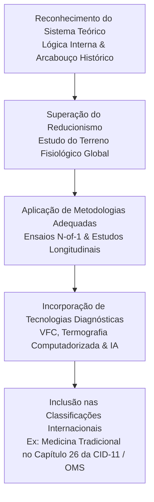

Autora: Silviane Silvério  
Data: 31 de julho de 2026  
Tempo médio de leitura: 10 minutos  

**Palavras-chave:** Epistemologia, restauração homeostática, saberes ancestrais, ciência integrativa, sistemas complexos, reducionismo, ensaio clínico randomizado, saúde integrativa.

---

> **© Conteúdo Autoral:** Todo o conteúdo desta postagem é de autoria de Silviane Silvério. Caso utilize este texto como referência em seus estudos, trabalhos ou publicações, solicitamos a gentileza de dar os devidos créditos à autora e incluir as referências bibliográficas. Para localizar a autora e a fonte do artigo, pesquise na internet: [https://praticasdebemestarsocial.github.io/blog/](https://praticasdebemestarsocial.github.io/blog/)
{: .prompt-info }

---

## Resumo

Quando se questiona a validação de práticas como a Iridologia Constitucional ou a Medicina Tradicional Chinesa (MTC), a resposta acadêmica convencional costuma apontar para a "ausência de evidências em ensaios duplamente-cegos". No entanto, essa interpretação desconsidera um choque de paradigmas epistemológicos: o Ensaio Clínico Randomizado (ECR) foi desenhado para isolar variáveis em intervenções pontuais (como fármacos sintéticos), enquanto os saberes ancestrais e a naturopatia trabalham com a modulação de sistemas biológicos complexos e não lineares. O desafio da ciência integrativa moderna não reside em "forçar" um saber holístico dentro da métrica reducionista, mas sim em expandir o olhar metodológico para validar a restauração da autorregulação fisiológica com absoluto rigor.

---

## Desenvolvimento

### 1. Por que o Rigor do Ensaio Clínico Randomizado Falha ao Avaliar Saberes Integrativos?

O Ensaio Clínico Randomizado (ECR) consolidou-se como o "padrão-ouro" da medicina baseada em evidências por sua capacidade extraordinária de isolar o efeito de uma substância farmacológica contra um grupo de controle com placebo.

Contudo, quando aplicamos esse desenho experimental a sistemas terapêuticos complexos, defrontamo-nos com limitações metodológicas estruturais. Um protocolo naturopático ou de MTC não prescreve um insumo idêntico para uma queixa pontual; ele ajusta a intervenção ao terreno individual, ao ritmo circadiano e às respostas adaptativas do organismo.

Superar essa limitação exige construir uma epistemologia da restauração homeostática que reconheça o organismo como um sistema dinâmico, autorregulável e não linear.

---

### 2. Incompatibilidade Epistemológica: O Modelo Reducionista vs. A Visão Sistêmica

Ao submeter um protocolo de restauração homeostática ao filtro reducionista, ocorre o que a filosofia da ciência denomina de erro categorial. A tabela abaixo sintetiza as discrepâncias metodológicas entre a abordagem biomédica hegemônica e a pesquisa em sistemas complexos de saúde:

| Dimensão Metodológica | Paradigma Reducionista (Biomédico) | Paradigma da Complexidade (Integrativo) |
| :--- | :--- | :--- |
| **Foco da Avaliação** | Isolamento de agente causal e supressão de sintoma específico | Avaliação do terreno biológico e modulação da homeostase |
| **Desenho do Protocolo** | Intervenção padronizada (mesmo fármaco para a mesma queixa) | Intervenção individualizada (diferentes condutas para o mesmo sintoma) |
| **Métrica Primária** | Biomarcadores lineares e alteração pontual de órgãos | Padrões de variabilidade, PROMs e autorregulação tecidual |
| **Mecanismo de Validação** | Controle por placebo com eliminação de variáveis de contexto | Estudos N-of-1, análise longitudinal e integração por Big Data/IA |

---

### A Trajetória de Integração Epistemológica dos Saberes Ancestrais

Para que uma prática integrativa alcance validação científica sem perder sua identidade, o caminho da pesquisa deve seguir etapas claras de coerência metodológica:

---

### 3. Amplie sua Visão sobre a Epistemologia e a Pesquisa em Saúde Integrativa

Se você é estudante, terapeuta ou pesquisador focado na ponte entre a ciência de ponta e a preservação dos saberes ancestrais:

📖 **Módulo Especializado: Epistemologia e Metodologia Científica em Saúde Integrativa**

Aprenda a fundamentar a pesquisa e a prática clínica integrativa utilizando metodologias científicas contemporâneas, análise de sistemas complexos e leitura crítica de publicações indexadas.

👉 [Clique aqui para explorar nossos Cursos e Livros na Plataforma](https://praticasdebemestarsocial.github.io/silvianesilverio/)

---

> ### ⚠️ Aviso Legal e Isenção de Responsabilidade (Disclaimer)
> Este artigo possui finalidade estritamente educativa, epistemológica e de divulgação de conceitos de ciência integrativa e Práticas Integrativas e Complementares em Saúde (PICS), sob a autoria de profissional Biomédica Naturopata. O conteúdo não configura diagnóstico ou tratamento de doenças. As discussões referem-se a modelos teóricos e metodológicos de pesquisa. Em caso de dúvidas sobre saúde, consulte um profissional médico habilitado.
{: .prompt-warning }

---

## Referências Bibliográficas

- **KAPTCHUK, T. J.** The double-blind, randomized, placebo-controlled trial: gold standard or golden calf? *The Journal of Alternative and Complementary Medicine*, v. 7, n. 6, p. 723-725, 2001.
- **ORGANIZAÇÃO MUNDIAL DA SAÚDE (OMS).** *Classificação Internacional de Doenças (CID-11): Capítulo 26 - Condições originadas na medicina tradicional.* Genebra: OMS, 2019.
- **SILVÉRIO, Silviane de Souza.** *Pesquisas em Iridologia, Epistemologia da Saúde Integrativa e Saberes Tradicionais.* São Paulo, 2025.

---

Quer pesquisar as referências acadêmicas e o histórico das minhas investigações em saúde integrativa, iridologia e saberes tradicionais? Acesse o meu currículo Lattes e ORCID:

* 🔗 **ORCID:** [https://orcid.org/0000-0001-6311-1195](https://orcid.org/0000-0001-6311-1195)
* 🔗 **Lattes:** [http://lattes.cnpq.br/7481458793724724](http://lattes.cnpq.br/7481458793724724)  
*(ID Lattes: 7481458793724724 | Registro Profissional: CRTH-BR 1741)*

---

*Com múltiplos olhos e um só coração,*  
**Silviane Silvério**  
*Olho Preditivo – Mapas do Autoconhecimento*

---

> **© Conteúdo Autoral:** Todo o conteúdo desta postagem é de autoria de Silviane Silvério. Licença CC BY-NC-ND 4.0 Internacional. Registros oficiais com DOI em Zenodo/OSF/HAL. Para localizar a autora e a fonte do artigo, pesquise na internet: [https://praticasdebemestarsocial.github.io/blog/](https://praticasdebemestarsocial.github.io/blog/)
{: .prompt-info }

---

**Reflexão para a comunidade:**  
Assim como o microbioma intestinal e o eixo cérebro-intestino levaram décadas para transitar da intuição naturopática para a validação molecular de ponta, qual prática ou marcador homeostático você acredita que será o próximo a ser plenamente compreendido e validado pela ciência contemporânea?  
Deixe sua perspectiva nos comentários digitando a palavra **"EPISTEMOLOGIA"** e contribua para esta construção epistemológica! 🌱✨
