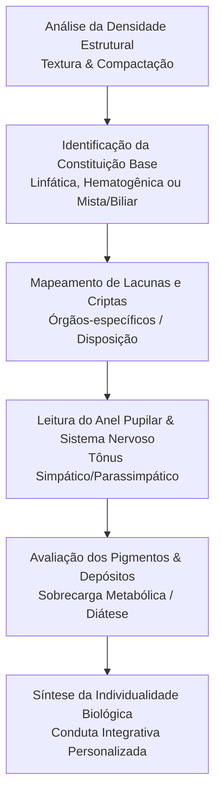

Autora: Silviane Silvério  
Data: 31 de julho de 2026  
Tempo médio de leitura: 10 minutos  

**Palavras-chave:** Joseph Deck, iridologia constitucional, tripé deckiano, iridologia alemã, constituição, disposição, diátese, individualidade biológica, naturopatia.

---

> **© Conteúdo Autoral:** Todo o conteúdo desta postagem é de autoria de Silviane Silvério. Caso utilize este texto como referência em seus estudos, trabalhos ou publicações, solicitamos a gentileza de dar os devidos créditos à autora e incluir as referências bibliográficas. Para localizar a autora e a fonte do artigo, pesquise na internet: [https://praticasdebemestarsocial.github.io/blog/](https://praticasdebemestarsocial.github.io/blog/)
{: .prompt-info }

---

## Resumo

A medicina tradicional e muitas abordagens analíticas focam predominantemente no sintoma manifesto. Joseph Deck (1914–1992), ao analisar mais de um milhão de íris ao longo de sua trajetória clínica, percebeu que dois indivíduos com a mesma queixa (como enxaquecas repetitivas ou fadiga crônica) possuem terrenos biológicos completamente distintos. A iridologia constitucional alemã, fundamentada por Deck em suas obras clássicas *Konstitutionelle Irisdiagnose* e *Die Prinzipien der Irisdiagnose*, estabelece que a íris não funciona como um "raio-X" patológico, mas sim como um registro genético e funcional da capacidade reacional do organismo. Trata-se de compreender a pessoa que carrega a fragilidade, e não apenas a fragilidade isolada.

---

## Desenvolvimento

### 1. Como a Visão de Joseph Deck Transformou a Análise Iridológica em um Estudo da Individualidade Biológica?

A contribuição de Joseph Deck marca a transição da iridologia empírica do século XIX para uma disciplina científica rigorosa, alinhada à biotipologia e à genética funcional.

Ao invés de associar cada pequeno sinal a um diagnóstico patológico estático, Deck demonstrou que as marcas iridianas revelam as características da matriz conectiva, a força do tecido estromal e as vias metabólicas preferenciais de resposta do indivíduo.

Compreender o método constitucional alemão capacita o terapeuta e o profissional de saúde a personalizar intervenções de estilo de vida, respeitando os limites biológicos herdados e prevenindo o estresse orgânico antes da instalação de doenças crônicas.

---

### 2. O Tripé Deckiano e a Arquitetura das Fibras Iridianas

O modelo constitucional de Deck é estruturado sobre o **Tripé Deckiano**, que separa a avaliação em três níveis fundamentais de observação:

1. **Constituição (O Terreno Genético):** Refere-se às características herdadas, permanentes e imutáveis da trama de fibras iridianas. Define a força vital inerente, a densidade tecidual e o *locus minoris resistentiae* (ponto de menor resistência) do indivíduo.
2. **Disposição (A Tendência Reacional):** Representa a propensão do organismo a reagir de determinada forma frente aos estímulos do meio ambiente, nutrição e estresse. Reflete a tendência latente antes mesmo da manifestação clínica.
3. **Diátese (O Estado Metabolicamente Adquirido):** Corresponde às alterações dinâmicas e acúmulos metabólicos (como depósitos de pigmentos, toxinas e sobrecargas de ácido úrico ou lipídios) que modificam o terreno ao longo da vida.

---

### Tabela Comparativa: Elementos do Tripé Deckiano e Sinais Iridianos

| Elemento | Conceito Fisiológico | Observação na Íris | Aplicação Terapêutica |
| :--- | :--- | :--- | :--- |
| **Constituição** | Matriz genética e densidade tecidual de nascença | Densidade, compactação e disposição radial das fibras | Define os limites e a vitalidade base do paciente |
| **Disposição** | Tendência do terreno em desenvolver padrão reacional | Lacunas, criptas, rarefação das fibras e do estroma | Direciona o foco da prevenção primária de órgãos frágeis |
| **Diátese** | Terreno alterado por fatores metabólicos e estilo de vida | Pigmentos (topolábeis/topostáveis), rosário linfático | Guia protocolos de desintoxicação e modulação de estilo de vida |

---

### A Jornada da Leitura Constitucional segundo Josef Deck

A avaliação constitucional segue um fluxo claro de interpretação do terreno individual:

---

### 3. Aprofunde seu Olhar na Iridologia Constitucional e no Método Deckiano

Para terapeutas, biomédicos e estudantes de Práticas Integrativas que desejam ir além das tabelas simplistas de "sinal-sintoma" e dominar a real análise de terreno:

📖 **Módulo Exclusivo: Joseph Deck e a Iridologia Constitucional**

Aprenda a interpretar a arquitetura da íris sob as fontes originais alemãs. Entenda como identificar o Tripé Deckiano na prática clínica e construir recomendações de saúde verdadeiramente personalizadas e éticas.

👉 [Clique aqui para explorar nossos Cursos e Livros na Plataforma](https://praticasdebemestarsocial.github.io/silvianesilverio/)

---

> ### ⚠️ Aviso Legal e Isenção de Responsabilidade (Disclaimer)
> Este artigo possui finalidade estritamente educativa e informativa no campo da Iridologia Constitucional e Práticas Integrativas em Saúde (PICS), sob a autoria de profissional Biomédica Naturopata. A iridologia é uma ferramenta de avaliação de tendências constitucionais e homeostáticas e não substitui diagnósticos médicos, exames laboratoriais ou de imagem. Em caso de dúvidas sobre condições de saúde, consulte um profissional médico habilitado.
{: .prompt-warning }

---

## Referências Bibliográficas

- **DECK, Josef.** *Konstitutionelle Irisdiagnose.* Stuttgart: Hippokrates Verlag, 1968.
- **DECK, Josef.** *Die Prinzipien der Irisdiagnose.* Stuttgart: Hippokrates Verlag, 1975.
- **SILVÉRIO, Silviane de Souza.** *Pesquisas em Iridologia, Saúde Integrativa e Saberes Tradicionais.* São Paulo, 2025.

---

Quer pesquisar as referências acadêmicas e o histórico das minhas investigações em saúde integrativa, iridologia e saberes tradicionais? Acesse o meu currículo Lattes e ORCID:

* 🔗 **ORCID:** [https://orcid.org/0000-0001-6311-1195](https://orcid.org/0000-0001-6311-1195)
* 🔗 **Lattes:** [http://lattes.cnpq.br/7481458793724724](http://lattes.cnpq.br/7481458793724724)  
*(ID Lattes: 7481458793724724 | Registro Profissional: CRTH-BR 1741)*

---

*Com múltiplos olhos e um só coração,*  
**Silviane Silvério**  
*Olho Preditivo – Mapas do Autoconhecimento*

---

> **© Conteúdo Autoral:** Todo o conteúdo desta postagem é de autoria de Silviane Silvério. Licença CC BY-NC-ND 4.0 Internacional. Registros oficiais com DOI em Zenodo/OSF/HAL. Para localizar a autora e a fonte do artigo, pesquise na internet: [https://praticasdebemestarsocial.github.io/blog/](https://praticasdebemestarsocial.github.io/blog/)
{: .prompt-info }

---

**Reflexão para a comunidade:**  
Na sua prática de autocuidado ou atendimento clínico, você costuma focar no alívio direto dos sintomas ou na identificação das tendências constitucionais do organismo?  
Como a compreensão do terreno biológico pode mudar a forma como você aborda a prevenção em saúde? Deixe seu comentário digitando a palavra **"CONSTITUIÇÃO"** e compartilhe suas percepções com nossa comunidade! 🌱✨
