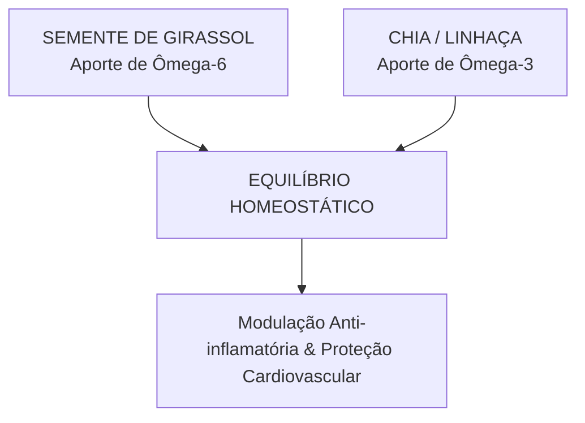

Autora: Silviane Silvério  
Data: 31 de julho de 2026  
Tempo médio de leitura: 7 minutos  

**Palavras-chave:** Semente de girassol, Helianthus annuus, vitamina E, alfa-tocoferol, magnésio, fitoesteróis, saúde cardiovascular, antioxidantes, dietoterapia.

---

> **© Conteúdo Autoral:** Todo o conteúdo desta postagem é de autoria de Silviane Silvério. Caso utilize este texto como referência em seus estudos, trabalhos ou publicações, solicitamos a gentileza de dar os devidos créditos à autora e incluir as referências bibliográficas. Para localizar a autora e a fonte do artigo, pesquise na internet: [https://praticasdebemestarsocial.github.io/blog/](https://praticasdebemestarsocial.github.io/blog/)
{: .prompt-info }

---

## Resumo

A semente de girassol (*Helianthus annuus*) é amplamente reconhecida pela ciência da nutrição como um alimento funcional de extraordinária densidade nutricional. Longe de ser apenas um snack casual, ela reúne uma combinação expressiva de vitamina E (alfa-tocoferol), magnésio, selênio e fitoesteróis. Quando integrada de forma consciente e moderada à dietoterapia, a semente de girassol atua como uma barreira protetora contra o estresse oxidativo celular, auxiliando na saúde do endotélio vascular, no fortalecimento da matriz óssea e na integridade cutânea. Este artigo aborda a bioquímica, o balanço de ácidos graxos e a aplicação prática do girassol na saúde integrativa.

---

## Desenvolvimento

### 1. Como o Concentrado Fitoquímico do Helianthus annuus Atua na Saúde Sistêmica?

Originário das Américas e cultivado historicamente por povos nativos como fonte alimentícia e medicinal, o girassol (*Helianthus annuus*) guarda em suas sementes uma verdadeira reserva biológica de nutrientes concentrados.

Na prática da naturopatia e nutrição funcional, a semente de girassol destaca-se pela alta biodisponibilidade de lipídios saudáveis, minerais traço e compostos antioxidantes lipofílicos.

Compreender o seu perfil bioquímico e a necessidade de equilibrar seu aporte de Ômega-6 com fontes vegetais de Ômega-3 é fundamental para extrair suas propriedades terapêuticas na busca pelo bem-estar social e pela autonomia no autocuidado.

---

### 2. Bioquímica Funcional, Modulação Antioxidante e Suporte Sistêmico

A sinergia entre os minerais e as vitaminas lipossolúveis do girassol atua em múltiplos eixos da fisiologia humana:

* **Proteção Antioxidante e Vascular:** A concentração expressiva de alfa-tocoferol (vitamina E) neutraliza os radicais livres nas membranas celulares, enquanto os fitoesteróis competem pela absorção do colesterol no trato gastrointestinal.
* **Matriz Óssea e Neuromuscular:** O trio mineral formado por magnésio, fósforo e cobre atua no fortalecimento da densidade mineral óssea e no relaxamento da musculatura estriada.
* **Barreira Cutânea e Microbiota:** A combinação de lipídios funcionais com fibras solúveis e insolúveis sustenta o equilíbrio da microbiota intestinal e melhora a retenção hídrica na epiderme.

---

### Tabela Comparativa: Matriz Nutricional x Benefício Fisiológico

| Componente Bioquímico | Função Bioquímica Principal | Impacto Fisiológico / Benefício Sistêmico |
| :--- | :--- | :--- |
| **Vitamina E (Alfa-tocoferol)** | Antioxidante lipossolúvel de membrana | Proteção contra peroxidação lipídica e envelhecimento precoce |
| **Magnésio & Fósforo** | Cofatores enzimáticos e estruturais | Saúde óssea, regulação pressórica e função neuromuscular |
| **Fitoesteróis & Ácido Linoleico** | Esteróis vegetais e ácidos graxos essenciais | Redução da absorção do LDL e suporte à barreira cutânea |
| **Selênio & Cobre** | Cofatores de enzimas antioxidantes (GPx) | Modulação da imunidade e combate ao estresse oxidativo |

---

### O Balanço Fitoquímico: Equilíbrio Ômega-6 x Ômega-3

Como a semente de girassol é naturalmente rica em ácido linoleico (Ômega-6), a dietoterapia integrativa orienta o consumo intercalado com fontes vegetais de Ômega-3 (como chia ou linhaça) para garantir a homeostase anti-inflamatória:

---

### 3. Prática Clínica, Porções e Boas Práticas de Consumo

Para extrair o máximo de vitalidade sem excesso calórico ou perda de nutrientes:

* **Preferência In Natura:** Opte sempre por sementes cruas ou levemente tostadas sem adição de sal. Evite as versões comercialmente salgadas ou fritas, que carregam excesso de sódio e gorduras oxidadas.
* **Porção Diária Recomendada:** A dose segura e eficaz para adultos varia entre 1 e 2 colheres de sopa (aproximadamente 15g a 30g por dia).
* **Armazenamento Adequado:** Por conter alto teor de gorduras insaturadas, mantenha as sementes em potes de vidro herméticos, ao abrigo da luz e do calor ou sob refrigeração, para evitar a oxidação e o ranço.
* **Diversificação no Prato:** Adicione as sementes sobre saladas, sopas, iogurtes vegetais, massas integrais ou no preparo de pães e granolas caseiras.

---

## 4. Aprofunde seus Estudos na Ecologia do Ser, Dietoterapia e Saúde Integrativa

Se você é estudante, nutricionista, terapeuta integrativo, profissional da saúde ou entusiasta do autocuidado consciente:

📚 **Conheça os livros e cursos da nossa plataforma!**

Mergulhe no acervo acadêmico e nas formações exclusivas desenvolvidas por **Silviane Silvério** (Biomédica, Naturóloga e Escritora). Aprenda a integrar os alimentos funcionais, a naturopatia e os mapas de autoconhecimento na sua prática pessoal e atendimento profissional.

👉 [Clique aqui para explorar nossos Cursos e Livros na Plataforma](https://praticasdebemestarsocial.github.io/silvianesilverio/)

---

> ### ⚠️ Aviso Legal e Isenção de Responsabilidade (Disclaimer)
> Este artigo possui finalidade estritamente educativa, nutricional e de divulgação de conceitos de dietoterapia e Práticas Integrativas e Complementares em Saúde (PICS), sob a autoria de profissional Biomédica Naturopata.  
> O conteúdo exposto não configura prescrição dietética individualizada ou tratamento médico. Pessoas com histórico de alergia a sementes ou condições renais específicas devem consultar um profissional habilitado.
{: .prompt-warning }

---

## Referências Bibliográficas

- **BRASIL. ANVISA.** *Tabela Brasileira de Composição de Alimentos (TBCA).* São Paulo: NUPENS/USP, 2023.
- **JUN, M. et al.** Phenolic compounds and antioxidant activity of sunflower (*Helianthus annuus*) seeds. *Journal of Agricultural and Food Chemistry*, v. 54, n. 15, p. 5494-5500, 2006.
- **SILVÉRIO, Silviane de Souza.** *Pesquisas em Dietoterapia, Saúde Integrativa e Saberes Tradicionais.* São Paulo, 2025.

---

Quer pesquisar as referências acadêmicas e o histórico das minhas investigações em saúde integrativa, iridologia e saberes tradicionais? Acesse o meu currículo Lattes e ORCID:

* 🔗 **ORCID:** [https://orcid.org/0000-0001-6311-1195](https://orcid.org/0000-0001-6311-1195)
* 🔗 **Lattes:** [http://lattes.cnpq.br/7481458793724724](http://lattes.cnpq.br/7481458793724724)  
*(ID Lattes: 7481458793724724 | Registro Profissional: CRTH-BR 1741)*

---

*Com múltiplos olhos e um só coração,*  
**Silviane Silvério**  
*Olho Preditivo – Mapas do Autoconhecimento*

---

> **© Conteúdo Autoral:** Todo o conteúdo desta postagem é de autoria de Silviane Silvério. Licença CC BY-NC-ND 4.0 Internacional. Registros oficiais com DOI em Zenodo/OSF/HAL. Para localizar a autora e a fonte do artigo, pesquise na internet: [https://praticasdebemestarsocial.github.io/blog/](https://praticasdebemestarsocial.github.io/blog/)
{: .prompt-info }

---

**Reflexão para a comunidade:**  
Você já costuma incluir a semente de girassol na sua rotina alimentar? Prefere consumi-la crua em saladas ou levemente torrada?  
Deixe seu comentário abaixo digitando a palavra **"ANTIOXIDANTE"** e compartilhe suas receitas e experiências com a nossa comunidade! 🌱✨
