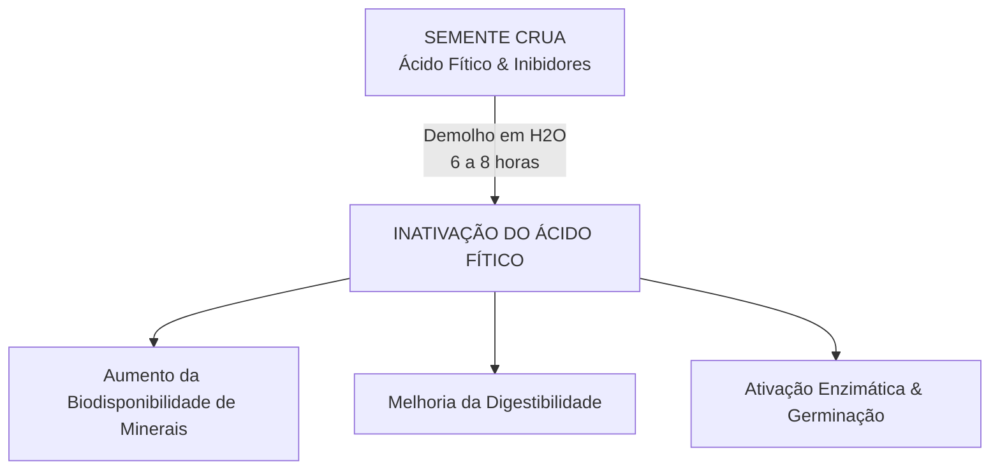

Autora: Silviane Silvério  
Data: 31 de julho de 2026  
Tempo médio de leitura: 9 minutos  

**Palavras-chave:** Sementes comestíveis, girassol, abóbora, chia, linhaça, gergelim, ácido fítico, antinutrientes, demolho, germinação, dietoterapia integrativa.

---

> **© Conteúdo Autoral:** Todo o conteúdo desta postagem é de autoria de Silviane Silvério. Caso utilize este texto como referência em seus estudos, trabalhos ou publicações, solicitamos a gentileza de dar os devidos créditos à autora e incluir as referências bibliográficas. Para localizar a autora e a fonte do artigo, pesquise na internet: [https://praticasdebemestarsocial.github.io/blog/](https://praticasdebemestarsocial.github.io/blog/)
{: .prompt-info }

---

## Resumo

As sementes comestíveis representam verdadeiros concentrados de vida. Biologicamente projetadas para conter todo o acervo nutricional necessário ao surgimento de uma nova planta, elas ocupam um papel de destaque na dietoterapia integrativa. Ricas em proteínas de alto valor biológico, ácidos graxos essenciais (Ômega-3, 6 e 9), fibras solúveis e insolúveis e uma vasta gama de fitoquímicos, as sementes atuam como coadjuvantes de peso na regulação glicêmica, na modulação do perfil lipídico e no suporte ao microbioma intestinal. Este artigo analisa as variedades funcionais, a física da inativação de antinutrientes e o consumo sustentável.

---

## Desenvolvimento

### 1. Como a Matriz Bioquímica das Sementes Comestíveis Atua no Controle Metabólico?

No reino vegetal, as sementes contêm as reservas energéticas e nutricionais mais densas do organismo botânico. Elas concentram minerais, óleos essenciais, enzimas e protetores fitoquímicos em proporções incomparáveis.

Na dietoterapia e naturologia integrativa, a inclusão variada de sementes comestíveis fortalece as vias metabólicas de autorregulação, melhora a sensibilidade à insulina e nutre a microbiota intestinal.

Compreender o perfil bioquímico de cada semente e dominar as técnicas para inativar antinutrientes e maximizar a biodisponibilidade é fundamental para promover a autonomia no autocuidado, fortalecendo a sustentabilidade e o bem-estar social.

---

### 2. Bioquímica Funcional, Variedade de Sementes e Otimização da Biodisponibilidade

Cada variedade de semente possui uma assinatura fitoquímica única, direcionando sua aplicação clínica e nutricional:

* **Semente de Girassol:** Abundante em alfa-tocoferol (vitamina E) e selênio, neutraliza os radicais livres e protege as membranas celulares contra a peroxidação lipídica.
* **Semente de Abóbora (Pepita):** Concentrado de zinco, magnésio e fitoesteróis, atuando no suporte à imunidade, relaxamento vascular e saúde da próstata.
* **Semente de Chia:** Excelente fonte vegetal de ácido alfa-linolênico (Ômega-3) e mucilagens que retardam o esvaziamento gástrico e promovem a saciedade.
* **Semente de Linhaça:** A maior fonte de lignanas (fitoestrógenos naturais) e fibras; deve ser preferencialmente moída na hora para liberar seus óleos.
* **Semente de Gergelim:** Destaque pelo teor de cálcio biodisponível, ferro e sesamina, auxiliando na saúde óssea e hepática.
* **Sementes Funcionais Adicionais:** A mostarda (rica em glucosinolatos), o alpiste (com enzimas lipolíticas) e o painço (cereal alcalinizante sem glúten).

---

### Tabela Comparativa: Matriz Nutricional x Aplicação Terapêutica

| Semente | Composto Bioativo Principal | Mecanismo de Ação Terapêutica | Aplicação Clínica / Indicação |
| :--- | :--- | :--- | :--- |
| **Girassol** | Vitamina E (Alfa-tocoferol) & Selênio | Antioxidante lipossolúvel e imunomodulador | Proteção vascular e saúde cutânea |
| **Abóbora** | Zinco, Magnésio & Fitoesteróis | Modulação de eicosanoides e relaxamento muscular | Saúde da próstata, sono e imunidade |
| **Chia** | Ômega-3 (ALA) & Mucilagem | Formação de gel intestinal e absorção lenta de glicose | Controle glicêmico, saciedade e eubiose |
| **Linhaça** | Lignanas & Ácido Alfa-Linolênico | Ação fitoestrogênica e modulação hormonal | Saúde feminina, perfil lipídico e trânsito |
| **Gergelim** | Cálcio, Sesamina & Cobre | Mineralização da matriz óssea e ação antioxidante | Saúde óssea, articular e prevenção de osteopenia |

---

### A Engenharia do Preparo: Inativação de Antinutrientes

Sementes cruas possuem defesas naturais (como o ácido fítico e inibidores enzimáticos) que reduzem a absorção intestinal de minerais essenciais como ferro, zinco e cálcio. A aplicação de técnicas de demolho e germinação neutraliza esses fatores antinutricionais:

---

### 3. Diretrizes Práticas, Dosagem e Sustentabilidade Alimentar

Para incluir as sementes na rotina com segurança e eficácia:

1. **Hidratação e Germinação:** Deixe as sementes de molho em água filtrada por 6 a 8 horas antes do consumo (descartando a água do demolho) ou promova a germinação inicial (brotos).
2. **Moagem da Linhaça:** Triture a linhaça imediatamente antes do consumo ou armazene a farinha moída no congelador em pote escuro por no máximo 7 dias para evitar a oxidação dos ácidos graxos.
3. **Moderação da Porção:** Devido à densidade calórica vinda das gorduras boas, a recomendação diária varia de 1 a 2 colheres de sopa (15g a 30g).
4. **Hidratação Abundante:** A ingestão de sementes ricas em fibras exige um consumo de ao menos 2 litros de água ao dia para prevenir a constipação.
5. **Valorização da Agroecologia:** O consumo diversificado de sementes fortalece a biodiversidade agrícola, apoia os pequenos produtores e promove a soberania alimentar.

---

## 4. Aprofunde seus Estudos na Ecologia do Ser, Dietoterapia e Saúde Integrativa

Se você é estudante, nutricionista, terapeuta integrativo, profissional da saúde, pesquisador ou entusiasta do autocuidado consciente:

📚 **Conheça os livros e cursos da nossa plataforma!**

Mergulhe no acervo acadêmico e nas formações exclusivas desenvolvidas por **Silviane Silvério** (Biomédica, Naturóloga e Escritora). Aprenda a integrar os alimentos funcionais, a dietoterapia e os mapas de autoconhecimento na sua prática diária e atendimento profissional.

👉 [Clique aqui para explorar nossos Cursos e Livros na Plataforma](https://praticasdebemestarsocial.github.io/silvianesilverio/)

---

> ### ⚠️ Aviso Legal e Isenção de Responsabilidade (Disclaimer)
> Este artigo possui finalidade estritamente educativa, nutricional e de divulgação de conceitos de dietoterapia e Práticas Integrativas e Complementares em Saúde (PICS), sob a autoria de profissional Biomédica Naturopata.  
> O conteúdo exposto não configura prescrição dietética individualizada ou tratamento de doenças. Pessoas com diverticulite em crise, alergias alimentares conhecidas ou condições gastrointestinais agudas devem consultar um profissional habilitado.
{: .prompt-warning }

---

## Referências Bibliográficas

- **BRASIL. ANVISA.** *Tabela Brasileira de Composição de Alimentos (TBCA).* São Paulo: NUPENS/USP, 2023.
- **LIUKKONEN, K. H. et al.** Cereal grains and seeds. In: *Encyclopedia of Food Sciences and Nutrition.* 2nd ed. Academic Press, 2003.
- **SILVÉRIO, Silviane de Souza.** *Pesquisas em Dietoterapia, Saúde Integrativa e Saberes Tradicionais.* São Paulo, 2025.

---

Quer pesquisar as referências acadêmicas e o histórico das minhas investigações em saúde integrativa, iridologia e saberes tradicionais? Acesse o meu currículo Lattes e ORCID:

* 🔗 **ORCID:** [https://orcid.org/0000-0001-6311-1195](https://orcid.org/0000-0001-6311-1195)
* 🔗 **Lattes:** [http://lattes.cnpq.br/7481458793724724](http://lattes.cnpq.br/7481458793724724)  
*(ID Lattes: 7481458793724724 | Registro Profissional: CRTH-BR 1741)*

---

*Com múltiplos olhos e um só coração,*  
**Silviane Silvério**  
*Olho Preditivo – Mapas do Autoconhecimento*

---

> **© Conteúdo Autoral:** Todo o conteúdo desta postagem é de autoria de Silviane Silvério. Licença CC BY-NC-ND 4.0 Internacional. Registros oficiais com DOI em Zenodo/OSF/HAL. Para localizar a autora e a fonte do artigo, pesquise na internet: [https://praticasdebemestarsocial.github.io/blog/](https://praticasdebemestarsocial.github.io/blog/)
{: .prompt-info }

---

**Reflexão para a comunidade:**  
Qual semente não pode faltar na sua despensa e qual técnica de preparo (demolho, moagem ou germinação) você costuma utilizar no dia a dia?  
Deixe seu comentário abaixo digitando a palavra **"SEMENTES"** e compartilhe suas receitas e rituais com nossa comunidade! 🌱✨
