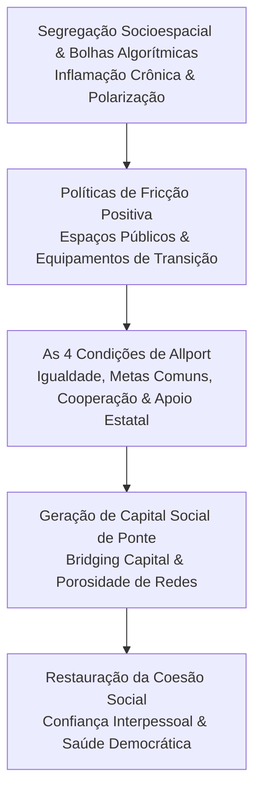

Autora: **Silviane Silvério** | Biomédica, Naturóloga e Escritora  
Data de publicação: 31 de julho de 2026 | Tempo médio de leitura: 12 minutos  

**Palavras-chave:** Ecologia social, coesão social, políticas públicas, capital social de ponte, Robert Putnam, Gordon Allport, democracia deliberativa, saúde coletiva, determinantes sociais, fricção positiva.

---

> **© Conteúdo Autoral:** Todo o conteúdo desta postagem é de autoria de Silviane Silvério. Licença CC BY-SA 4.0 Internacional. O compartilhamento e a adaptação são permitidos mediante atribuição clara à autora e distribuição sob a mesma licença. Para localizar a autora e a fonte do artigo, pesquise na internet: [https://praticasdebemestarsocial.github.io/silvianesilverio/](https://praticasdebemestarsocial.github.io/silvianesilverio/)
{: .prompt-info }

---

> 🔥 **Na biologia, um sistema orgânico que perde a capacidade de intercambiar matéria e informação entra em colapso.** Nas ciências sociais e na saúde coletiva, esse mesmo fenômeno manifesta-se sob a forma de segregação socioespacial e isolamento em "bolhas".
{: .prompt-tip }

---

## 1. A Patologia do Isolamento: Quando a Sociedade Adoece em Silos

Na biologia, um sistema orgânico que perde a capacidade de intercambiar matérias e informações com o seu entorno entra em estagnação e colapso metabólico. Nas ciências sociais e na saúde coletiva, esse mesmo fenômeno manifesta-se sob a forma de segregação socioespacial e isolamento algorítmico.

Como nos alerta a literatura sobre governabilidade e coesão social (Fleury, 2009), as fraturas sociais contemporâneas emergem do distanciamento entre:

1. **A Esfera Econômica:** Mercados excludentes e assimetrias de oportunidade;
2. **A Esfera Política:** Desengajamento cidadão e perda de direitos;
3. **A Esfera Comunitária:** Enfraquecimento das redes de solidariedade e reciprocidade.

Quando grupos sociais, geográficos ou ideológicos deixam de se cruzar, o tecido social desenvolve um estado de **inflamação crônica**: a expansão do preconceito, da polarização e da paranoia intergrupal. Sob a ótica da ecologia humana, o isolamento em "bolhas" funciona como uma câmara de eco que amplifica o estresse sistêmico, a desconfiança interpessoal e a degradação da democracia deliberativa.

---

## 2. O Antídoto: Capital Social de Ponte e a Homeostase Democrática

Para restaurar o equilíbrio do ecossistema social, o desenho de políticas públicas deve focar na promoção do **capital social de ponte** (*bridging capital*), conceito formalizado pelo sociólogo Robert Putnam. Ao contrário do capital social de ligação (*bonding capital*) — que apenas estreita laços entre pessoas idênticas —, o capital de ponte constrói conexões intencionais entre grupos heterogêneos.

Essa abordagem apoia-se na **Teoria do Contato Intergrupal** de Gordon Allport (1954), a qual estabelece que a diminuição da hostilidade social não ocorre por discursos abstratos, mas pela convivência diária e estruturada. Para que a interação gere coesão e não conflito, quatro condições de "homeostase social" são indispensáveis:

* ⚖️ **Status de Igualdade:** Ausência de hierarquias implícitas ou explícitas no ambiente de convivência.
* 🎯 **Metas Comuns:** Objetivos compartilhados que exijam o esforço conjunto dos participantes.
* 🤝 **Interdependência Cooperativa:** Necessidade de auxílio mútuo para a resolução de problemas concretos.
* 🏛️ **Apoio Institucional:** Legislação, políticas de Estado e autoridades legitimando o processo de integração.

---

### Fluxo da Homeostase Social e do Contato Intergrupal

---

## 3. Desenhando Políticas de Fricção Positiva

A verdadeira inovação social não nasce da passividade, mas da criação deliberada de espaços de **"fricção positiva"** — ambientes planejados onde a diversidade é metabolizada como recurso de aprendizado e coesão coletiva:

### 🏞️ 1. Implantação de Equipamentos Públicos de Transição (Espaços Neutros e Acessíveis)
Construção de parques, centros culturais, bibliotecas e arenas poliesportivas localizados em zonas limítrofes entre diferentes classes socioeconômicas, incentivando o cruzamento geográfico diário.

### 🎭 2. Estímulo a Ligas e Coletivos Heterogêneos (Editais Transversais)
Formulação de critérios de financiamento público em cultura, esporte e inovação comunitária que pontuem favoravelmente projetos compostos por integrantes de múltiplos territórios e contextos sociais.

### 🗳️ 3. Instalação de Assembleias Deliberativas Participativas (Sorteio Demográfico)
Uso de amostragem aleatória representativa para compor conselhos locais e júris cidadãos, evitando o sequestro da esfera pública por grupos de pressão previamente organizados.

---

## 4. A Métrica da Integração: Como Mensurar o Rompimento de Bolhas

Para avaliar a efetividade de intervenções socioespaciais, a gestão pública contemporânea e a sociologia da saúde recorrem a uma matriz de indicadores quantitativos e qualitativos:

### Matriz de Indicadores de Coesão Social

| Dimensão de Análise | Indicador / Ferramenta | Objetivo de Avaliação |
| :--- | :--- | :--- |
| **Socioespacial** | Índice de Dissimilaridade e Exposição Espacial | Medir a probabilidade real de encontro entre habitantes de diferentes áreas urbanas nos transportes e parques. |
| **Redes Sociais** | Método do Gerador de Nomes (*Ego-network Survey*) | Identificar o nível de homofilia (associação exclusiva entre pares) e a porosidade das conexões pessoais. |
| **Subjetiva** | Termômetro de Sentimento Intergrupal | Avaliar os níveis de confiança interpessoal generalizada e a tolerância à diversidade de perspectivas. |

---

### O Score de Diversidade da Rede (IDR)

Por meio da aplicação do *Questionário de Redes de Confiança* — em conformidade com as diretrizes da LGPD —, mapeiam-se os contatos de maior relevância citados pelo cidadão fora do círculo familiar imediato. O cálculo do Índice de Diversidade da Rede (IDR) categoriza a porosidade social do indivíduo:

* 🔴 **0 a 4 pontos — Bolha Rígida:** Conexões excessivamente homogêneas; isolamento socioespacial elevado.
* 🟡 **5 a 9 pontos — Bolha Porosa:** Estágio intermediário de transição e abertura a contatos heterogêneos.
* 🟢 **10 a 15 pontos — Rede Integrada:** O indivíduo atua como um agente ativo de capital social de ponte.

---

## 5. Ética, Privacidade e Escuta Qualitativa

A utilização de dados de mobilidade urbana (como bilhetagem de transporte e mapas de fluxo) e o diagnóstico de redes sociais exigem um crivo ético inegociável. A atuação do poder público deve pautar-se estritamente pelo anonimato dos dados e pela agregação de IDs.

Além disso, para calibrar potenciais vieses da coleta digital — que tende a invisibilizar populações idosas ou sem acesso a dispositivos conectados —, é imprescindível aplicar metodologias presenciais de observação urbana (como a análise de espaço público de Jan Gehl) e escuta qualitativa comunitária.

---

## 6. Restauração da Ecologia Humana e da Democracia

A construção de uma sociedade democrática sustentável exige superar os limites do formalismo institucional e investir na **saúde das relações cotidianas**. 

O rompimento de bolhas sociais configura-se como uma medida mestre de vigilância preventiva e ecologia humana. Quando o Estado inova ao planejar territórios inclusivos, ele intervém diretamente na qualidade de vida, na redução do estresse comunitário e no bem-estar coletivo.

---

### Aprofunde seus Estudos em Determinantes Sociais da Saúde

Se você deseja explorar a interface entre sociologia da saúde, políticas públicas e ecologia humana:

📚 **Módulo de Pesquisa: Determinantes Sociais da Saúde e Políticas Públicas**

Aprofunde seus estudos sobre inovação social, esfera pública ampliada e a interface entre sociologia e saúde coletiva.

👉 [Clique aqui para acessar os Cursos e Materiais Acadêmicos de Silviane Silvério](https://praticasdebemestarsocial.github.io/silvianesilverio/)

---

## 7. Reflexão para a Comunidade

> Considerando as suas redes cotidianas de convivência e confiança, como você classificaria a porosidade da sua "bolha" social (rígida, porosa ou integrada)? De que maneira o planejamento de sua cidade poderia favorecer o encontro seguro e empático entre diferentes realidades?
>
> **Compartilhe suas reflexões e propostas nos comentários abaixo**! Digite a palavra **"DEMOCRACIA"** ao iniciar sua contribuição. 🏛️🌿

---

## 📄 Referências & Isenção de Responsabilidade

> ### ⚠️ Aviso Legal e Isenção de Responsabilidade (Disclaimer)
> Este artigo possui finalidade estritamente educativa, analítica e de divulgação de conceitos de Sociologia da Saúde, Determinantes Sociais e Inovação em Políticas Públicas, sob a autoria de profissional Biomédica Naturopata. O conteúdo não configura consultoria política ou substituição de diagnósticos de órgãos oficiais de planejamento urbano.
{: .prompt-warning }

---

### Direitos Autorais e Registro
© 2026 **Silviane Silvério**. Licença *CC BY-SA 4.0 Internacional*. O compartilhamento e a adaptação são permitidos mediante atribuição clara à autora e distribuição sob a mesma licença.

### Referências Bibliográficas

- **ALLPORT, Gordon W.** *The Nature of Prejudice.* Cambridge, MA: Addison-Wesley, 1954.
- **FLEURY, Sonia.** *Coesão Social, Democracia e Seguridade: Fundamentos para a Inovação em Políticas Públicas.* Rio de Janeiro: EBAPE/FGV - PEEP, 2009.
- **PUTNAM, Robert D.** *Bowling Alone: The Collapse and Revival of American Community.* New York: Simon & Schuster, 2000.
- **SILVÉRIO, Silviane de Souza.** *Pesquisas em Saúde Integrativa, Determinantes Sociais e Saberes Tradicionais.* São Paulo, 2025.

---

### Saiba Mais sobre a Autora

* 🔗 **ORCID:** [https://orcid.org/0000-0001-6311-1195](https://orcid.org/0000-0001-6311-1195)
* 🔗 **Currículo Lattes:** [http://lattes.cnpq.br/7481458793724724](http://lattes.cnpq.br/7481458793724724)  
*(ID Lattes: 7481458793724724 | Registro Profissional: CRTH-BR 1741)*
