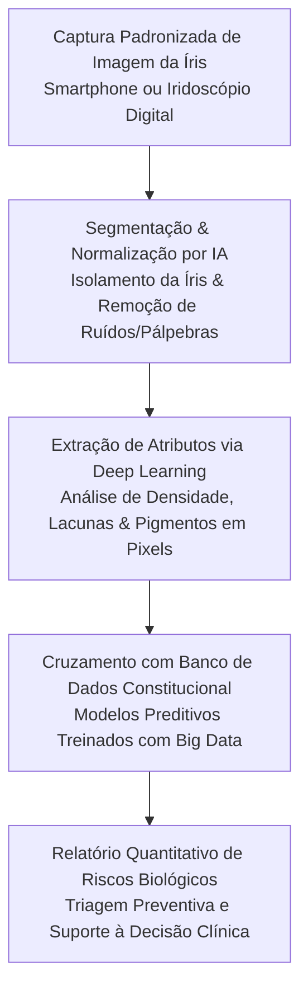

Autora: **Silviane Silvério** | Biomédica, Naturóloga e Escritora  
Data de publicação: 20 de novembro de 2025 | Tempo médio de leitura: 9 minutos  

**Palavras-chave:** Iridologia, inteligência artificial, visão computacional, deep learning, redes neurais, saúde integrativa, biomedicina, naturologia, PICS, validação científica.

---

> **© Conteúdo Autoral:** Todo o conteúdo desta postagem é de autoria de Silviane Silvério. Licença CC BY-SA 4.0 Internacional. O compartilhamento e a adaptação são permitidos mediante atribuição clara à autora e distribuição sob a mesma licença. Para localizar a autora e a fonte do artigo, pesquise na internet: [https://praticasdebemestarsocial.github.io/silvianesilverio/](https://praticasdebemestarsocial.github.io/silvianesilverio/)
{: .prompt-info }

---

> 🔥 **A iridologia encontra-se diante de uma virada metodológica sem precedentes:** a transição da observação visual empírica para a quantificação objetiva impulsionada pela inteligência artificial.
{: .prompt-tip }

---

## 1. A Iridologia em seu Ponto de Inflexão: Da Empiria à Validação por Dados

A iridologia, prática de observação sistêmica com mais de três séculos de histórico, passa por um processo profundo de reestruturação metodológica. Historicamente marginalizada ou criticada em fóruns acadêmicos convencionais pela dependência da avaliação visual subjetiva, a leitura iridiana ganha novos contornos na era da medicina digital.

A chegada da **Inteligência Artificial (IA)** — especificamente por meio da **Visão Computacional** e de algoritmos de **Deep Learning** — provê a infraestrutura tecnológica necessária para converter padrões de vulnerabilidade constitucional em dados quantificáveis, objetivamente mensuráveis e reprodutíveis em larga escala.

---

## 2. Superando as Limitações do Modelo Clássico: Os 7 Desafios Metodológicos

A incompatibilidade histórica entre a leitura da íris e a ciência reducionista não decorria da ausência de fenômenos biológicos, mas sim da escassez de métodos capazes de processar padrões complexos e não lineares. Os sete principais gargalos históricos incluem:

### 🎯 1. Subjetividade na Análise Visual (Variabilidade Interexaminador)
A interpretação manual dependia exclusivamente da acuidade visual e da experiência individual do avaliador, gerando divergências em diagnósticos constitucionais e ceticismo acadêmico.

### 🌐 2. Falta de Padronização Global (Divergência entre Escolas)
A coexistência de múltiplos mapas topográficos (como os modelos europeus, americanos e asiáticos) sem uma base unificada impedia a reprodutibilidade universal dos achados.

### 🔬 3. Escassez de Pesquisas com Alto Nível de Evidência
Delineamentos experimentais frágeis, metodologias desatualizadas e amostras reduzidas limitavam o impacto das publicações no ecossistema de saúde *mainstream*.

### ⏱️ 4. Inviabilidade Temporal em Práticas de Alta Rotatividade
O mapeamento manual e minucioso da íris exigia de 30 a 60 minutos por sessão, constituindo um obstáculo prático para a integração em rotinas clínicas dinâmicas.

### 💻 5. Barreiras de Custo e Equipamento (Acessibilidade Tecnológica)
A necessidade de biomicroscópios de lâmpada de fenda e iridoscópios de altíssima resolução encarecia a implementação da técnica por profissionais autônomos.

### 📚 6. Fragmentação Teórica em Silos de Conhecimento
A ausência de repositórios abertos e protocolos compartilhados reduzia a construção de avanços científicos coletivos e multicêntricos.

### 🎓 7. Dependência do Saber Empírico Transmitido
A transferência do conhecimento dependia predominantemente da intuição e da bagagem empírica de mestres, dificultando a criação de matrizes curriculares universais.

---

## 3. A Revolução Silenciosa: Visão Computacional e Deep Learning

Com a introdução do *Deep Learning*, o processamento digital de imagem analisa microestruturas da íris em escala de pixels — avaliando com precisão matemática a densidade de fibras, a profundidade de lacunas, os relevos da colarete e as pigmentações locais.

Estudos apresentados em congressos internacionais de inovação, como a **ICRASET (2024)**, demonstram a aplicação de redes neurais convolucionais (CNNs) treinadas em grandes repositórios de imagens irisgráficas, obtendo acurácias **superiores a 93%** na identificação de padrões associados a riscos de desequilíbrios metabólicos (como o *diabetes mellitus*).

---

### Fluxo de Validação Computacional da Íris

---

### Tabela Comparativa: Desafios Históricos vs. Soluções de Inteligência Artificial

| Desafio Tradicional | Solução Proposta pela Inteligência Artificial | Impacto na Prática Integrativa |
| :--- | :--- | :--- |
| **Subjetividade visual** | Visão Computacional e extração de atributos por pixel | Eliminação do viés individual de interpretação |
| **Divergência de mapas** | Unificação via algoritmos de consenso e aprendizado estatístico | Criação de um padrão-ouro global de topografia iridiana |
| **Tempo prolongado** | Processamento computacional em milissegundos | Triagem rápida, precisa e viável em grandes populações |
| **Custo de hardware** | Processamento via nuvem em dispositivos móveis cotidianos | Democratização da triagem constitucional em áreas remotas |

---

## 4. O Futuro da Saúde Integrativa: A Sinergia Humano-Máquina

A Inteligência Artificial não substitui a atuação do profissional de saúde integrativa; ela atua como uma **ferramenta de ampliação cognitiva**. Enquanto a máquina identifica com precisão matemática a presença objetiva de um padrão estrutural na íris, cabe ao profissional humano correlacionar esses achados com a anamnese, os hábitos de vida, a epigenética e o contexto socioemocional do indivíduo.

---

### Aprofunde seus Conhecimentos em Tecnologia e Iridologia

Se você busca explorar as fronteiras da inovação na saúde integrativa e o avanço científico no mapeamento da íris:

📚 **Módulo de Pesquisa: Inovação Tecnológica e Mapeamento Iridiano**

Explore investigações sobre novos métodos de triagem, biotipologia e a validação de Práticas Integrativas e Complementares em Saúde (PICS).

👉 [Clique aqui para acessar os Cursos e Materiais Acadêmicos de Silviane Silvério](https://praticasdebemestarsocial.github.io/silvianesilverio/)

---

## 5. Reflexão para a Comunidade Integrativa

> A tecnologia está transformando a saúde preventiva. De que forma você avalia que a Inteligência Artificial pode contribuir para tornar as Práticas Integrativas mais acessíveis, confiáveis e integradas à medicina baseada em evidências?
>
> **Deixe sua perspectiva nos comentários abaixo** e enriqueça este debate! Digite a palavra **"INTELIGÊNCIA ARTIFICIAL"** ao iniciar sua mensagem. 🤖🌿

---

## 📄 Referências & Isenção de Responsabilidade

> ### ⚠️ Aviso Legal e Isenção de Responsabilidade (Disclaimer)
> Este artigo possui finalidade estritamente educativa, informativa e de divulgação de conceitos de inovação tecnológica em Práticas Integrativas e Complementares em Saúde (PICS), sob a autoria de profissional Biomédica Naturopata. O conteúdo não configura diagnóstico médico, prescrição ou tratamento de doenças. A análise iridiana, mesmo com apoio de IA, é uma ferramenta de triagem de tendências e avaliação constitucional, não substituindo exames clínicos ou de imagem. Em caso de dúvidas sobre sua saúde, consulte um profissional médico habilitado.
{: .prompt-warning }

---

### Direitos Autorais e Registro
© 2026 **Silviane Silvério**. Licença *CC BY-SA 4.0 Internacional*. O compartilhamento e a adaptação são permitidos mediante atribuição clara à autora e distribuição sob a mesma licença.

### Referências Bibliográficas

- **INTERNATIONAL CONFERENCE ON RECENT ADVANCES IN SCIENCE, ENGINEERING, AND TECHNOLOGY (ICRASET).** *Deep Learning Models for Iris-Based Prediction of Metabolic Disorders.* Proceedings of the Conference, 2024.
- **SILVÉRIO, Silviane de Souza.** *Pesquisas em Iridologia, Saúde Integrativa e Inovação Tecnológica.* São Paulo, 2025.
- **WORLD HEALTH ORGANIZATION (WHO).** *WHO global report on traditional and complementary medicine 2019.* Geneva: World Health Organization, 2019.

---

### Saiba Mais sobre a Autora

* 🔗 **ORCID:** [https://orcid.org/0000-0001-6311-1195](https://orcid.org/0000-0001-6311-1195)
* 🔗 **Currículo Lattes:** [http://lattes.cnpq.br/7481458793724724](http://lattes.cnpq.br/7481458793724724)  
*(ID Lattes: 7481458793724724 | Registro Profissional: CRTH-BR 1741)*
