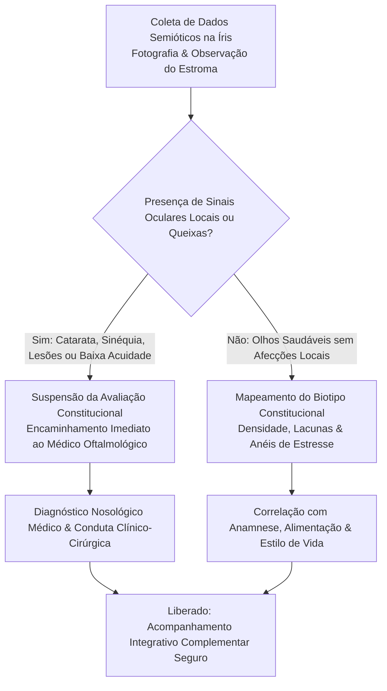

Autora: **Silviane Silvério** | Biomédica, Naturóloga e Escritora  
Data de publicação: 31 de julho de 2026 | Tempo médio de leitura: 10 minutos  

**Palavras-chave:** Iridologia constitucional, anamnese integrativa, semiótica iridiana, biotipos constitucionais, ética profissional, interconsulta oftalmológica, PICS, biomedicina, naturologia.

---

> **© Conteúdo Autoral:** Todo o conteúdo desta postagem é de autoria de Silviane Silvério. Licença CC BY-SA 4.0 Internacional. O compartilhamento e a adaptação são permitidos mediante atribuição clara à autora e distribuição sob a mesma licença. Para localizar a autora e a fonte do artigo, pesquise na internet: [https://praticasdebemestarsocial.github.io/silvianesilverio/](https://praticasdebemestarsocial.github.io/silvianesilverio/)
{: .prompt-info }

---

> 🔥 **É fundamental delimitar com clareza a atuação da iridologia:** ela não realiza diagnóstico médico nosológico de patologias, mas se consolida como um refinado método de coleta de dados semióticos para a anamnese integrativa.
{: .prompt-tip }

---

## 1. A Iridologia como Método de Coleta de Dados na Anamnese Integrativa

A iridologia, em sua essência epistemológica contemporânea, consolida-se como um método não invasivo de observação dos sinais semióticos do estroma ocular. Ao analisar a trama de fibras, as variações de relevo, a densidade tecidual e as pigmentações locais, o profissional integrativo não busca patologias nosográficas médicas, mas sim o **mapeamento do biotipo constitucional** do indivíduo, suas tendências de menor resistência orgânica e o estado momentâneo de sua homeostase.

Estes achados, quando correlacionados com a história clínica detalhada, o padrão alimentar, o nível de estresse oxidativo e o contexto socioemocional, oferecem subsídios estruturados para a formulação de condutas personalizadas em naturopatia, fitoterapia e estilo de vida.

---

## 2. O Impacto das Patologias Oculares na Leitura da Íris

A prática rigorosa da iridologia exige capacidade técnica para diferenciar sinais constitucionais orgânicos de distorções anatômicas provocadas por afecções oculares locais primárias.

Pesquisas aplicadas à visão computacional e às redes neurais convolucionais (Amaral & Souza, 2024) evidenciam que patologias oculares — tais como catarata, glaucoma, sinéquias anteriores/posteriores e úlceras de córnea — causam variações morfológicas profundas na textura e no relevo da íris.

### Análise Semiótica da Íris: Sinais Constitucionais vs. Artefatos Locais

| Dimensão Semiótica | Sinais Constitucionais Sistêmicos (Foco Integrativo) | Distorções e Artefatos Locais (Patologias Oculares / Lesões) |
| :--- | :--- | :--- |
| **Densidade & Trama** | Alinhamento e compacidade das fibras do estroma iridiano. | Opacificação de meios transparentes (ex: Catarata). |
| **Padrões de Relevo** | Presença de anéis de estresse contráteis e rosário linfático. | Deformações pupilares e trações por Sinéquia. |
| **Pigmentos & Manchas** | Depósitos metabólicos, heterocromias e diáteses genéticas. | Alterações de relevo e escavação pupilar por Glaucoma. |

Compreender esses fenômenos é essencial para que o iridologista não interprete artefatos decorrentes de uma doença ocular primária como se fossem indicadores de desequilíbrios viscerais, preservando a precisão da avaliação.

---

## 3. A Fronteira Ética: O Encaminhamento Oftalmológico

A preservação da integridade do paciente e o respeito à interconsulta interdisciplinar estabelecem uma fronteira ética inegociável na prática integrativa:

1. 👁️ **Identificação de Alterações Estruturais e Queixas:** Durante a anamnese ou o registro fotográfico, o profissional observa opacificações, assimetrias pupilares abruptas, processos inflamatórios oculares ou queixas de acuidade visual.
2. 🛑 **Triagem e Limitação do Escopo:** A avaliação iridológica constitucional é imediatamente suspensa ou delimitada para que artefatos locais não comprometam a interpretação dos dados.
3. 🩺 **Direcionamento à Oftalmologia:** O paciente é formalmente orientado e encaminhado ao médico oftalmologista para diagnóstico nosológico, exames de refração e conduta clínica específica.
4. 🌱 **Atuação Integrativa Centrada na Vitalidade:** Após a devida avaliação e liberação médica, o acompanhamento naturopático prossegue de forma complementar e segura, focado no bem-estar geral e no estilo de vida.

---

### Protocolo Ético de Triagem & Interconsulta

---

## 4. O Foco no Indivíduo Saudável e no Biotipo Constitucional

Superadas as barreiras de triagem ocular, a iridologia expressa todo o seu potencial na promoção da saúde de indivíduos que buscam aprimorar sua vitalidade e performance biológica.

### Dimensões da Avaliação Constitucional Iridiana

| Dimensão Avaliada | Expressão na Íris | Aplicação na Conduta Integrativa |
| :--- | :--- | :--- |
| **Reserva Constitucional** | Densidade e alinhamento das fibras do estroma iridiano. | Determinação da capacidade de recuperação e resiliência ao estresse. |
| **Padrão Reativo** | Presença de anéis contráteis e variação dinâmica da orla pupilar. | Modulação do sistema nervoso autônomo e estratégias de gerenciamento do estresse. |
| **Carregamento Metabólico** | Manchas pigmentares metabólicas e depósitos no bordo pupilar. | Indicação de fitoterápicos depurativos e adequação da função gastrointestinal. |

---

## 5. Da Análise à Ação: Dietoterapia, Fitoterapia e Monitoramento

Os dados colhidos na iridologia direcionam a elaboração de planos terapêuticos individualizados. A identificação de uma constituição com menor resistência no setor gastrointestinal, por exemplo, orienta a introdução de fitoterápicos específicos (como plantas carminativas ou protetoras de mucosa) e ajustes na microbiota por meio da alimentação funcional.

Além disso, o **registro fotográfico sequencial da íris** atua como um recurso visual de monitoramento. Ao longo do tempo, a adoção de hábitos saudáveis, a hidratação adequada e a redução do estresse oxidativo refletem-se no ganho de brilho, nitidez do estroma e na uniformização dos sinais oculares, servindo como estimulante fator de autoconhecimento e adesão ao autocuidado.

---

## 6. Conclusão: Integração, Rigor e Respeito aos Limites

A iridologia, pautada no rigor metodológico e na clareza de suas fronteiras, afirma-se como uma valiosa ferramenta da saúde integrativa. 

Ao se distanciar da pretensão diagnóstica de doenças nosológicas e firmar-se como um método de leitura constitucional, ela enriquece a anamnese, protege o paciente e constrói um diálogo ético e transparente com a medicina convencional.

---

### Aprofunde seus Estudos em Iridologia e Anamnese Integrativa

Se você deseja aprofundar sua fundamentação teórica e prática sobre cartografia iridiana, biotipologia e limites éticos de atuação:

📚 **Módulo de Pesquisa: Iridologia, Anamnese Integrativa e Biotipos Constitucionais**

Aprofunde seus estudos nas bases teóricas da avaliação iridológica, mapeamento constitucional e condutas integrativas baseadas em evidências.

👉 [Clique aqui para acessar os Cursos e Materiais Acadêmicos de Silviane Silvério](https://praticasdebemestarsocial.github.io/silvianesilverio/)

---

## 7. Reflexão para a Comunidade

> Como você avalia o papel de ferramentas de autoconhecimento visual, como a iridologia, na conscientização do paciente sobre seus hábitos de vida? De que forma o estabelecimento de limites éticos claros pode fortalecer a credibilidade das Práticas Integrativas no sistema de saúde?
>
> **Deixe sua perspectiva nos comentários abaixo** e enriqueça nossa discussão acadêmica e profissional! Digite a palavra **"ÉTICA"** ao iniciar sua mensagem. 👁️⚖️

---

## 📄 Referências & Isenção de Responsabilidade

> ### ⚠️ Aviso Legal e Isenção de Responsabilidade (Disclaimer)
> Este artigo possui finalidade estritamente educativa, informativa e de divulgação de conceitos de saúde integrativa e Práticas Integrativas e Complementares em Saúde (PICS), sob a autoria de profissional Biomédica Naturopata. O conteúdo não configura diagnóstico médico, prescrição ou tratamento de doenças. A iridologia é um método de avaliação de tendências constitucionais e não substitui a consulta oftalmológica ou exames clínicos. Em caso de dúvidas sobre sua saúde, consulte profissionais habilitados.
{: .prompt-warning }

---

### Direitos Autorais e Registro
© 2026 **Silviane Silvério**. Licença *CC BY-SA 4.0 Internacional*. O compartilhamento e a adaptação são permitidos mediante atribuição clara à autora e distribuição sob a mesma licença.

### Referências Bibliográficas

- **AMARAL, G. O.; SOUZA, J. M.** Avaliação dos padrões da íris sob patologias oculares. In: *15º Congresso de Inovação, Ciência e Tecnologia do IFSP (CONICT)*, 2024.
- **DECK, Josef.** *Grundlagen der Irisdiagnostik.* Ettlingen: Selbstverlag, 1965.
- **SILVÉRIO, Silviane de Souza.** *Pesquisas em Iridologia, Saúde Integrativa e Saberes Tradicionais.* São Paulo, 2025.

---

### Saiba Mais sobre a Autora

* 🔗 **ORCID:** [https://orcid.org/0000-0001-6311-1195](https://orcid.org/0000-0001-6311-1195)
* 🔗 **Currículo Lattes:** [http://lattes.cnpq.br/7481458793724724](http://lattes.cnpq.br/7481458793724724)  
*(ID Lattes: 7481458793724724 | Registro Profissional: CRTH-BR 1741)*
