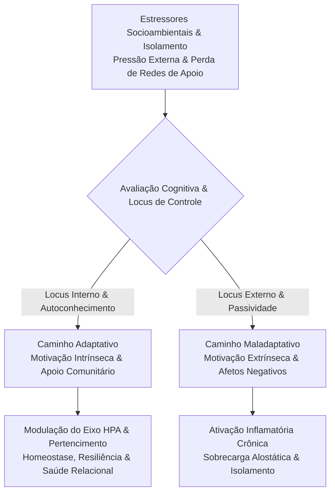

Autora: **Silviane Silvério** | Biomédica, Naturóloga e Escritora  
Data de publicação: 31 de julho de 2026 | Tempo médio de leitura: 10 minutos  

**Palavras-chave:** Sociabilidade, determinantes sociais da saúde, autoconhecimento, resiliência, isolamento social, Teoria da Autodeterminação, PICS, regulação emocional, saúde coletiva.

---

> **© Conteúdo Autoral:** Todo o conteúdo desta postagem é de autoria de Silviane Silvério. Licença CC BY 4.0 Internacional. O compartilhamento e a adaptação são permitidos mediante atribuição clara à autora. Para localizar a autora e a fonte do artigo, pesquise na internet: [https://praticasdebemestarsocial.github.io/silvianesilverio/](https://praticasdebemestarsocial.github.io/silvianesilverio/)
{: .prompt-info }

---

> 🔥 **A saúde humana é, em sua essência biológica e psíquica, um fenômeno relacional.** O isolamento social e a solidão atuam como determinantes sociais capazes de desencadear cascatas inflamatórias e sobrecarga neuroendócrina crônica.
{: .prompt-tip }

---

## 1. Introdução: A Natureza Relacional da Saúde Humana

A experiência recente com crises sanitárias e o isolamento prolongado expôs uma vulnerabilidade estrutural da sociedade contemporânea: a dependência visceral da interação social e do pertencimento comunitário.

Revisões integrativas sobre os impactos do distanciamento sociais (Acta Paulista de Enfermagem, 2021) revelam que a solidão não afeta apenas o humor e a qualidade do sono, mas desencadeia cascatas inflamatórias, elevação de citocinas pró-inflamatórias e estresse neuroendócrino crônico via eixos metabólicos e autônomos.

Neste ensaio teórico-epistemológico, investiga-se como o autoconhecimento, a regulação emocional e a reconstrução dos vínculos sociais funcionam como **tecnologias leves de alto impacto e baixo custo** na promoção da saúde coletiva e no âmbito das Práticas Integrativas e Complementares em Saúde (PICS).

---

## 2. Determinantes da Qualidade de Vida e a Motivação Intrínseca

A qualidade de vida resulta da interação entre hábitos biológicos, contexto socioeconômico e motivações subjetivas. Um aspecto crítico apontado pela literatura é a distinção fundamental entre motivação intrínseca e extrínseca no cuidado com o próprio corpo:

* ⚠️ **Motivação Extrínseca (Pressionamento Estético):** A prática de hábitos saudáveis motivada exclusivamente por pressão estética ou imposição social costuma associar-se a menores índices de satisfação com a vida, gerando insatisfação corporal, frustração e estresse crônico.
* 🌿 **Motivação Intrínseca (Autoconhecimento):** Quando o cuidado corporal é mediado pelo autoconhecimento, pelo autocuidado e pela escuta ativa do próprio organismo, o indivíduo fortalece sua capacidade adaptativa, resiliência e percepção genuína de bem-estar.

---

## 3. A Arquitetura do Estresse e a Capacidade Adaptativa

A resposta ao isolamento e às pressões socioambientais varia conforme a capacidade adaptativa do indivíduo. O modelo teórico de enfrentamento do estresse (Faro, 2010) demonstra como a resiliência e o foco na resolução de problemas atenuam o impacto dos estressores:

### 🧩 1. Estratégias Adaptativas Ativas (Foco na Solução e Resiliência)
Desenvolvimento de recursos internos de regulação emocional e resolução prática de conflitos, reduzindo a sobrecarga sobre o sistema nervoso autônomo.

### ⚡ 2. Influência de Afetos Negativos (Perpétuo Estado de Alerta)
A perpetuação de emoções de desamparo e raiva amplifica a percepção subjetiva do estressor, mantendo a ativação contínua do eixo HPA (hipotálamo-hipófise-adrenal).

### 🎯 3. Percepção de Autoeficácia (Locus de Controle Interno vs. Externo)
A crença de que a saúde e o destino dependem exclusivamente de fatores externos incontroláveis reduz o engajamento em práticas de autocuidado e preservação da autonomia.

---

### Modelo Adaptativo do Estresse e Suporte Social

---

## 4. Motivação, Pertencimento e a Superação de "Bolhas Sociais"

Segundo a Teoria da Autodeterminação (Silva et al., 2026), a motivação de qualidade e a saúde mental repousam sobre três necessidades psicológicas fundamentais: **autonomia, competência e pertencimento**.

### Matriz das Necessidades Psicológicas Fundamentais

| Necessidade Básica | Impacto na Saúde Mental | Consequência da Frustração |
| :--- | :--- | :--- |
| **Autonomia** | Sensação de maestria, liberdade e autodirecionamento | Sensação de desamparo, passividade e submissão |
| **Competência** | Percepção de eficácia e capacidade nas ações cotidianas | Insegurança, impotência e baixa autoestima |
| **Pertencimento** | Vínculo afetivo profundo com grupos e redes de apoio | Isolamento, anomia e inflamação crônica do tecido social |

A segregação socioespacial e o fechamento em "bolhas sociais" reduzem drasticamente o repertório de pertencimento. O incentivo ao contato intergrupal positivo — onde indivíduos de diferentes origens compartilham espaços de diálogo e cooperação — restaura o tecido social e fortalece o capital social de ponte.

---

## 5. Resultados: A Tríade Epistemológica da Saúde Relacional

A articulação conceitual entre psicologia da saúde, saúde coletiva e práticas integrativas converge para três pilares metodológicos:

1. 🤝 **A Relacionalidade como Requisito Biológico:** A conexão humana autêntica atua como um agente regulador da homeostase, do tom vagal e do sistema imunológico.
2. 🌱 **A Motivação Intrínseca como Moderadora:** O autocuidado baseado na escuta interna e no autoconhecimento reduz os estressores associados às pressões sociais externas.
3. 🛠️ **O Autoconhecimento como Tecnologia Social:** Fortalecer a inteligência emocional comunitária diminui a sobrecarga nos serviços de saúde de alta complexidade.

---

## 6. Considerações Clínicas e Limitações

Se você deseja aprofundar sua compreensão sobre os determinantes psicossociais da saúde e o impacto dos vínculos interpessoais na saúde coletiva:

📚 **Módulo de Pesquisa: Determinantes Psicossociais e Saúde Integrativa**

Para aprofundar o estudo sobre resiliência, regulação emocional e o impacto dos vínculos na saúde coletiva.

👉 [Clique aqui para acessar os Cursos e Materiais Acadêmicos de Silviane Silvério](https://praticasdebemestarsocial.github.io/silvianesilverio/)

---

## 7. Reflexão para a Comunidade

> De que maneira você percebe o impacto das suas redes de convivência na sua saúde física e emocional? O que sua comunidade poderia fazer para criar espaços de acolhimento e escuta para quem enfrenta o isolamento?
>
> **Deixe sua perspectiva nos comentários abaixo** e enriqueça este debate! Digite a palavra **"PERTENCIMENTO"** ao iniciar sua contribuição. 🤝✨

---

## 📄 Referências & Isenção de Responsabilidade

> ### ⚠️ Aviso Legal e Isenção de Responsabilidade (Disclaimer)
> Este trabalho constitui um ensaio teórico e de revisão conceitual para a promoção do bem-estar, sob a autoria de profissional Biomédica Naturopata. O conteúdo exposto possui finalidade estritamente educativa e informativa, não configurando diagnóstico médico, psicoterapêutico ou prescrição de tratamentos. Em caso de sofrimento psíquico, ansiedade ou depressão persistentes, busque obrigatoriamente a orientação de médicos, psicólogos e profissionais de saúde habilitados.
{: .prompt-warning }

---

### Direitos Autorais e Registro
© 2026 **Silviane Silvério**. Licença *CC BY 4.0 Internacional*. O compartilhamento e a adaptação são permitidos mediante atribuição clara à autora.

### Referências Bibliográficas

- **ACTA PAULISTA DE ENFERMAGEM.** Efeitos psicossociais do distanciamento social durante as infecções por coronavírus: revisão integrativa. *Acta Paulista de Enfermagem*, v. 34, eAPE01141, 2021.
- **FARO, André.** Determinantes psicossociais da capacidade adaptativa: um modelo teórico para o estresse. *Estudos de Psicologia (Natal)*, v. 15, n. 2, p. 139-148, 2010.
- **SILVA, Mariana Marcelino et al.** Motivação dos estudantes: determinantes psicossociais, impacto na aprendizagem e correlação com a saúde mental. *Revista FT*, v. 30, n. 158, 2026.
- **SILVÉRIO, Silviane de Souza.** *Pesquisas em Saúde Integrativa, Determinantes Sociais e Saberes Tradicionais.* São Paulo, 2025.

---

### Saiba Mais sobre a Autora

* 🔗 **ORCID:** [https://orcid.org/0000-0001-6311-1195](https://orcid.org/0000-0001-6311-1195)
* 🔗 **Currículo Lattes:** [http://lattes.cnpq.br/7481458793724724](http://lattes.cnpq.br/7481458793724724)  
*(ID Lattes: 7481458793724724 | Registro Profissional: CRTH-BR 1741)*
