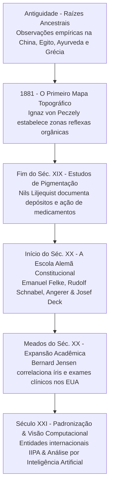

Autora: **Silviane Silvério** | Biomédica, Naturóloga e Escritora  
Data de publicação: 31 de julho de 2026 | Tempo médio de leitura: 7 minutos  

**Palavras-chave:** Iridologia, história da medicina, Ignaz von Peczely, Nils Liljequist, Josef Deck, Bernard Jensen, irisdiagnose constitucional, saúde integrativa, biomedicina, naturologia.

---

> **© Conteúdo Autoral:** Todo o conteúdo desta postagem é de autoria de Silviane Silvério. Licença CC BY-SA 4.0 Internacional. O compartilhamento e a adaptação são permitidos mediante atribuição clara à autora e distribuição sob a mesma licença. Para localizar a autora e a fonte do artigo, pesquise na internet: [https://praticasdebemestarsocial.github.io/silvianesilverio/](https://praticasdebemestarsocial.github.io/silvianesilverio/)
{: .prompt-info }

---

> 🔥 **A iridologia é uma disciplina de avaliação constitucional cujas raízes remontam às tradições médicas da Antiguidade.** Compreender sua evolução é fundamental para posicioná-la no campo contemporâneo das Práticas Integrativas e Complementares em Saúde (PICS).
{: .prompt-tip }

---

## 1. Da Observação Empírica à Mapeação Sistêmica

A observação dos olhos como espelho da vitalidade biológica é um fenômeno documentado ao longo de séculos. Registros históricos demonstram que tradições médicas da China, do Egito Antigo, da Índia (*Ayurveda*) e da Grécia Hipocrática já reconheciam que alterações na tonalidade, no brilho e na densidade tecidual ocular ofereciam indicativos valiosos sobre a integridade interna e os desequilíbrios do indivíduo.

Na saúde integrativa contemporânea, o objetivo da iridologia não é a diagnose noológica nosológica (rotulação de patologias clínicas específicas), mas sim a **identificação de predisposições constitucionais**, tendências funcionais e suporte individualizado ao terreno biológico.

---

## 2. O Marco Fundador: Ignaz von Peczely e a Primeira Cartografia Iridiana

A transição de uma intuição médica milenar para uma cartografia reflexa estruturada ocorreu no século XIX com o médico húngaro **Ignaz von Peczely** (1822–1911), considerado o pai da iridologia moderna.

A narrativa fundadora relata que, ao observar o surgimento de uma marca escura na íris de uma coruja ferida — e sua posterior modificação em uma tonalidade mais clara durante a consolidação tecidual —, Peczely dedicou sua carreira à pesquisa clínica das correlações iridianas.

Em **1881**, a publicação do seu primeiro mapa topográfico dividiu a íris em zonas que se correlacionavam reflexamente com a anatomia humana, teorizando que variações na densidade e pigmentação revelavam vulnerabilidades genéticas e históricas do organismo.

---

## 3. A Evolução Cronológica da Irisdiagnose Constitucional

A consolidação da iridologia perpassou diferentes fases de aprofundamento científico e metodológico, desde a Europa até a sua expansão global nas Américas:

#### 🏛️ Raízes Ancestrais (Antiguidade)
Observações empíricas registradas em papiros egípcios, tratados ayurvédicos e textos hipocráticos que relacionavam a clareza e marcas oculares ao estado geral de vitalidade.

#### 🗺️ O Primeiro Mapa Iridiano (1881)
Ignaz von Peczely publica o primeiro mapa topográfico reflexo, correlacionando graficamente setores iridianos com órgãos e sistemas corporais.

#### 🧪 Estudos de Pigmentação e Drogas (Fim do Séc. XIX)
O pesquisador sueco Nils Liljequist documenta independentemente as alterações de coloração e depósitos na íris correlacionados ao uso sustentado de substâncias químicas e medicamentos de época.

#### 🔬 A Escola Alemã e a Iridologia Constitucional (Início do Séc. XX)
Pioneiros como Emanuel Felke, Rudolf Schnabel, Joseph Angerer e Josef Deck integram a irisdiagnose à homeopatia e à naturopatia, introduzindo conceitos rigorosos de biotipologia e vulnerabilidade tecidual.

#### 📘 Expansão e Integração Acadêmica (Meados do Séc. XX)
O Dr. Bernard Jensen expande o modelo na América do Norte, relacionando achados iridianos com nutrição funcional, análise laboratorial e práticas de desintoxicação.

#### 🤖 Padronização e Visão Computacional (Século XXI)
Atuação de entidades profissionais (como a IIPA) na padronização ética e o surgimento de algoritmos de Inteligência Artificial para análise quantitativa de padrões.

---

## 4. A Contribuição dos Pioneiros da Iridologia

A tabela abaixo sintetiza as principais contribuições metodológicas dos nomes mais expressivos na construção dessa ciência integrativa:

| Pesquisador / Escola | Período / Origem | Principal Contribuição Metodológica |
| :--- | :--- | :--- |
| **Ignaz von Peczely** | Século XIX (Hungria) | Criação da primeira cartografia iridiana e conceituação do arco reflexo ocular |
| **Nils Liljequist** | Século XIX (Suécia) | Investigação de acúmulos tóxicos, heterocromias e alterações pigmentares na íris |
| **Josef Deck & Joseph Angerer** | Século XX (Alemanha) | Sistematização da Iridologia Constitucional, diatética e biotipologia alemã |
| **Bernard Jensen** | Século XX (EUA) | Correlação clínica integrativa, cartografia expandida e difusão nas Américas |
| **IIPA & Pesquisadores Atuais** | Século XXI (Global) | Padronização de currículos internacionais, ética e integração com tecnologia e IA |

---

## 5. O Papel da Iridologia na Saúde Integrativa Contemporânea

A transição da iridologia tradicional para a modernidade reafirma seu valor como uma **matriz de avaliação constitucional**, em vez de um substituto para o diagnóstico patológico convencional. 

Ao analisar o terreno biológico, a densidade das fibras iridianas e as marcas pigmentares, o profissional integrativo obtém pistas valiosas para guiar escolhas preventivas, suporte nutricional, manejo do estresse e intervenções no estilo de vida.

---

### Aprofunde seus Estudos em História e Epistemologia da Iridologia

Se você busca compreender em profundidade a evolução histórica e a fundamentação científica do mapeamento constitucional:

📚 **Módulo de Pesquisa: História e Epistemologia da Iridologia**

Aprofunde seus conhecimentos sobre a evolução das cartografias iridianas, biotipologia e a aplicação prática na saúde integrativa.

👉 [Clique aqui para explorar os Cursos e Materiais Acadêmicos de Silviane Silvério](https://praticasdebemestarsocial.github.io/silvianesilverio/)

---

## 6. Reflexão para a Comunidade Integrativa

> Ao conhecer a evolução da iridologia — desde a observação intuitiva até as tentativas contemporâneas de padronização —, qual fase histórica mais desperta seu interesse sobre o potencial da observação do corpo como mapa da saúde?
>
> **Deixe sua perspectiva nos comentários abaixo** e continue essa reflexão conosco! Digite a palavra **"HISTÓRIA"** ao iniciar seu comentário. 📜👁️

---

## 📄 Referências & Isenção de Responsabilidade

> ### ⚠️ Aviso Legal e Isenção de Responsabilidade (Disclaimer)
> Este artigo possui finalidade estritamente educativa, histórica e de divulgação de conceitos de Práticas Integrativas e Complementares em Saúde (PICS), sob a autoria de profissional Biomédica Naturopata. O conteúdo exposto não configura diagnóstico médico, prescrição ou tratamento de doenças. A iridologia é uma ferramenta de avaliação de tendências constitucionais e homeostáticas, não substituindo exames clínicos, laboratoriais ou de imagem. Em caso de dúvidas sobre sua saúde, consulte um profissional médico habilitado.
{: .prompt-warning }

---

### Direitos Autorais e Registro
© 2026 **Silviane Silvério**. Licença *CC BY-SA 4.0 Internacional*. O compartilhamento e a adaptação são permitidos mediante atribuição clara à autora e distribuição sob a mesma licença.

### Referências Bibliográficas

- **BRIDGET'S NATUROPATHY.** *Origins of Iridology.* Acesso em 2025.
- **SILVÉRIO, Silviane de Souza.** *Pesquisas em Iridologia, História da Saúde Integrativa e Saberes Tradicionais.* São Paulo, 2025.

---

### Saiba Mais sobre a Autora

* 🔗 **ORCID:** [https://orcid.org/0000-0001-6311-1195](https://orcid.org/0000-0001-6311-1195)
* 🔗 **Currículo Lattes:** [http://lattes.cnpq.br/7481458793724724](http://lattes.cnpq.br/7481458793724724)  
*(ID Lattes: 7481458793724724 | Registro Profissional: CRTH-BR 1741)*
