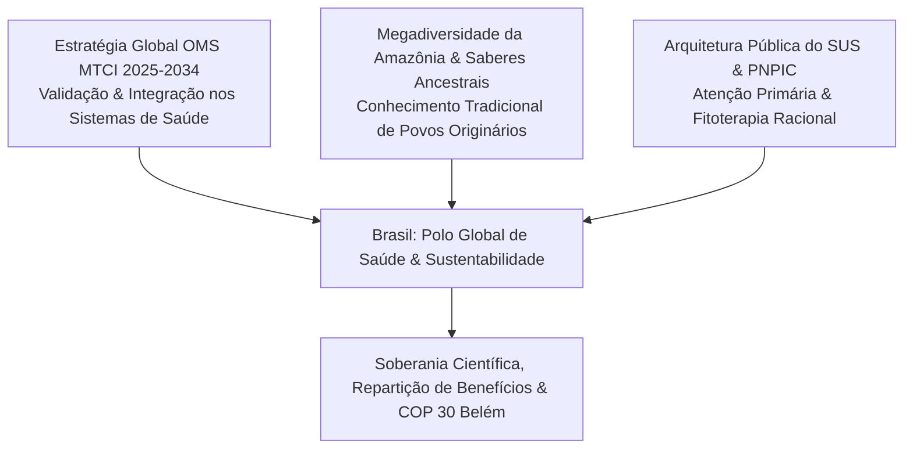

Autora: **Silviane Silvério** | Biomédica, Naturóloga e Escritora  
Data de publicação: 15 de maio de 2025 | Tempo médio de leitura: 8 minutos  

**Palavras-chave:** Medicina Tradicional, Complementar e Integrativa (MTCI), Política Nacional de Práticas Integrativas e Complementares (PNPIC), COP 30, biodiversidade, saberes ancestrais, soberania científica, SUS, Amazônia.

---

> **© Conteúdo Autoral:** Todo o conteúdo desta postagem é de autoria de Silviane Silvério. Licença CC BY-SA 4.0 Internacional. O compartilhamento e a adaptação são permitidos mediante atribuição clara à autora e distribuição sob a mesma licença. Para citação oficial e localização do artigo, pesquise na internet: [https://praticasdebemestarsocial.github.io/silvianesilverio/](https://praticasdebemestarsocial.github.io/silvianesilverio/)
{: .prompt-info }

---

> 🔥 **A aprovação da nova Estratégia Global da OMS para a Medicina Tradicional 2025–2034** e a realização da **COP 30 em Belém do Pará** posicionam o Brasil e o bioma amazônico no centro da diplomacia ambiental e da saúde integrativa mundial.
{: .prompt-tip }

---

## 1. Resumo & Introdução

Em maio de 2025, a Organização Mundial da Saúde (OMS) aprovou a nova **Estratégia Global para a Medicina Tradicional 2025–2034**, reconhecendo e fortalecendo a Medicina Tradicional, Complementar e Integrativa (MTCI) como pilar fundamental da governança global em saúde.

O Brasil — detentor da maior biodiversidade do planeta e guardião de saberes milenares de povos originários e comunidades tradicionais — possui uma oportunidade estratégica ímpar para liderar essa agenda internacional. Com a realização da **COP 30 em Belém do Pará**, o país torna-se o palco central para discutir a intersecção entre preservação ambiental, justiça socioambiental e saúde pública.

Este artigo analisa como a modernização e o fortalecimento da **Política Nacional de Práticas Integrativas e Complementares (PNPIC)** no Sistema Único de Saúde (SUS), alinhados aos marcos da Convenção sobre Diversidade Biológica (CDB) e da Organização Mundial da Propriedade Intelectual (OMPI), podem posicionar o Brasil como referência em soberania científica, diplomacia ambiental e inovação em saúde.

---

## 2. A Nova Estratégia Global da OMS e o Reconhecimento da MTCI

A aprovação da Estratégia Global para a Medicina Tradicional 2025–2034 pela OMS representa um divisor de águas na saúde coletiva internacional. O documento estabelece diretrizes estratégicas estruturantes:

* 🔬 **Evidências Científicas:** Consolidar metodologias rigorosas de pesquisa adaptadas às especificidades dos sistemas tradicionais, ecológicos e integrativos.
* ⚖️ **Marcos Regulatórios:** Criar regulamentações robustas para assegurar a qualidade, eficácia e segurança de produtos fitoterápicos, terapias e praticantes.
* 🏥 **Inclusão nos Sistemas de Saúde:** Promover a integração responsável e equitativa dessas práticas na atenção primária e nos serviços públicos de saúde.

Essa diretriz internacional ratifica o princípio de que a saúde humana é indissociável dos territórios, das culturas e dos ecossistemas em que as comunidades vivem.

---

## 3. O SUS como Pioneiro e os Desafios da PNPIC

O Brasil destacou-se mundialmente ao institucionalizar a Política Nacional de Práticas Integrativas e Complementares (PNPIC) no SUS em 2006, incorporando modalidades como fitoterapia, medicina tradicional chinesa, acupuntura, homeopatia e outras terapêuticas naturais.

Entretanto, para atingir sua plena maturidade institucional, a PNPIC enfrenta gargalos estruturais relevantes que exigem superação:

### Desafios Estruturais da PNPIC no SUS e Caminhos de Inovação

| Gargalo Identificado | Dimensão do Problema | Estratégia de Superação e Fortalecimento |
| :--- | :--- | :--- |
| **Resistências Institucionais** | Barreiras epistemológicas entre a biomedicina hegemônica e os saberes tradicionais. | Fomento à pesquisa transdisciplinar e inclusão das PICS nas matrizes curriculares. |
| **Subfinanciamento Crônico** | Escassez de recursos orçamentários específicos para a cadeia de insumos e fitoterápicos. | Vinculação de fundos de desenvolvimento sustentável e bioeconomia da Amazônia. |
| **Protocolos & Capacitação** | Necessidade de padronização de fluxos e capacitação continuada na Atenção Primária. | Criação de guias clínicos baseados em evidências e fortalecimento da Educação Permanente. |

---

## 4. COP 30 em Belém: Soberania Científica e Geopolítica da Saúde

A realização da 30ª Conferência das Partes (COP 30) em Belém do Pará consolida a Amazônia não apenas como patrimônio ecológico, mas como um **polo vivo de ciência, saúde e bem-estar**.

As populações amazônicas desenvolveram, ao longo de séculos, sistemas de cuidado que integram a saúde do corpo à preservação do bioma. Trazer esses conhecimentos para o centro da agenda da COP 30 demonstra que a proteção da biodiversidade e a promoção da saúde pública são dimensões indissociáveis do mesmo compromisso sustentável.

---

### Convergência Estratégica: Amazônia, Saúde & Diplomacia Ambiental

---

## 5. Proteção dos Saberes Ancestrais e Soberania Científica

Para garantir liderança ética e geopolítica nessa área, é indispensável estruturar a PNPIC em consonância com instrumentos internacionais de salvaguarda, como a **Convenção sobre Diversidade Biológica (CDB)** e os marcos da **OMPI**.

Essa articulação previne práticas de biopirataria e assegura a **repartição justa e equitativa de benefícios** decorrentes do uso do patrimônio genético e dos conhecimentos tradicionais associados. Dessa forma, o Brasil fortalece sua soberania científica e demonstra que a inovação em saúde pode caminhar lado a lado com o respeito aos direitos dos povos originários e das comunidades locais.

---

## 6. Conclusão

A convergência entre as diretrizes globais da OMS, a megadiversidade do bioma amazônico e a arquitetura pública do SUS oferece ao Brasil uma oportunidade histórica de protagonismo internacional.

Ao aprimorar suas políticas públicas de práticas integrativas, salvaguardar os saberes tradicionais e integrar a dimensão da saúde às negociações climáticas da COP 30, o país reforça seu papel na construção de um modelo global de desenvolvimento onde a saúde do planeta e o bem-estar humano são indissociáveis.

---

### Aprofunde seus Estudos em MTCI e Saúde Integrativa

Se você busca acompanhar pesquisas e artigos acadêmicos sobre bioterapias, saberes tradicionais e políticas públicas em saúde:

📚 **Módulo de Pesquisa: Saberes Tradicionais, Biodiversidade e Saúde Coletiva**

Acesse investigações, notas técnicas e análises epistemológicas sobre o bioma amazônico e as PICS no SUS.

👉 [Clique aqui para acessar os Cursos e Materiais Acadêmicos de Silviane Silvério](https://praticasdebemestarsocial.github.io/silvianesilverio/)

---

## 7. Reflexão para a Comunidade

> De que maneira você acredita que a preservação da Amazônia e o fortalecimento dos saberes tradicionais podem transformar a saúde pública no Brasil e no mundo rumo à COP 30?
>
> **Deixe sua perspectiva nos comentários abaixo**! Digite a palavra **"AMAZÔNIA"** ao iniciar seu comentário. 🌿🌎

---

## 📄 Referências & Isenção de Responsabilidade

> ### ⚠️ Aviso Legal e Isenção de Responsabilidade (Disclaimer)
> Este artigo possui finalidade estritamente educativa, informativa e de divulgação de conceitos de saúde coletiva, geopolítica ambiental e Práticas Integrativas e Complementares em Saúde (PICS), sob a autoria de profissional Biomédica Naturopata. O conteúdo exposto não configura diagnósticos, tratamentos de doenças ou consultoria jurídica oficial.
{: .prompt-warning }

---

### Direitos Autorais e Registro
© 2026 **Silviane Silvério**. Licença *CC BY-SA 4.0 Internacional*. O compartilhamento e a adaptação são permitidos mediante atribuição clara à autora e distribuição sob a mesma licença.

### Referências Bibliográficas

- **MEDICINAS A.S.A.** *Medicina Tradicional no SUS: desafios e perspectivas.* Disponível em: [https://medicinasa.com.br/medicina-tradicional-sus/](https://medicinasa.com.br/medicina-tradicional-sus/). Acesso em: 15 maio 2025.
- **MINISTÉRIO DA SAÚDE (Brasil).** *Política Nacional de Práticas Integrativas e Complementares (PNPIC) no SUS.* Brasília: Ministério da Saúde, 2006.
- **ORGANIZAÇÃO MUNDIAL DA SAÚDE (OMS).** *Estratégia Global da OMS sobre Medicina Tradicional 2025-2034.* Genebra: OMS, 2025.
- **SILVÉRIO, Silviane de Souza.** *Pesquisas em Saúde Integrativa, Saberes Tradicionais e Biodiversidade.* São Paulo, 2025.

---

### Saiba Mais sobre a Autora

*Com múltiplos olhos e um só coração,*  
**Silviane Silvério**  
*Olho Preditivo – Mapas do Autoconhecimento*

* 🔗 **ORCID:** [https://orcid.org/0000-0001-6311-1195](https://orcid.org/0000-0001-6311-1195)
* 🔗 **Currículo Lattes:** [http://lattes.cnpq.br/7481458793724724](http://lattes.cnpq.br/7481458793724724)  
*(ID Lattes: 7481458793724724 | Registro Profissional: CRTH-BR 1741)*
