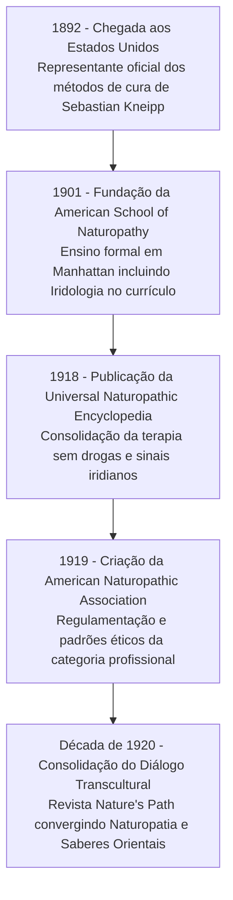

Autora: **Silviane Silvério** | Biomédica, Naturóloga e Escritora  
Data de publicação: 31 de julho de 2026 | Tempo médio de leitura: 9 minutos  

**Palavras-chave:** Benedict Lust, história da naturopatia, iridologia constitucional, Sebastian Kneipp, Ignaz von Peczely, Vis Medicatrix Naturae, saúde integrativa, biomedicina, naturologia.

---

> **© Conteúdo Autoral:** Todo o conteúdo desta postagem é de autoria de Silviane Silvério. Licença CC BY-SA 4.0 Internacional. O compartilhamento e a adaptação são permitidos mediante atribuição clara à autora e distribuição sob a mesma licença. Para localizar a autora e a fonte do artigo, pesquise na internet: [https://praticasdebemestarsocial.github.io/silvianesilverio/](https://praticasdebemestarsocial.github.io/silvianesilverio/)
{: .prompt-info }

---

> 🔥 **Reconhecido historicamente como o "Pai da Naturopatia", Benedict Lust (1872–1945)** desempenhou um papel divisor de águas na transição das terapias empíricas europeias para um sistema de saúde estruturado, ético e institucionalizado.
{: .prompt-tip }

---

## 1. Como a Visão Pioneira de Benedict Lust Sistematizou os Saberes de Cura Natural e Institucionalizou a Iridologia na América?

Discípulo do padre Sebastian Kneipp e profundamente influenciado pelas propostas de Adolf Just, Benedict Lust unificou a hidroterapia, a fitoterapia, a nutrição funcional, a helioterapia e a homeopatia sob o termo abrangente **"Naturopatia"**.

Mais do que organizar um modelo terapêutico multidisciplinar, Lust compreendeu que a avaliação da saúde não poderia se limitar à supressão do sintoma aparente. Ele foi o responsável direto por introduzir formalmente a **iridologia** no currículo acadêmico e na prática clínica naturopática nos Estados Unidos, estabelecendo a leitura do terreno biológico individual como o pilar mestre da prevenção proativa.

---

## 2. Das Águas de Kneipp à Construção de uma Ciência de Cura Global

A trajetória de Lust foi impulsionada por sua própria experiência pessoal de superação de uma enfermidade grave por meio dos métodos de cura pela água de Sebastian Kneipp. Ao emigrar para os Estados Unidos em 1892, ele transformou sua missão de vida em uma causa de institucionalização médica e acadêmica:

### 🏛️ 1. A Fundação Acadêmica (1901)
Criou a *American School of Naturopathy* em Manhattan, garantindo que o ensino das práticas naturais tivesse rigor científico, ética profissional, anatomofisiologia e currículo formalizado.

### 👁️ 2. A Integração da Iridologia como Ferramenta Avaliativa
Embora Ignaz von Peczely tenha decodificado os mapas iniciais da íris no século XIX, foi Benedict Lust quem construiu a ponte prática e pedagógica nas Américas. Ele ensinou a iridologia como uma ferramenta indispensável para mapear a ***Vis Medicatrix Naturae*** (o poder de cura intrínseco da natureza), identificar estados de toxemia e avaliar predisposições teciduais antes mesmo do surgimento de alterações clínicas estruturais.

### 🌏 3. A Intersecção entre Ocidente e Oriente
Antecipando em quase um século o conceito moderno de medicina integrativa global, Lust incorporou ensinamentos do Ayurveda e do Yoga em suas publicações de grande circulação (como a renomada revista *Nature's Path*), contando com contribuições diretas de mestres orientais como Paramahansa Yogananda.

---

### Tabela Comparativa: Influências Fundacionais na Obra de Benedict Lust

| Influência / Pensador | Princípio Fisiológico / Terapêutico | Contribuição para a Naturopatia de Lust |
| :--- | :--- | :--- |
| **Sebastian Kneipp** | Hidroterapia, estímulo circulatório e vitalismo | Base teórica sobre o uso da água e forças naturais na restauração da saúde |
| **Adolf Just** | *Return to Nature* (Estilo de vida natural e cura pela terra) | Relevância da alimentação crua, banhos de ar e vida em sintonia com a natureza |
| **Ignaz von Peczely** | Topografia iridiana e projeção reflexa nos tecidos | Adoção da iridologia no diagnóstico constitucional naturopático |
| **Sabedoria Oriental (Ayurveda/Yoga)** | Equilíbrio bioenergético e integração mente-corpo | Visão holística expandida divulgada amplamente na revista *Nature's Path* |

---

### O Mapeamento Histórico da Institucionalização Naturopática

A construção da naturopatia e a formalização da iridologia seguiram etapas cronológicas estruturantes no trabalho de Benedict Lust:

#### 🚢 1892 — Chegada aos Estados Unidos
Benedict Lust emigra para a América como representante oficial dos métodos de cura de Sebastian Kneipp, iniciando a difusão da restauração vital pela água e pelo estilo de vida natural.

#### 🏫 1901 — Fundação da American School of Naturopathy
Criação da primeira instituição formal de ensino naturopático em Manhattan, estabelecendo a iridologia como disciplina fundamental de avaliação constitucional e funcional.

#### 📖 1918 — Publicação da Enciclopédia Naturopática Universal
Lust lança a *Universal Naturopathic Encyclopedia*, consolidando o corpo de conhecimento da terapia sem drogas, da dietoterapia integrativa e do estudo dos sinais iridianos.

#### ⚖️ 1919 — Criação da American Naturopathic Association
Organização da categoria profissional para garantir padrões éticos, científicos e práticos no exercício da naturopatia e da iridologia nos Estados Unidos.

#### 🌐 Década de 1920 — Consolidação do Diálogo Transcultural
Edição contínua da revista *Nature's Path*, promovendo a convergência entre a naturopatia ocidental, a iridologia constitucional e os saberes milenares da medicina tradicional oriental.

---

## 3. Aprofunde seus Estudos em História da Naturopatia e Iridologia Constitucional

Se você busca compreender a evolução histórica das Práticas Integrativas e a aplicação clínica da iridologia na avaliação do terreno biológico:

📚 **Módulo de Estudos: História da Naturopatia e Fundamentos da Iridologia**

Acesse materiais explicativos, revisões históricas e fundamentação teórico-prática desenvolvidos por Silviane Silvério (Biomédica, Naturóloga e Escritora).

👉 [Clique aqui para explorar os Cursos e Materiais Acadêmicos de Silviane Silvério](https://praticasdebemestarsocial.github.io/silvianesilverio/)

---

## 4. Reflexão para a Comunidade Integrativa

> Benedict Lust acreditava que a verdadeira cura dependia da união entre as leis da natureza e o conhecimento do próprio terreno biológico. Na sua jornada de autoconhecimento e saúde, qual abordagem integrativa (como a iridologia, a nutrição funcional ou a hidroterapia) mais transformou a sua percepção de bem-estar?
>
> **Compartilhe sua experiência nos comentários abaixo** e participe dessa construção coletiva! Digite a palavra **"NATUROPATIA"** ao iniciar sua reflexão. 🌱✨

---

## 📄 Referências & Isenção de Responsabilidade

> ### ⚠️ Aviso Legal e Isenção de Responsabilidade (Disclaimer)
> Este artigo possui finalidade estritamente educativa, histórica e de divulgação de conceitos de naturopatia e Práticas Integrativas e Complementares em Saúde (PICS), sob a autoria de profissional Biomédica Naturopata. O conteúdo não configura diagnóstico médico, prescrição ou tratamento de doenças. A iridologia e a naturopatia são ferramentas de avaliação constitucional e promoção do bem-estar. Em caso de dúvidas sobre sua saúde, consulte um profissional médico habilitado.
{: .prompt-warning }

---

### Direitos Autorais e Registro
© 2026 **Silviane Silvério**. Licença *CC BY-SA 4.0 Internacional*. O compartilhamento e a adaptação são permitidos mediante atribuição clara à autora e distribuição sob a mesma licença.

### Referências Bibliográficas

- **ASSOCIAÇÃO BRASILEIRA DE MEDICINA NATURAL.** *Quem Somos: Dr. Benedict Lust e o termo naturopatia.* São Paulo, 2025.
- **LUST, Benedict.** *Universal Naturopathic Encyclopedia.* New York: Benedict Lust, 1918.
- **SILVÉRIO, Silviane de Souza.** *Pesquisas em Iridologia, História da Naturopatia e Saúde Integrativa.* São Paulo, 2025.
- **WIKIPÉDIA.** *Benedict Lust.* Acesso em 2025.

---

### Saiba Mais sobre a Autora

* 🔗 **ORCID:** [https://orcid.org/0000-0001-6311-1195](https://orcid.org/0000-0001-6311-1195)
* 🔗 **Currículo Lattes:** [http://lattes.cnpq.br/7481458793724724](http://lattes.cnpq.br/7481458793724724)  
*(ID Lattes: 7481458793724724 | Registro Profissional: CRTH-BR 1741)*
