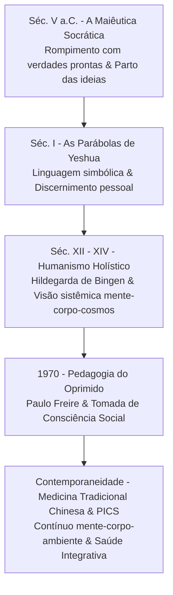

Autora: **Silviane Silvério** | Biomédica, Naturóloga e Escritora  
Data de publicação: 17 de dezembro de 2025 | Tempo médio de leitura: 12 minutos  

**Palavras-chave:** Educação libertadora, espiritualidade consciente, pedagogia do discernimento, Paulo Freire, maiêutica socrática, epistemologia, saúde integrativa, autoconhecimento.

---

> **© Conteúdo Autoral:** Todo o conteúdo desta postagem é de autoria de Silviane Silvério. Caso utilize este texto como referência em seus estudos, trabalhos ou publicações, solicitamos a gentileza de dar os devidos créditos à autora e incluir as referências bibliográficas. Para localizar a autora e a fonte do artigo, pesquise na internet: [https://praticasdebemestarsocial.github.io/silvianesilverio/](https://praticasdebemestarsocial.github.io/silvianesilverio/)
{: .prompt-info }

---

> 🔥 **A verdadeira maturidade interior exige a fusão entre educação libertadora e espiritualidade consciente.** A maturidade do ser não floresce no adestramento da mente, mas na capacidade de cultivar uma percepção crítica e autônoma sobre a realidade interna e externa.
{: .prompt-tip }

---

## 1. Como a Transição da Memorização Passiva para a Pedagogia do Discernimento Liberta a Consciência e Reconecta Saber, Ética e Ser?

Muitas estruturas educacionais e espirituais foram historicamente desenhadas sobre o modelo da obediência, privilegiando a aceitação passiva de dogmas em detrimento do questionamento genuíno. Como consequência, a espiritualidade contemporânea frequentemente oscila entre dois extremos opostos: a **ingenuidade dogmática** ou o **cinismo reativo**.

A ingenuidade dogmática aceita cegamente estruturas sem submetê-las ao filtro da razão ética e da experiência direta; o cinismo reativo, por sua vez, rejeita qualquer dimensão de transcendência ou valor moral por trauma das imposições autoritárias.

Para superar esse impasse, faz-se urgente uma **pedagogia do discernimento**. Não se trata de acumular dados ou memorizar manuais de conduta, mas de desenvolver a capacidade de problematizar o mundo, auscultar a voz interna da consciência e integrar o saber intelectual à práxis ética. Ao migrar da reprodução passiva para o discernimento ativo, o indivíduo reconecta o saber (ciência e filosofia), a ética (responsabilidade com o outro) e o ser (integração biopsicossocial e espiritual).

---

## 2. A Evolução do Processo Formativo: Do Controle Hegemônico à Emancipação da Consciência

Ao longo da história das ideias, a educação oscilou entre o instrumento de manutenção de poder e o vetor de emancipação individual. A tabela a seguir compara o paradigma tradicionalista/bancário e o modelo emancipatório/integrativo:

### Quadro Comparativo dos Paradigmas Educacionais e Espirituais

| Dimensão de Análise | Paradigma da Domesticação (Educação Bancária) | Paradigma da Emancipação (Pedagogia Crítica e Integrativa) |
| :--- | :--- | :--- |
| **Papel do Educador/Guia** | Transmissor inquestionável de respostas prontas e regras | Facilitador da investigação, maiêutica e discernimento |
| **Relação com o Conhecimento** | Memorização, reprodução passiva e adesão ao dogma | Problematização, reflexão crítica e leitura do mundo |
| **Abordagem Espiritual** | Dogmática, exteriorizada e fundamentada no medo ou na culpa | Autônoma, interiorizada e vinculada à ética da responsabilidade |
| **Visão do Ser Humano** | Receptáculo fragmentado (mente isolada do corpo e do cosmos) | Sistema complexo e integrado (razão, intuição, emoção e biologia) |

---

### O Mapeamento Histórico das Pedagogias Emancipatórias

O caminho em direção a uma espiritualidade lúcida é marcado por momentos decisivos na história da filosofia, da educação e dos saberes integrativos:

#### 🏛️ A Maiêutica Socrática (Séc. V a.C.)
Sócrates rompe com a imposição de verdades prontas e inaugura o método maiêutico: fazer perguntas para partejar o conhecimento interno do indivíduo, promovendo a autonomia do pensamento e a coragem de examinar a própria vida.

#### 🌾 As Parábolas de Yeshua (Séc. I)
Ensino itinerante fundamentado em narrativas simbólicas que exigem interpretação ativa e discernimento pessoal (*"Quem tem ouvidos para ouvir, ouça"*), desafiando estruturas rituais rígidas e devolvendo a responsabilidade moral ao coração humano.

#### 🌿 Humanismo Holístico e Visão Sistêmica (Séc. XII - XIV)
A preservação do saber integrativo por figuras como Hildegarda de Bingen, conectando a saúde biológica ao ecossistema e à dimensão espiritual humana, antecipando a visão holística moderna.

#### 📘 Pedagogia do Oprimido — Paulo Freire (1970)
A sistematização da educação libertadora. A alfabetização e o aprendizado deixam de ser depósitos de dados ("educação bancária") para tornarem-se atos de tomada de consciência, leitura crítica do mundo e transformação social.

#### ☯️ A Integração com a Medicina Tradicional Chinesa (Contemporaneidade)
Consolidação de modelos explicativos integrativos que encaram o ser humano como um contínuo entre mente, corpo e ambiente, superando a separação cartesiana e fundamentando as Práticas Integrativas e Complementares em Saúde (PICS).

---

## 3. Fortaleça sua Jornada de Autoconhecimento e Discernimento Crítico

Se você busca aprofundar sua compreensão sobre a intersecção entre o pensamento crítico, a saúde integrativa e as linguagens simbólicas do autoconhecimento:

📚 **Módulo de Estudos: Formação em Epistemologia, Linguagens Simbólicas e Saúde Integrativa**

Acesse materiais estruturados, mapas conceituais e reflexões filosóficas para construir uma prática baseada na lucidez, na ética e na autonomia.

👉 [Acesse aqui o ecossistema de estudos e artigos científicos de Silviane Silvério](https://praticasdebemestarsocial.github.io/silvianesilverio/)

---

## 4. Reflexão para a Comunidade de Aprendizagem

> Ao revisitar sua própria trajetória de formação e busca pessoal, qual "verdade" ou dogma herdado você precisou questionar para construir uma visão de mundo mais lúcida, autêntica e alinhada à sua integridade?
>
> **Compartilhe sua perspectiva nos comentários abaixo** para enriquecermos esse diálogo comunitário! Digite a palavra **"LUCIDEZ"** ao iniciar seu comentário. ✨

---

## 📄 Referências & Isenção de Responsabilidade

> ### ⚠️ Aviso Legal e Isenção de Responsabilidade (Disclaimer)
> Este artigo possui finalidade estritamente educativa, filosófica e de divulgação de conceitos de humanidades médicas e Práticas Integrativas e Complementares em Saúde (PICS), sob a autoria de profissional Biomédica Naturopata. O conteúdo exposto não configura proselitismo religioso, diagnóstico, prescrição ou tratamento de doenças. As reflexões sobre espiritualidade e educação visam ao desenvolvimento pessoal e ao pensamento crítico. Em caso de sofrimento psíquico ou condições clínicas, consulte profissionais de saúde habilitados.
{: .prompt-warning }

---

### Direitos Autorais e Registro
© 2026 **Silviane Silvério**. Licença *CC BY-NC-ND 4.0 Internacional*. Registros oficiais com DOI em Zenodo/OSF/HAL.

### Referências Bibliográficas

- **FREIRE, Paulo.** *Pedagogia do Oprimido.* Rio de Janeiro: Paz e Terra, 1970.
- **FRANCISCO, Papa.** *Carta Encíclica Laudato Si’: Sobre o cuidado da casa comum.* Vaticano, 2015.
- **MACIOCIA, Giovanni.** *The Foundations of Chinese Medicine.* 3. ed. Edinburgh: Churchill Livingstone, 2015.
- **PLATÃO.** *Apologia de Sócrates.* São Paulo: Editora 34, 2013.

---

### Saiba Mais sobre a Autora

* 🔗 **ORCID:** [https://orcid.org/0000-0001-6311-1195](https://orcid.org/0000-0001-6311-1195)
* 🔗 **Currículo Lattes:** [http://lattes.cnpq.br/7481458793724724](http://lattes.cnpq.br/7481458793724724)  
*(ID Lattes: 7481458793724724 | Registro Profissional: CRTH-BR 1741)*
