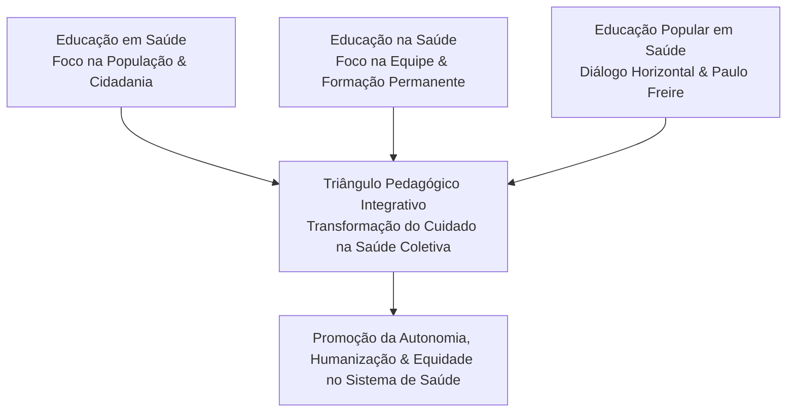

Autora: **Silviane Silvério** | Biomédica, Naturóloga e Escritora  
Data de publicação: 31 de julho de 2026 | Tempo médio de leitura: 10 minutos  

**Palavras-chave:** Educação em Saúde, Educação na Saúde, Educação Popular em Saúde, Paulo Freire, Saúde Coletiva, PICS, humanização, formação permanente, autonomia, diálogo de saberes.

---

> **© Conteúdo Autoral:** Todo o conteúdo desta postagem é de autoria de Silviane Silvério. Licença CC BY-SA 4.0 Internacional. O compartilhamento e a adaptação são permitidos mediante atribuição clara à autora e distribuição sob a mesma licença. Para localizar a autora e a fonte do artigo, pesquise na internet: [https://praticasdebemestarsocial.github.io/silvianesilverio/](https://praticasdebemestarsocial.github.io/silvianesilverio/)
{: .prompt-info }

---

> 🔥 **A construção de práticas humanizadas e transformadoras na Saúde Coletiva exige superar a confusão conceitual** entre instrução sanitária prescritiva e verdadeira educação emancipatória.
{: .prompt-tip }

---

## 1. Desvelando os Conceitos: Educação "em" vs. Educação "na" Saúde

No cotidiano dos serviços e no meio acadêmico, termos como "educação sanitária", "educação para a saúde" e "educação permanente" são frequentemente empregados de forma indistinta. No entanto, para a construção de modelos de cuidado éticos e transformadores, é crucial diferenciar dois eixos conceituais fundamentais:

### Quadro Comparativo: Educação "em" Saúde vs. Educação "na" Saúde

| Dimensão Metodológica | Educação em Saúde | Educação na Saúde |
| :--- | :--- | :--- |
| **Público-Alvo** | Indivíduos, famílias, grupos comunitários e população em geral. | Profissionais, residentes, estudantes e trabalhadores do sistema de saúde. |
| **Objetivo Central** | Promover a autonomia, o autocuidado consciente e a cidadania. | Aprimorar competências técnicas, éticas, relacionais e o processo de trabalho. |
| **Estratégias de Ação** | Rodas de conversa, oficinas participativas, educação popular e diálogo. | Educação permanente (EPS), matrizes de residência e capacitação continuada. |
| **Efeito Esperado** | Autogestão do cuidado e fortalecimento do tecido comunitário. | Humanização, interdisciplinaridade e resolução eficaz das demandas de saúde. |

---

## 2. Os Três Pilares da Prática Pedagógica na Saúde

A articulação pedagógica no campo da Saúde Coletiva e das Práticas Integrativas apoia-se sobre três dimensões fundamentais:

### 📢 1. Educação em Saúde: Empoderamento e Autonomia Comunitária
Práticas orientadas à população para o desenvolvimento do autocuidado, escolha consciente de hábitos, compreensão dos determinantes sociais e apropriação dos seus direitos à saúde.

### 🏥 2. Educação na Saúde: Formação Permanente de Profissionais
Processos formativos continuados voltados à qualificação das equipes, promovendo a integração ensino-serviço, o trabalho colaborativo multiprofissional e a reflexão crítica sobre a prática diária.

### 🤝 3. Educação Popular em Saúde: Diálogo de Saberes e Ação Crítica (Paulo Freire)
Metodologia emancipatória que valoriza o conhecimento tradicional, a sabedoria ancestral e a bagagem cultural do indivíduo, substituindo a prescrição vertical pelo diálogo horizontal.

---

### Os Três Pilares Pedagogia na Saúde Coletiva

---

## 3. A Educação Popular em Saúde como Eixo de Autonomia

A Educação Popular em Saúde rompe definitivamente com a antiga lógica prescritiva e higienista da "educação sanitária". Fundamentada na pedagogia crítica de Paulo Freire, ela reconhece a saúde não como um bem a ser doado, mas como um **direito social construído coletivamente**.

Nesta abordagem, o profissional atua como mediador pedagógico entre o conhecimento técnico-científico e os saberes populares. O objetivo deixa de ser a mera "adesão passiva ao tratamento" e passa a ser o desenvolvimento da **consciência crítica e autogestão da saúde**, permitindo que sujeitos e comunidades identifiquem suas vulnerabilidades estruturais e elaborem soluções contextualizadas.

---

## 4. O Desafio da Formação do Profissional de Saúde

Superar o modelo biomédico tradicional — focado na doença e fragmentado em especialidades desconectadas — exige repensar as diretrizes curriculares do ensino superior. O profissional do século XXI necessita de habilidades que extrapolam o domínio puramente técnico da fisiopatologia:

* 👂 **Escuta ativa e empatia:** Compreender a representação cultural e o significado singular do adoecer para cada paciente.
* ⚖️ **Manejo da incerteza:** Tomar decisões assertivas e éticas em cenários clínicos e sociais complexos.
* 👥 **Visão interdisciplinar:** Trabalhar de forma integrada com equipes multiprofissionais, naturologia e práticas complementares.
* 🏛️ **Compromisso social:** Reconhecer o papel político e transformador das ações de saúde na redução das desigualdades.

---

## 5. Conclusão: Integração para uma Saúde Emancipatória

A Saúde Coletiva consolidada não se fundamenta apenas no aparato tecnológico de ponta, mas no diálogo constante e no compromisso ético com a vida humana. 

Integrar a **Educação em Saúde** e a **Educação na Saúde** sob a luz da **Educação Popular** oferece a sustentação teórica e prática necessária para reorientar os modelos de atenção, humanizar os serviços e cuidar do ser humano em sua integralidade.

---

### Aprofunde seus Estudos em Educação e Saúde Coletiva

Se você é estudante, profissional de saúde ou pesquisador focado em metodologias educativas e práticas integrativas:

📚 **Módulo de Pesquisa: Metodologia e Saúde Coletiva**

Conheça os projetos de pesquisa, artigos e materiais pedagógicos desenvolvidos sobre práticas educativas, saberes tradicionais e saúde integrativa.

👉 [Clique aqui para acessar os Materiais Acadêmicos e Currículo Lattes de Silviane Silvério](https://praticasdebemestarsocial.github.io/silvianesilverio/)

---

## 6. Reflexão para a Comunidade

> Na sua experiência com os serviços de saúde, você percebe que as orientações são transmitidas de forma vertical ou dialogada? Como a valorização dos saberes populares pode contribuir para uma relação mais humana entre profissionais e comunidade?
>
> **Compartilhe sua visão nos comentários abaixo** para expandirmos esta construção coletiva! Digite a palavra **"DIÁLOGO"** ao iniciar sua reflexão. 🌱💬

---

## 📄 Referências & Isenção de Responsabilidade

> ### ⚠️ Aviso Legal e Isenção de Responsabilidade (Disclaimer)
> Este texto possui caráter educativo, crítico e de divulgação científica na área de Saúde Coletiva, Educação em Saúde e Práticas Integrativas, sob a autoria de profissional Biomédica Naturopata. O conteúdo não substitui a avaliação clínica ou orientação médica individualizada. Em caso de dúvidas sobre sua saúde, consulte profissionais habilitados.
{: .prompt-warning }

---

### Direitos Autorais e Registro
© 2026 **Silviane Silvério**. Licença *CC BY-SA 4.0 Internacional*. Permitido o compartilhamento e a adaptação mediante citação clara da autora e manutenção da mesma licença.

### Referências Bibliográficas

- **FALKENBERG, M. B. et al.** Educação em saúde e educação na saúde: conceitos e implicações para a saúde coletiva. *Ciência & Saúde Coletiva*, v. 19, n. 3, p. 847-852, 2014.
- **NAMEN, F. M.; GALAN Jr, J.; CABREIRA, R. D.** Educação, saúde e sociedade. *Espaço Saúde*, v. 9, n. 1, p. 43-55, 2007.
- **SILVÉRIO, Silviane de Souza.** *Pesquisas em Saúde Integrativa, Educação em Saúde e Saberes Tradicionais.* São Paulo, 2025.

---

### Saiba Mais sobre a Autora

* 🔗 **ORCID:** [https://orcid.org/0000-0001-6311-1195](https://orcid.org/0000-0001-6311-1195)
* 🔗 **Currículo Lattes:** [http://lattes.cnpq.br/7481458793724724](http://lattes.cnpq.br/7481458793724724)  
*(ID Lattes: 7481458793724724 | Registro Profissional: CRTH-BR 1741)*
