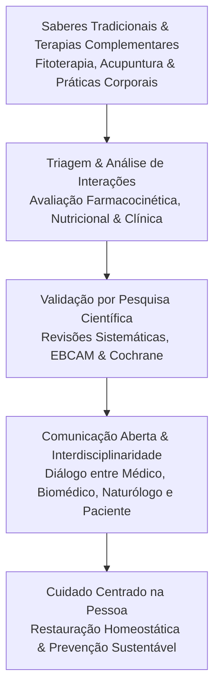

Autora: **Silviane Silvério** | Biomédica, Naturóloga e Escritora  
Data de publicação: 7 de novembro de 2026 | Tempo médio de leitura: 8 minutos  

**Palavras-chave:** Medicina integrativa, Práticas Integrativas e Complementares em Saúde (PICS), EBCAM, fitoterapia racional, acupuntura, biomedicina, naturologia, Vis Medicatrix Naturae, cuidado centrado na pessoa.

---

> **© Conteúdo Autoral:** Todo o conteúdo desta postagem é de autoria de Silviane Silvério. Licença CC BY-SA 4.0 Internacional. O compartilhamento e a adaptação são permitidos mediante atribuição clara à autora e distribuição sob a mesma licença. Para localizar a autora e a fonte do artigo, pesquise na internet: [https://praticasdebemestarsocial.github.io/silvianesilverio/](https://praticasdebemestarsocial.github.io/silvianesilverio/)
{: .prompt-info }

---

> 🔥 **A Medicina Integrativa consolida-se como o padrão-ouro contemporâneo:** ela une a eficácia das condutas convencionais à segurança de práticas complementares validadas, recolocando o indivíduo no centro do seu processo de saúde.
{: .prompt-tip }

---

## 1. O Que São as PICS e Por Que Elas Importam?

Em um cenário de aceleração tecnológica e transformações profundas na área da saúde, observa-se um crescimento expressivo no interesse pelas **Práticas Integrativas e Complementares em Saúde (PICS)**. Longe de representar uma simples tendência passageira, essa busca responde à necessidade urgente de consolidar um modelo de cuidado centrado na totalidade do ser humano.

Segundo o *National Center for Complementary and Integrative Health* (NCCIH), as PICS compreendem um conjunto de sistemas, terapias e intervenções que expandem a abordagem biomédica convencional. Dentre as modalidades mais investigadas e aplicadas no meio acadêmico, destacam-se:

* 🌿 **Fitoterapia e Suplementação Funcional:** Uso guiado e racional de extratos vegetais e compostos bioativos.
* ☯️ **Acupuntura e Medicina Tradicional Chinesa:** Estímulo de pontos específicos para modulação neuromuscular, neuroquímica e dolorosa.
* 🧘 **Meditação, Mindfulness e Práticas Respiratórias:** Intervenções mente-corpo focadas na autorregulação autonômica e redução do estresse crônico.
* 🤲 **Práticas Corporais e Osteopatia:** Alinhamento miofascial, estímulo mecânico e promoção de mobilidade sistêmica.

---

## 2. O Poder da Evidência: Por Que a Ciência é Essencial nas PICS?

Historicamente vista com ceticismo devido à escassez de ensaios clínicos com amostras robustas, a área das PICS passa por um rigoroso processo de sistematização científica denominado ***Evidence-Based Complementary and Alternative Medicine* (EBCAM)**. Entidades globais e revisões sistemáticas (como a *Cochrane Library*) trazem dados concretos sobre a eficácia e segurança de intervenções específicas:

### Tabela: Aplicações Validadas e Níveis de Evidência nas PICS

| Prática Integrativa | Mecanismo / Aplicação Validada | Nível de Evidência / Observações Clínicas |
| :--- | :--- | :--- |
| **Fitoterapia (*Hypericum perforatum*)** | Coadjuvante no manejo de quadros depressivos leves a moderados | Eficácia comparável a antidepressivos de síntese; requer atenção às vias de metabolização hepática (Citocromo P450). |
| **Acupuntura** | Modulação da nocicepção, controle inflamatório e liberação de endorfinas | Recomendada pela OMS e por diretrizes internacionais para dores crônicas, enxaquecas e profilaxia de náuseas. |
| **Suplementação (*Ginkgo biloba* e *Allium sativum*)** | Ação antioxidante, microcirculatória e modulação vascular/lipídica | Potencial protetor vascular e preservação de funções cognitivas em populações senescentes sob acompanhamento. |

---

## 3. Desafios na Integração com a Medicina Convencional

Embora dados do *Centers for Disease Control and Prevention* (CDC) indiquem que mais de 60% dos adultos já utilizaram alguma forma de prática integrativa, a integração plena entre a tradição e o ambiente hospitalar/ambulatorial ainda enfrenta gargalos relevantes:

### 🤐 1. Omissão do Uso de Fitoterápicos (Comunicação Paciente-Profissional)
Muitos indivíduos omitem a autoingestão de chás, tinturas ou suplementos por receio de julgamento ou falta de questionamento ativo na anamnese, aumentando a vulnerabilidade a eventos adversos subnotificados.

### 💊 2. Risco de Interações Medicamentosas (Farmacocinética e Farmacodinâmica)
Substâncias vegetais ativas podem alterar a metabolização de fármacos sintéticos (como o uso de *Ginkgo biloba* ou Erva-de-São-João associado a anticoagulantes ou imunossupressores).

### 🔍 3. Variabilidade de Padronização (Controle de Qualidade)
A flutuação na concentração de princípios ativos nos extratos vegetais exige rigor técnico no momento da prescrição e indicação clínica.

### 🎓 4. Lacunas na Formação Acadêmica (Matriz Curricular)
A abordagem das PICS ainda ocorre de forma incipiente em muitos cursos de graduação da área da saúde, limitando a interdisciplinaridade e o diálogo médico-terapêutico.

---

### Fluxo de Integração Segura e Baseada em Evidências

---

## 4. Um Novo Paradigma: O Cuidado Centrado na Pessoa

A verdadeira essência da medicina integrativa reside em sua visão sistêmica. Em alinhamento com os princípios da naturopatia e das medicinas tradicionais, este paradigma sustenta que:

* 🌐 **A saúde é multidisciplinar:** A restauração da homeostase envolve fatores bioquímicos, psicossociais, ambientais, biológicos e emocionais.
* 🌿 **Autonomia e *Vis Medicatrix Naturae*:** O papel da terapêutica é favorecer as condições biológicas para que o próprio organismo exerça sua capacidade inata de autorregulação.
* 🛡️ **Prevenção como Eixo Central:** O estilo de vida consciente, a nutrição adequada e a educação em saúde antecedem a necessidade de intervenções invasivas.

---

## 5. O Caminho para a Saúde Sustentável

Conforme sintetizado na literatura científica recente (Mortada, 2024), o avanço da saúde preventiva não exige uma escolha excludente entre a alta tecnologia e os saberes ancestrais. O caminho viável apoia-se no rigor metodológico, no diálogo ético e na personalização do cuidado.

---

### Aprofunde seus Estudos em PICS e Medicina Integrativa

Se você deseja aprofundar sua fundamentação científica sobre fitoterapia racional, diretrizes clínicas e saúde integrativa:

📚 **Módulo de Pesquisa: Evidências Científicas em PICS e Saúde Integrativa**

Aprofunde sua leitura sobre diretrizes clínicas, fitoterapia racional e metodologias de avaliação constitucional.

👉 [Clique aqui para acessar os Cursos e Materiais Acadêmicos de Silviane Silvério](https://praticasdebemestarsocial.github.io/silvianesilverio/)

---

## 6. Reflexão para a Comunidade Integrativa

> A integração entre a ciência e as sabedorias tradicionais exige escuta ativa e transparência. Você já conversou abertamente com sua equipe de saúde sobre o uso de práticas integrativas ou fitoterápicos em sua rotina? Como foi essa experiência?
>
> **Compartilhe suas percepções nos comentários abaixo** para enriquecermos nossa comunidade de aprendizado! Digite a palavra **"INTEGRAÇÃO"** ao iniciar seu relato. 🌱🔬

---

## 📄 Referências & Isenção de Responsabilidade

> ### ⚠️ Aviso Legal e Isenção de Responsabilidade (Disclaimer)
> Este artigo possui finalidade estritamente educativa, informativa e de divulgação de conceitos de Medicina Integrativa e Práticas Integrativas e Complementares em Saúde (PICS), sob a autoria de profissional Biomédica Naturopata. O conteúdo exposto não configura diagnóstico médico, prescrição ou tratamento de doenças. As práticas integrativas atuam como coadjuvantes e não substituem o acompanhamento médico convencional. Devido ao risco de interações medicamentosas, consulte sempre profissionais habilitados.
{: .prompt-warning }

---

### Direitos Autorais e Registro
© 2026 **Silviane Silvério**. Licença *CC BY-SA 4.0 Internacional*. O compartilhamento e a adaptação são permitidos mediante atribuição clara à autora e distribuição sob a mesma licença.

### Referências Bibliográficas

- **MORTADA, E. M.** Evidence-Based Complementary and Alternative Medicine in Current Medical Practice. *Cureus*, v. 16, n. 1, p. e51258, 2024.
- **NATIONAL CENTER FOR COMPLEMENTARY AND INTEGRATIVE HEALTH (NCCIH).** *Complementary, Alternative, or Integrative Health: What’s In a Name?* Bethesda: NCCIH, 2021.
- **SILVÉRIO, Silviane de Souza.** *Pesquisas em Saúde Integrativa, Evidência Científica em PICS e Saberes Tradicionais.* São Paulo, 2025.

---

### Saiba Mais sobre a Autora

* 🔗 **ORCID:** [https://orcid.org/0000-0001-6311-1195](https://orcid.org/0000-0001-6311-1195)
* 🔗 **Currículo Lattes:** [http://lattes.cnpq.br/7481458793724724](http://lattes.cnpq.br/7481458793724724)  
*(ID Lattes: 7481458793724724 | Registro Profissional: CRTH-BR 1741)*
