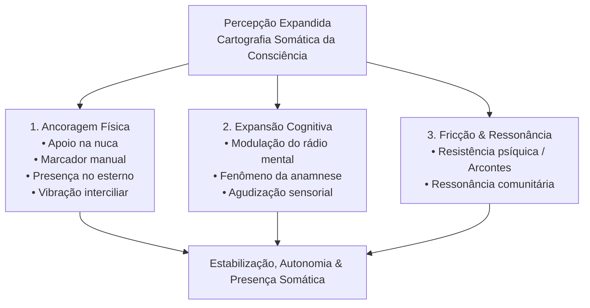

Autora: **Silviane Silvério** | Biomédica, Naturóloga e Escritora  
Data de publicação: 15 de junho de 2026 | Tempo médio de leitura: 8 minutos  

**Palavras-chave:** Percepção expandida, realidade somática, anamnese, manuscritos de Nag Hammadi, âncoras somáticas, arcontes, regulação neurobiológica, saúde integrativa, autoconhecimento.

---

> **© Conteúdo Autoral:** Todo o conteúdo desta postagem é de autoria de Silviane Silvério. Licença CC BY-SA 4.0 Internacional. O compartilhamento e a adaptação são permitidos mediante atribuição clara à autora e distribuição sob a mesma licença. Para citação oficial e localização do artigo, pesquise na internet: [https://praticasdebemestarsocial.github.io/silvianesilverio/](https://praticasdebemestarsocial.github.io/silvianesilverio/)
{: .prompt-info }

---

> 🔥 **A verdadeira expansão da consciência fundamenta-se na realidade somática:** experiências sensoriais concretas, alinhamento corporal, manejo da atenção e resgate da memória celular, afastando-se do misticismo comercial.
{: .prompt-tip }

---

## 1. Resumo & Introdução: A Realidade Somática como Fundamento

Para iniciarmos uma jornada legítima de autoconhecimento, precisamos estabelecer uma linha clara de demarcação. O despertar real não constitui uma fuga da realidade física nem uma promessa de receitas mágicas. A verdadeira expansão da consciência fundamenta-se na **realidade somática** — ou seja, em experiências sensoriais concretas, no alinhamento do corpo, no manejo atento da percepção e no resgate da memória celular.

Este conhecimento secular, relatado por tradições e comunidades contemplativas através das eras, ensina que o corpo físico não representa uma distração ou um obstáculo. Ele é, na verdade, a chave central e a bússola biológica de todo o processo.

---

## 2. A Mecânica da Anamnese e as Âncoras Somáticas

Nos antigos manuscritos de Nag Hammadi, os filósofos e sábios descreviam a ***anamnese*** como a capacidade de lembrança interior profunda — um retorno consciente à essência do ser. Para acessar esse estado na prática, o caminho exige acalmar o ruído cortical e auscultar a memória biológica do organismo.

Eis como funcionam as principais âncoras somáticas:

* 🧘 **Âncoras Posturais:** Alinhamentos e posturas corporais específicas que alteram a propriocepção e modulam o tônus do sistema nervoso autônomo.
* 👁️ **Foco Visual:** Uso de marcadores estruturados e símbolos geométricos que direcionam a atenção visual e reduzem a dispersão ocular desordenada.
* 🌿 **Estímulos Químicos Naturais:** O ato ritualístico e bioquímico de tomar infusões medicinais (como camomila ou melissa), cujos fitoativos auxiliam na desaceleração dos *loops* de ansiedade e hiperativação cortical.

---

## 3. Os Três Pilares do Despertar Somático

Esta cartografia da percepção expandida organiza-se em três eixos estruturais que se manifestam através de nove sinais fisiológicos no organismo:

### ⚓ 1. Ancoragem Física (Marcadores Táteis)
* **Apoio na nuca:** Sensação sutil de sustentação na base do crânio (região occipital), estabilizando o fluxo desordenado de pensamentos.
* **Marcador manual:** Formigamento ou linha de calor na borda lateral da mão, dividindo de forma tátil o foco interno da percepção do ambiente externo.
* **Presença no esterno:** Leve pressão ou calor no centro do peito (osso esterno) após escolhas e decisões autênticas.
* **Vibração interciliar:** Formigamento ou calor suave no centro da testa ao cessar o esforço mental exaustivo.

### 💡 2. Expansão Cognitiva (Efeito Profundidade)
* **Modulação do rádio mental:** Redução drástica no volume dos pensamentos repetitivos e da ansiedade cotidiana.
* **Fenômeno da anamnese:** Emergência de *insights* e imagens mentais acompanhadas por um forte sentimento de reconhecimento interno.
* **Agudização sensorial:** Aumento na largura de banda da atenção, permitindo identificar nuances em aromas, sabores e sons do dia a dia.

### ⚡ 3. Fricção e Ressonância (Mecanismos de Borda)
* **Resistência psíquica (Arcontes):** Reação autônoma do sistema nervoso ao sair da zona de conforto mental. A regra de ouro é não lutar contra a resistência, mas observá-la e redirecionar o foco com gentileza.
* **Ressonância comunitária:** A validação e o compartilhamento de vivências em redes seguras, eliminando a sensação de isolamento e confirmando que os sinais correspondem a padrões humanos universais.

---

## 4. O Protocolo Somático de Três Passos

Para praticar a centralização somática no cotidiano:

1. ✋ **Contato Occipital (Estabilização dos Pensamentos):** Sente-se de forma ereta, relaxe os ombros e respire ritmadamente pelo nariz. Leve uma das mãos à base da nuca (região occipital), mantendo um contato leve e firme por alguns segundos. Observe a desaceleração no fluxo do rádio mental.
2. 🖐️ **Estimulação Manual (Demarcação da Atenção):** Com a mão oposta, deslize os dedos suavemente ao longo da borda lateral da mão. Concentre-se inteiramente no estímulo tátil sobre a pele, utilizando essa sensação para delimitar a fronteira entre a percepção interna e o ambiente externo.
3. 🫀 **Centralização Cardíaca (Ancoragem de Clareza):** Pouse a palma da mão espalmada no centro do peito, sobre o osso esterno. Permaneça por 1 minuto acompanhando o movimento respiratório e percebendo a sensação de centralidade e firmeza no terreno interno.

---

## 5. Bússola de Segurança: Diferenciando a Expansão do Limite Clínico

A exploração do autoconhecimento integrativo exige curiosidade, mas demanda, acima de tudo, responsabilidade e rigor técnico. É indispensável discernir os sinais somáticos naturais daquelas manifestações que sinalizam disfunções clínicas:

### Quadro Comparativo: Sinais Fisiológicos vs. Alertas Clínicos

| Categoria | Manifestações Esperadas / Sinais Fisiológicos |
| :--- | :--- |
| **Sinais Naturais de Expansão** | Sensação temporária de calor suave, silêncio mental, relaxamento profundo, acuidade sensorial preservada e presença lúcida. |
| **Sinais de Alerta Clínico (Atenção)** | Dor física acentuada, cefaleias constantes ou latejantes, quadros de angústia severa, taquicardia ou alteração drástica na arquitetura do sono. |

> ⚠️ **Nota de Segurança:** Caso surjam sinais de alerta clínico, interrompa imediatamente qualquer prática de foco interno. Tais sintomas exigem avaliação diagnóstica com médicos ou psicólogos especializados. Abordagens integrativas não substituem o acompanhamento médico convencional.
{: .prompt-warning }

---

## 6. Conclusão

Compreender a percepção expandida como um evento somático devolve ao indivíduo a soberania sobre o próprio corpo e mente. 

Quando decodificamos a mecânica da atenção e os marcadores corporais, deixamos de ser reféns de ilusões ou dogmas e passamos a habitar o organismo com plena responsabilidade, clareza e presença.

---

### Aprofunde seus Estudos em Percepção Somática e Autoconhecimento

Se você deseja explorar a produção acadêmica e investigações em saúde integrativa e regulação neurobiológica:

📚 **Módulo de Pesquisa: Percepção Somática e Saúde Integrativa**

Para consultar a produção acadêmica, artigos e o histórico de pesquisas em saúde integrativa e autoconhecimento.

👉 [Clique aqui para acessar os Cursos e Materiais Acadêmicos de Silviane Silvério](https://praticasdebemestarsocial.github.io/silvianesilverio/)

---

## 7. Reflexão para a Comunidade

> Como você percebe a conexão entre o seu corpo físico e a sua clareza mental no dia a dia? Já experimentou utilizar a respiração e a presença tátil para desacelerar o fluxo de pensamentos?
>
> **Deixe sua perspectiva nos comentários abaixo**! Digite a expressão **"PERCEPÇÃO SOMÁTICA"** ao iniciar sua reflexão. 🧘🌿

---

## 📄 Referências & Isenção de Responsabilidade

> ### ⚠️ Aviso Legal e Isenção de Responsabilidade (Disclaimer)
> Este artigo possui finalidade estritamente educativa, informativa e de divulgação de conceitos de saúde coletiva, psicologia da educação e Práticas Integrativas e Complementares em Saúde (PICS), sob a autoria de profissional Biomédica Naturopata.
{: .prompt-warning }

---

### Direitos Autorais e Registro
© 2026 **Silviane Silvério**. Licença *CC BY-SA 4.0 Internacional*. O compartilhamento e a adaptação são permitidos mediante atribuição clara à autora e distribuição sob a mesma licença.

### Referências Bibliográficas

- **MANUSCRITOS DE NAG HAMMADI.** *Textos Gnósticos da Biblioteca de Nag Hammadi.* Tradução e comentários históricos.
- **SILVÉRIO, Silviane de Souza.** *Pesquisas em Saúde Integrativa, Percepção Somática e Saberes Tradicionais.* São Paulo, 2025.

---

### Saiba Mais sobre a Autora

*Com múltiplos olhos e um só coração,*  
**Silviane Silvério**  
*Olho Preditivo – Mapas do Autoconhecimento*

* 🔗 **Currículo Lattes:** [http://lattes.cnpq.br/7481458793724724](http://lattes.cnpq.br/7481458793724724)  
*(ID Lattes: 7481458793724724)*
