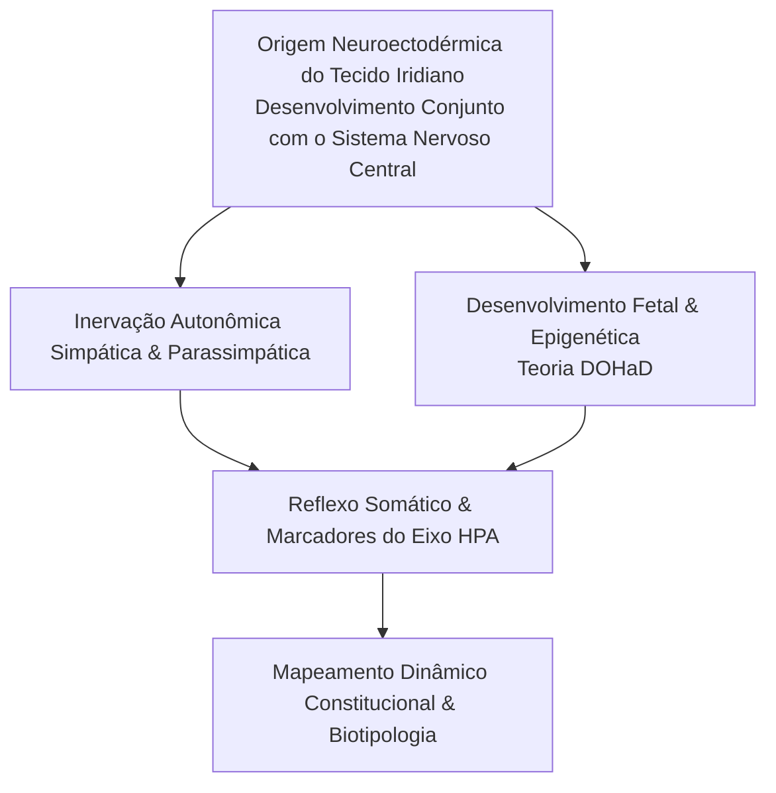
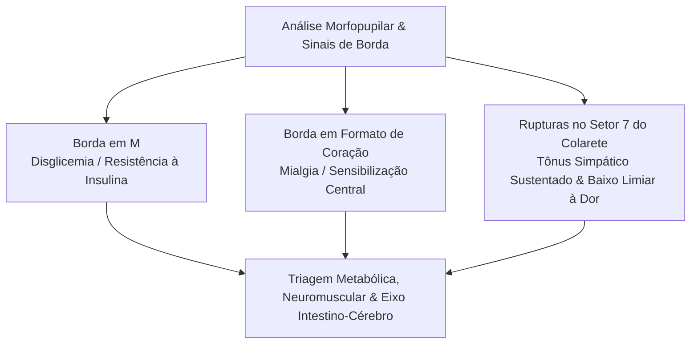

Autora: **Silviane Silvério** | Biomédica, Naturóloga e Escritora  
Data de publicação: 1º de agosto de 2026 | Tempo médio de leitura: 10 minutos  

**Palavras-chave:** Iridologia moderna, psiconeuroimunologia (PNI), embriologia, cronobiologia, trauma somático, bioquímica celular, eixo intestino-cérebro, saúde integrativa, autoconhecimento.

---

> **© Conteúdo Autoral:** Todo o conteúdo desta postagem é de autoria de Silviane Silvério. Licença CC BY-SA 4.0 Internacional. O compartilhamento e a adaptação são permitidos mediante atribuição clara à autora e distribuição sob a mesma licença. Para citação oficial e localização do artigo, pesquise na internet: [https://praticasdebemestarsocial.github.io/silvianesilverio/](https://praticasdebemestarsocial.github.io/silvianesilverio/)
{: .prompt-info }

---

> 🔥 **A iridologia evoluiu de uma cartografia estática para uma ferramenta dinâmica de avaliação somática**, estabelecendo diálogos profundos com a embriologia, a psiconeuroimunologia e a bioquímica celular.
{: .prompt-tip }

---

## 1. Resumo & Introdução: A Reconfiguração dos Mapas Iridológicos sob a Ótica Embriológica

A iridologia contemporânea transcende a simples localização topográfica dos órgãos. A compreensão moderna fundamenta-se na **embriologia**, reconhecendo que a íris, de origem neuroectodérmica, compartilha vias de desenvolvimento e inervação autonômica direta com diversas estruturas centrais do organismo.

Os mapas clássicos têm sido continuamente refinados a partir de correlações anatômicas e funcionais:

* 🫀 **Eixo Cardíaco-Endócrino:** O coração, tradicionalmente analisado em um setor específico do olho esquerdo, possui áreas de análise complementares mapeadas entre as zonas do pâncreas e da tireoide, com espelhamento no olho direito e conexões na zona intestinal. Essa atualização alinha-se à inervação vagal e às conexões fasciais que integram esses sistemas.
* 🧬 **Origens Desenvolvimentistas (Teoria DOHaD):** A conexão observada entre a área do cólon ascendente, da mama direita e a zona de formação da tireoide fundamenta-se no desenvolvimento embriológico compartilhado. Sinais nessas regiões indicam a necessidade de investigar fatores do estresse pré-natal ou variações na organogênese.

---

## 2. A Dimensão Psiconeuroimunológica e a Dinâmica dos Órgãos

A **psiconeuroimunologia (PNI)** valida a premissa iridológica de que o sistema endócrino e a morfologia tecidual refletem dinâmicas psicossomáticas profundas. A íris atua como um marcador visual de alta sensibilidade para a atividade do eixo hipotálamo-hipófise-adrenal (HPA):

* ⚡ **Zona Suprarrenal:** Marcas iridianas e recessos teciduais na área adrenérgica frequentemente acompanham relatos de exaustão, correlacionando-se à desregulação na secreção de cortisol sob estresse crônico.
* 🎯 **Zona Prostática/Pélvica:** Sinais no setor reprodutivo correlacionam-se, na anamnese integrativa, com somatização de estresse, ansiedade ligada ao pertencimento e estagnação de projetos vitais.

---

## 3. Crono-Iridobiologia e a Memória Somática do Trauma

Um dos avanços mais relevantes na iridologia clínica é a leitura da **linha do tempo somática** associada à coluna vertebral e ao sistema nervoso autônomo. A psicologia do trauma (Levine, 1997; Van der Kolk, 2015) confirma que experiências aversivas não resolvidas alteram o tônus muscular profundo e a inervação segmentar.

### Tabela: Leitura da Linha do Tempo Somática e Vertebral

| Marcador Temporal / Vertebral | Região Iridiana Associada | Fisiopatologia Integrativa | Correlação Psicossomática |
| :--- | :--- | :--- | :--- |
| **Gatilho ~29 anos** | Região Lombar 5 (L5) | Estresse adrenal crônico, alteração no tônus pélvico e microcirculação. | Conflitos de quebra de vínculo familiar, insegurança de base ou reestruturação. |
| **Gatilho ~45 anos** | Região Dorsal 3 (D3) | Tensão na cadeia simpática paravertebral e restrição respiratória reflexa. | Vivências de sobrecarga, luto não elaborado, assédio moral ou hipervigilância. |

---

## 4. Bioquímica Celular, Morfologia Pupilar e o Eixo Intestino-Cérebro

A análise morfofuncional da íris e da pupila permite rastrear tendências a desequilíbrios metabólicos e neurovegetativos:

### 🔬 Sulcos Radiais e Ciclo de Krebs
A presença de sulcos radiais profundos no setor metabólico é correlacionada ao estresse oxidativo e ao acúmulo de intermediários metabólicos (como o ácido pirúvico), sinalizando tendência à disfunção mitocondrial.

### 👁️ Morfologia da Borda Pupilar
* **Borda em "M":** Tendência a instabilidades glicêmicas, picos de insulina e resistência à glicose.
* **Borda em Formato de Coração:** Predisposição a estados de sensibilização central e dores miofasciais difusas.
* **Rupturas na Orla Pupilar (Setor 7):** Associadas a um limiar reduzido de dor e estresse simpático sustentado.

### 🧠 Eixo Intestino-Cérebro
A integridade da zona do colarete reflete a permeabilidade intestinal e a relação com o sistema nervoso entérico. Hipersensibilidades alimentares (como ao glúten ou lactose) manifestam-se por meio de alterações de coloração ou depressões na orla, associando-se a quadros de neuroinflamação e oscilações do humor.

---

## 5. Aplicações Clínicas: Da Causa Raiz à Ressignificação

Na prática clínica integrativa, a avaliação iridológica atua como uma ferramenta complementar de investigação somática:

* 🎯 **Mapeamento da Causa Raiz:** Reduz a margem de erro na identificação de gatilhos para queixas crônicas (como cefaleias vasculares ou distúrbios do sono).
* 🌿 **Individualização Terapêutica:** Direciona a indicação de fitoterápicos, nutrientes e florais com base nas fragilidades constitucionais e no cronotipo (diurno/noturno) do indivíduo.
* 🪞 **Autonomia e Autoconhecimento:** Permite ao paciente visualizar as marcas de sua própria história biológica, promovendo o engajamento e a ressignificação de experiências somatizadas.

---

## 6. Conclusão

A iridologia evoluiu de uma prática observacional empírica para uma linguagem integrativa sofisticada que dialoga com a embriologia, a psiconeuroimunologia e a bioquímica celular. 

Ao fundamentar seus sinais em mecanismos neurofisiológicos e em pesquisas contemporâneas, a análise iridiana fortalece o papel das PICS no cuidado integral, transformando marcas somáticas em vetores de saúde, prevenção e autoconhecimento.

---

### Aprofunde seus Estudos em Iridologia Moderna e PNI

Se você deseja explorar artigos, pesquisas e fundamentação teórica sobre iridologia constitucional e psiconeuroimunologia:

📚 **Módulo de Pesquisa: Iridologia Moderna, Embriologia e PNI**

Para consultar a produção acadêmica, artigos e o histórico de pesquisas em iridologia, embriologia e saúde integrativa.

👉 [Clique aqui para acessar os Cursos e Materiais Acadêmicos de Silviane Silvério](https://praticasdebemestarsocial.github.io/silvianesilverio/)

---

## 7. Reflexão para a Comunidade

> Como você avalia a evolução da iridologia ao integrar conceitos de embriologia e psiconeuroimunologia? De que maneira essa fundamentação científica pode ampliar a aceitação da leitura iridiana na saúde integrativa?
>
> **Deixe sua perspectiva nos comentários abaixo**! Digite a expressão **"IRIDOLOGIA MODERNA"** ao iniciar sua reflexão. 👁️🧬

---

## 📄 Referências & Isenção de Responsabilidade

> ### ⚠️ Aviso Legal e Isenção de Responsabilidade (Disclaimer)
> Este artigo possui finalidade estritamente educativa, teórica e de divulgação científica no campo da Saúde Coletiva e das Práticas Integrativas e Complementares em Saúde (PICS), sob a autoria de profissional Biomédica Naturopata. A análise iridológica é uma ferramenta complementar e não substitui diagnósticos médicos, exames laboratoriais ou tratamentos de saúde convencionais.
{: .prompt-warning }

---

### Direitos Autorais e Registro
© 2026 **Silviane Silvério**. Licença *CC BY-SA 4.0 Internacional*. O compartilhamento e a adaptação são permitidos mediante atribuição clara à autora e distribuição sob a mesma licença.

### Referências Bibliográficas

- **AMERICAN PSYCHIATRIC ASSOCIATION.** *Manual Diagnóstico e Estatístico de Transtornos Mentais (DSM-5).* 5. ed. Porto Alegre: Artmed, 2014.
- **BERNARD, C. W.** *Iridology: The Science and Practice in the Healing Arts.* 2. ed. Vermont: Healing Arts Press, 1991.
- **KANDIL, E. et al.** The gut-brain axis: interactions between enteric microbiota, central and enteric nervous systems. *Annals of Gastroenterology*, v. 28, n. 2, p. 203-209, 2015.
- **LEVINE, P.** *Waking the Tiger: Healing Trauma.* Berkeley: North Atlantic Books, 1997.
- **SAPOLSKY, R. M.** *Why Zebras Don't Get Ulcers: The Acclaimed Guide to Stress, Stress-Related Diseases, and Coping.* 3. ed. New York: Holt Paperbacks, 2004.
- **VAN DER KOLK, B.** *O Corpo Guarda as Marcas: Reprogramando a Mente e o Corpo para Superar o Trauma.* Rio de Janeiro: Rocco, 2015.
- **SILVÉRIO, Silviane de Souza.** *Pesquisas em Iridologia, Saúde Integrativa e Embriologia.* São Paulo, 2025.

---

### Saiba Mais sobre a Autora

*Com múltiplos olhos e um só coração,*  
**Silviane Silvério**  
*Olho Preditivo – Mapas do Autoconhecimento*

* 🔗 **ORCID:** [https://orcid.org/0000-0001-6311-1195](https://orcid.org/0000-0001-6311-1195)
* 🔗 **Currículo Lattes:** [http://lattes.cnpq.br/7481458793724724](http://lattes.cnpq.br/7481458793724724)  
*(ID Lattes: 7481458793724724 | Registro Profissional: CRTH-BR 1741)*
