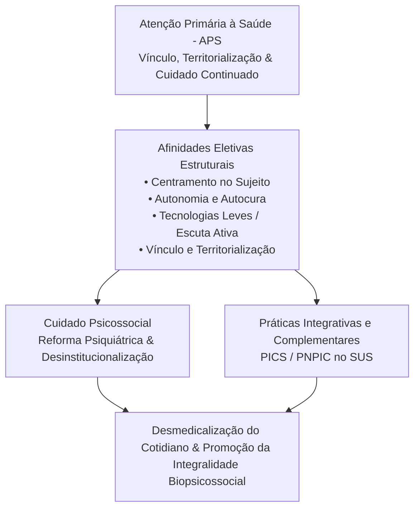

Autora: **Silviane Silvério** | Biomédica, Naturóloga e Escritora  
Data de publicação: 1º de agosto de 2026 | Tempo médio de leitura: 12 minutos  

**Palavras-chave:** Práticas Integrativas e Complementares (PICS), descolonização da saúde, ecologia de saberes, modelo biopsicossocial, atenção primária à saúde, epistemologias do sul, SUS.

---

> **© Conteúdo Autoral:** Todo o conteúdo desta postagem é de autoria de Silviane Silvério. Licença CC BY-SA 4.0 Internacional. O compartilhamento e a adaptação são permitidos mediante atribuição clara à autora e distribuição sob a mesma licença. Para citação oficial e localização do artigo, pesquise na internet: [https://praticasdebemestarsocial.github.io/silvianesilverio/](https://praticasdebemestarsocial.github.io/silvianesilverio/)
{: .prompt-info }

---

> 🔥 **Descolonizar a saúde significa romper com a hegemonia cartesiana** que reduz o sujeito à biologia e posiciona o saber biomédico como o único detentor da legitimidade terapêutica.
{: .prompt-tip }

---

## 1. Resumo & Introdução: A Crise do Modelo Hegemônico e a Necessidade de Descolonização

O modelo biomédico hegemônico, embora responsável por avanços científicos e tecnológicos inegáveis, consolidou uma visão cartesiana e fragmentada do ser humano. Ao reduzir o processo saúde-doença a um fenômeno estritamente biológico e focado na patologia, esse paradigma frequentemente marginaliza dimensões fundamentais da existência, como a subjetividade, a dimensão existencial e os determinantes socioculturais.

Nesse cenário, as **Práticas Integrativas e Complementares em Saúde (PICS)** emergem não como mera inclusão de técnicas secundárias ao prontuário, mas como um poderoso movimento epistemológico de descolonização. Inspiradas nas **Epistemologias do Sul** (Santos et al., 2020), descolonizar a saúde significa romper com a hierarquia que posiciona a medicina cartesiana como a única matriz de saber legítima.

Trata-se de operacionalizar a interculturalidade crítica em três dimensões indissociáveis:

* 📚 **Descolonização do Saber:** Apropriar-se do conhecimento científico de forma contra-hegemônica, construindo um diálogo horizontal em pé de igualdade com os saberes tradicionais, populares e ancestrais.
* ⚖️ **Descolonização do Poder:** Garantir o acesso universal e equitativo a uma diversidade de recursos terapêuticos nos serviços públicos de saúde.
* 🌿 **Descolonização do Ser:** Acolher a subjetividade, a escuta qualificada e a integralidade como eixos fundantes da existência e do cuidado em saúde.

---

## 2. Afinidades Eletivas: APS, Cuidado Psicossocial e PICS

Existe uma convergência estrutural e filosófica entre três eixos da saúde pública brasileira: a **Atenção Primária à Saúde (APS)**, o **cuidado psicossocial** (decorrente da Reforma Psiquiátrica) e a consolidação das **PICS** (Tesser & Sousa, 2012). Embora operem com ferramentas distintas, compartilham afinidades eletivas que respondem diretamente às limitações do modelo hospitalocêntrico tradicional.

### Afinidades Eletivas no Cuidado Biopsicossocial do SUS

Essas três frentes convergem na substituição de uma prática focada na prescrição medicamentosa por abordagens centradas no sujeito inserido em seu contexto familiar e territorial. Ao privilegiar **tecnologias leves** (o vínculo, a escuta atenta, a empatia e a dialogicidade), o cuidado fortalece a autonomia do indivíduo e promove um efeito desmedicalizante no cotidiano das comunidades.

---

## 3. Potencialidades e Fragilidades na Implantação da PNPIC

Embora legitimadas pela Organização Mundial da Saúde (OMS) e institucionalizadas no SUS desde 2006 por meio da **Política Nacional de Práticas Integrativas e Complementares (PNPIC)**, a consolidação dessas práticas ainda enfrenta desafios estruturais expressivos (Habimorad et al., 2020):

### Matriz de Análise: Implantação da PNPIC no SUS

| Dimensão de Análise | Potencialidades Identificadas | Fragilidades Estruturais a Superar |
| :--- | :--- | :--- |
| **Acesso e Oferta** | Expansão contínua na Atenção Primária e grande receptividade pelos usuários. | Concentração desigual no território nacional e falta de monitoramento epidemiológico sistemático. |
| **Abordagem Clínico-Terapêutica** | Estímulo à autorregulação biológica, ao bem-estar e à autonomia do indivíduo. | Risco de uso meramente sintomático, pontual ou "biologizado" de terapias integrativas. |
| **Formação Profissional** | Interesse crescente da comunidade acadêmica, de estudantes e de profissionais de saúde. | Disciplinas predominantemente opcionais, periféricas e desarticuladas do currículo base universitário. |
| **Gestão e Financiamento** | Reconhecimento institucional consolidado pela política pública nacional (PNPIC). | Flutuações orçamentárias de financiamento e desconhecimento do rol total de práticas por gestores locais. |

O gargalo mais urgente reside no ecossistema de formação acadêmica (Zanardi et al., 2018). Em grande parte das universidades públicas, o ensino de PICS permanece confinado a disciplinas optativas ou atividades extracurriculares. Sem uma integração transversal nos cursos de graduação em saúde, os profissionais formados continuam reprodutores do olhar fragmentado, comprometendo o potencial emancipatório das práticas integrativas.

---

## 4. O Caminho para uma Ecologia de Saberes no SUS

Para consolidar uma verdadeira **"ecologia de saberes"** no SUS — na qual a biomedicina e os conhecimentos tradicionais interajam sem subordinação epistemológica —, torna-se indispensável reformular as diretrizes curriculares do ensino em saúde.

A efetivação da PNPIC exige o fortalecimento da Saúde Coletiva e a formação de profissionais capacitados a navegar entre diferentes racionalidades médicas. O objetivo não é recusar o avanço científico da biomedicina, mas sim submetê-lo a um diálogo plural e aberto, construindo um modelo biopsicossocial que respeite a complexidade e a dignidade da vida humana.

---

## 5. Conclusão

As Práticas Integrativas e Complementares representam uma oportunidade histórica para reconfigurar os paradigmas do cuidado no SUS. 

Ao aproximar a atenção primária, a saúde mental e as racionalidades tradicionais, abrem-se caminhos para um sistema verdadeiramente universal, integral e equânime. A consolidação dessa perspectiva exige o compromisso ético de transformar a formação universitária e descentralizar as práticas de saúde, garantindo a emancipação e o cuidado integral do ser humano.

---

### Aprofunde seus Estudos em Descolonização da Saúde e PICS

Se você busca explorar a produção acadêmica e investigações sobre saúde coletiva, epistemologias do sul e práticas integrativas:

📚 **Módulo de Pesquisa: Descolonização do Cuidado e Saúde Coletiva**

Acesse artigos, ensaios teóricos e materiais pedagógicos sobre racionalidades médicas e a PNPIC no SUS.

👉 [Clique aqui para acessar os Cursos e Materiais Acadêmicos de Silviane Silvério](https://praticasdebemestarsocial.github.io/silvianesilverio/)

---

## 6. Reflexão para a Comunidade

> Como você avalia a presença das Práticas Integrativas no seu posto de saúde ou comunidade? De que maneira a valorização dos saberes tradicionais pode tornar o SUS mais humano, acolhedor e desmedicalizado?
>
> **Deixe sua perspectiva nos comentários abaixo**! Digite a expressão **"ECOLOGIA DE SABERES"** ao iniciar sua reflexão. 🌱🤝

---

## 📄 Referências & Isenção de Responsabilidade

> ### ⚠️ Aviso Legal e Isenção de Responsabilidade (Disclaimer)
> Este artigo possui finalidade estritamente educativa, teórica e de divulgação de conceitos de Saúde Coletiva, Políticas Públicas de Saúde e Práticas Integrativas e Complementares em Saúde (PICS), sob a autoria de profissional Biomédica Naturopata. O conteúdo exposto não configura prescrição, diagnóstico ou tratamento individualizado. As reflexões apresentadas visam ao debate acadêmico e à qualificação da prática e formação em saúde no Brasil.
{: .prompt-warning }

---

### Direitos Autorais e Registro
© 2026 **Silviane Silvério**. Licença *CC BY-SA 4.0 Internacional*. O compartilhamento e a adaptação são permitidos mediante atribuição clara à autora e distribuição sob a mesma licença.

### Referências Bibliográficas

- **HABIMORAD, P. H. L. et al.** Potencialidades e fragilidades de implantação da Política Nacional de Práticas Integrativas e Complementares. *Ciência & Saúde Coletiva*, v. 25, n. 2, p. 395-405, 2020.
- **SANTOS, B. de S. et al.** As práticas integrativas e complementares no campo da saúde: para uma descolonização dos saberes e práticas. *Saúde e Sociedade*, v. 29, n. 1, e190297, 2020.
- **TESSER, C. D.; SOUSA, I. M. C. de.** Atenção primária, atenção psicossocial, práticas integrativas e complementares e suas afinidades eletivas. *Saúde e Sociedade*, v. 21, n. 2, p. 336–350, 2012.
- **ZANARDI, L. P. et al.** Formação em Práticas Integrativas e Complementares em Saúde: desafios para as universidades públicas. *Trabalho, Educação e Saúde*, v. 16, n. 2, p. 623-643, 2018.
- **ZANARDI, L. P. et al.** Práticas integrativas e complementares: desafios para a educação. *Trabalho, Educação e Saúde*, v. 9, n. 3, p. 435-451, 2011.
- **SILVÉRIO, Silviane de Souza.** *Pesquisas em Saúde Integrativa, Racionalidades Médicas e Saberes Tradicionais.* São Paulo, 2025.

---

### Saiba Mais sobre a Autora

*Com múltiplos olhos e um só coração,*  
**Silviane Silvério**  
*Olho Preditivo – Mapas do Autoconhecimento*

* 🔗 **ORCID:** [https://orcid.org/0000-0001-6311-1195](https://orcid.org/0000-0001-6311-1195)
* 🔗 **Currículo Lattes:** [http://lattes.cnpq.br/7481458793724724](http://lattes.cnpq.br/7481458793724724)  
*(ID Lattes: 7481458793724724 | Registro Profissional: CRTH-BR 1741)*
